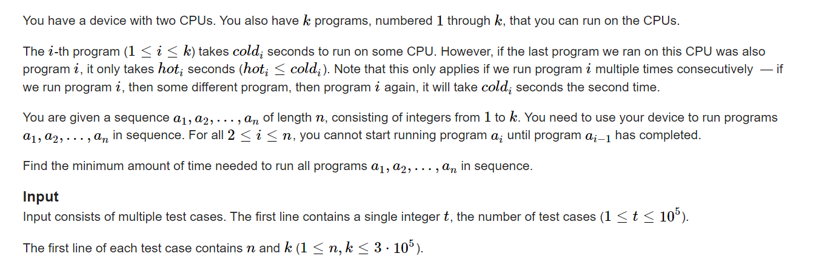

**D2. Hot Start Up (hard version)**
https://codeforces.com/contest/1799/problem/D2

[Problem - D2 - Codeforces](https://codeforces.com/contest/1799/problem/D2)



#### solve

1. ==**第一角度：**==

   1. **状态定义** : 

      $f_{k,i ,j}$ 表示处理完前k个程序， 当前两个cpu上一个运行的程序分别为： i ， j。其最小价值。

   2. **状态转移方程：**

      在上述状态下 ： 显然是暴力的$N\times K^2$

   ##### 优化一
   
   1. **状态优化**
   
      分析冗余， 抽出有有意义的状态： 按顺序执行完程序之后，上一个有效的状态中必定有一个cpu是运行了a[i - 1]的。并且由于$f_{i,j}=f_{j ,i}$， 于是我们可以优化掉一个维度：
   
   2. **状态转移方程优化：**
   
      概念定义：
   
      ```latex
      X :  a[i]
      Y :  a[i - 1]
      f[i] : 指标函数的解
      nf[i] : 滚动数组优化， 上一个阶段的指标函数的解。
      cold[i] , hot[i]  题意
      
      下方的下标i显然指的是连续的 0 ... k。
      ```
   
      $$
      if(X= Y)\\
      f_i = min(f_i  ,  nf_i + hot_x)\\
      f_x = min(f_x , nf_i + cold_x)
      $$
   
      
      $$
      if(X\ne Y)\\
      f_i = min(f_i , nf_i + cold_x)\\
      f_y = min(f_y , nf_i + cold_x)\\
      f_y = min(f_y , nf_x + hot_x)
      $$
      
   
2. 

##### 优化2 ：

1. 方程上的优化： 

   1. 是否可以简化： 可以对max ， min运算做一个界的收缩？

      观察发现

      1. （1）中$f_x$ 的优化式子可以删除。

2. 处理转移上的优化：

   1. 上述就是简单的区间加 ， 单点修改 ， 区间最小值查询的操作。直接用单调栈维护即可。

##### 优化3 ：

 发现是全局的区间加：维护的信息是非常朴素的。于是维护这些信息， 可以适时还原。

另外： 每一个阶段 ，几个元素之间的相对关系变化不大；如果a[i] != a[i - 1] ， 更新最小值 ， 只需要关注一个元素。

参考题解为： https://www.luogu.com.cn/blog/CGY/solution-cf1799d2


==**第二角度**==  ~~出错了~~

首先按照常规的方法处理完所有的值： 其花费是： $\sum cold[a_i]$

然后考虑让hot情况出现的次数尽量小：

1. 考虑让某两个元素在同一个cpu中相遇： 这意味着，i + 1  ..... j  - 1中的元素要在同一个cpu中运行：
2. 特殊的 ： 相邻相连同值得元素做特殊处理：

**状态定义：**
$f_{i}$表示i之前单独处理连线的最大贡献。

**状态转移方程：**

首先贪心的选择更短的边：
$$
考虑当前是否向之前连边：\\
f_{i} = max(f_{i - 1}, f_{pre_i} + cold_i-hot_i)
$$


hack

```in
input : 
1
5 3
1 3 2 1 2
2 2 2
1 1 1

output :
8
```

相似的思想： 参考该篇题解：

https://www.cnblogs.com/legendstane/p/codeforces-round-854-cybercats-cf-1799-a-b-c-d1-d2-e-f-g-solution.html

**和上述角度的不同之处**

1. 特殊处理了相邻相同点的情况。
2. 正推角度下的状态转移方程。
3. 贡献计算中的一个容斥角度：

#### 朴素写法：面对简单版本的问题：

```cpp
int a[N] , cold[N] , hot[N];
void work(int testNo)
{
	int n , k;
	cin >> n >> k;
	for (int i = 1; i <= n; i++)
		cin >> a[i];
	for (int i = 1; i <= k; i++) cin >> cold[i];
	for (int i = 1; i <= k; i++) cin >> hot[i];
	vector<ll> dp(k + 1, INF);
	dp[0] = 0;
	// 关于对称性的问题：
	for (int j = 1; j <= n; j++) {
		auto ndp = dp;
		dp = vector<ll> (k + 1 , INF);
		int x = a[j] , y = a[j - 1];;
		if (x == y) {
			for (int i = 0; i <= k; i++) {
				dp[i] = min(ndp[i] + hot[x] , dp[i]);
			}
			for (int i = 0; i <= k; i++) {
				if (i != x) dp[x] = min(dp[x] , ndp[i] + cold[x]);
			}

		} else {
			for (int i = 0; i <= k; i++) {
				dp[i] = min(dp[i] , ndp[i] + cold[x]);
			}
			for (int i = 0; i <= k; i++) {
				dp[y] = min(dp[y] , ndp[i] + cold[x]);
			}
			dp[y] = min(dp[y] , ndp[x] + hot[x]);
		}
	}
	cout << *min_element(dp.begin() , dp.end()) << "\n";
}
signed main()
{
	ios::sync_with_stdio(false);
	cin.tie(0);

	int t; cin >> t;
	for (int i = 1; i <= t; i++)work(i);
}
```


#### 第二个角度code

```cpp
int pre[N] , pos[N],  a[N];
ll f[N] , hot[N] , cold[N] , val[N];
void work(int testNo)
{
	int n , k;
	cin >> n >> k;
	vector<vector<int>> pos(k + 1);
	for (int i = 1; i <= n; i++) {
		cin >> a[i];
		pos[a[i]].push_back(i);
	}
	for (int i = 1; i <= k; i++)
		cin >> cold[i];
	for (int i = 1; i <= k; i++)
		cin >> hot[i];

	vector<vector<pair<int , int>>> line (n + 1);
	ll addr = 0;
	for (int i = 1; i <= k; i++)
		for (int j = 1; j < sz(pos[i]); j++) {
			if (pos[i][j] == pos[i][j - 1] + 1) {addr += cold[i] - hot[i]; continue;};
			line[pos[i][j - 1] + 1].push_back(make_pair(pos[i][j] - 1 , cold[i] - hot[i]));
		}
	vector<ll>f(n + 1 , 0);
	ll res = 0;
	for (int i = 1; i <= n; i++) {
		res += cold[a[i]];
		f[i] = max(f[i - 1] , f[i]);
		for (auto [x , y] : line[i]) {
			f[x + 1] = max(f[x + 1] , f[i] + y);
		}
	}
	cout << res - f[n] - addr << "\n";
}
signed main()
{
	ios::sync_with_stdio(false);
	cin.tie(0);

	int t; cin >> t;
	for (int i = 1; i <= t; i++)work(i);
}

/* stuff you should look for
* int overflow, array bounds
* special cases (n=1?)
* do smth instead of nothing and stay organized
* WRITE STUFF DOWN
* DON'T GET STUCK ON ONE APPROACH
*/

/*
1
5 3
1 3 2 1 2
2 2 2
1 1 1
*/
```

#### 维护全局离线加法

```cpp\
#include<bits/stdc++.h>
using namespace std;

using ll = long long;
using i64 = long long;
using ull = unsigned long long;
using ld = long double;
using uint = unsigned int;
using pii = pair<int , int>;
using pli = pair<ll , int>;
using pll = pair<ll , ll>;


#define dbg(x) cerr << "[" << __LINE__ << "]" << ": " << x << "\n"

#define all(x) (x).begin(),(x).end()
#define sz(x) (int)(x).size()
#define pb push_back
#define fi first
#define se second

const int inf = 1 << 29;
const ll INF = 1LL << 59;
const int N = 1E6 + 10;

int a[N];
ll  hot[N] , cold[N];

void work(int testNo)
{
	int n , k;
	cin >> n >> k;
	for (int i = 1; i <= n; i++) {
		cin >> a[i];
	}
	for (int i = 1; i <= k; i++)
		cin >> cold[i];
	for (int i = 1; i <= k; i++)
		cin >> hot[i];
	ll add = 0 , mi = 0;
	vector<ll> f(k + 1 , INF);
	f[0] = 0;
	for (int i = 1; i <= n; i++) {
		int x = a[i] , y = a[i - 1];

		if (x == y)
			add += hot[x];
		else {
			add += cold[x];
			f[y] = min(mi + cold[x] , f[x] + hot[x]) - cold[x];
			mi = min(mi , f[y]);
		}
	}
	cout << mi + add << "\n";
}
signed main()
{
	ios::sync_with_stdio(false);
	cin.tie(0);

	int t; cin >> t;
	for (int i = 1; i <= t; i++)work(i);
}

/* stuff you should look for
* int overflow, array bounds
* special cases (n=1?)
* do smth instead of nothing and stay organized
* WRITE STUFF DOWN
* DON'T GET STUCK ON ONE APPROACH
*/

/*
1
5 3
1 3 2 1 2
2 2 2
1 1 1
*/
```

#### code 线段树优化：

```cpp
#include<bits/stdc++.h>
using namespace std;

using ll = long long;
using i64 = long long;
using ull = unsigned long long;
using ld = long double;
using uint = unsigned int;
using pii = pair<int , int>;
using pli = pair<ll , int>;
using pll = pair<ll , ll>;


#define dbg(x) cerr << "[" << __LINE__ << "]" << ": " << x << "\n"

#define all(x) (x).begin(),(x).end()
#define sz(x) (int)(x).size()
#define pb push_back
#define fi first
#define se second

const int inf = 1 << 29;
const ll INF = 1LL << 50;
const int N = 1E6 + 10;

int id[N];
ll  hot[N] , cold[N];

// 于是现在写一颗维护两种信息的线段树
// 维护区间。
// 维护单点修改
// 维护单点查询最小值。
// 维护单点修改：
//const int N = 201000;
//const ll mod = 1000000007;
int a[N];
ll f[N];

struct tag {
	// 区间加法
	ll add;
};
struct info {
	ll mi;
	ll sum;
};
//标记合并。用于updatetag

//节点的内容。数据项以及内容。
//如果维护信息比较复杂。也可以考虑将信息封装。并且如上写一个区间信息合并重载函数。
struct node {
	ll add;
	info val;
	int sz;
} seg[N * 4];

// [l, r]

//在modify以及建树之后。把两个儿子的信息合并。
void update(int id) {
	seg[id].val.sum = seg[id * 2].val.sum + seg[id * 2 + 1].val.sum;
	seg[id].val.mi = min(seg[id * 2].val.mi , seg[id * 2 + 1].val.mi);
}
//push down。
//完成两项东西。合并标记。
//修改区间信息。
void settag(int id, ll t) {
	seg[id].add += t;
	seg[id].val.sum += seg[id].sz * t;
	seg[id].val.mi += t;
}
//记得将下放后将标记初始化。
void pushdown(int id) {
	if (seg[id].add != 0) { // 标记非空
		settag(id * 2, seg[id].add);
		settag(id * 2 + 1, seg[id].add);
		seg[id].add = 0;
	}
}

//建树。记得建完之后update.
//以及到达终点时，将节点信息修正。
void build(int id, int l, int r) {
	seg[id].add = {0};
	seg[id].sz = r - l + 1;
	if (l == r) {
		seg[id].val = {f[l] , f[l]};
	} else {
		int mid = (l + r) / 2;
		build(id * 2, l, mid);
		build(id * 2 + 1, mid + 1, r);
		update(id);
	}
}

// 节点为id，对应的区间为[l, r]，修改a[pos] -> val
//记得update
//正确sertag
void modify(int id, int l, int r, int ql, int qr, ll t) {
	if (l == ql && r == qr) {
		settag(id, t);
		return;
	}
	int mid = (l + r) / 2;
	// 重要‼️
	pushdown(id);
	if (qr <= mid) modify(id * 2, l, mid, ql, qr, t);
	else if (ql > mid) modify(id * 2 + 1, mid + 1, r, ql, qr, t);
	else {
		modify(id * 2, l, mid, ql, mid, t);
		modify(id * 2 + 1, mid + 1, r, mid + 1, qr, t);
	}
	// 重要‼️
	update(id);
}
// [ql, qr]表示查询的区间
//到达终点时及时返回。
ll query_mi(int id, int l, int r, int ql, int qr) {
	if (l == ql && r == qr) return seg[id].val.mi;
	int mid = (l + r) / 2;
	// 重要‼️
	pushdown(id);
	if (qr <= mid) return query_mi(id * 2, l, mid, ql, qr);
	else if (ql > mid) return query_mi(id * 2 + 1, mid + 1, r, ql, qr);
	else {
		// qr > mid, ql <= mid
		// [ql, mid], [mid + 1, qr]
		return min(query_mi(id * 2, l, mid, ql, mid) ,
		           query_mi(id * 2 + 1, mid + 1, r, mid + 1, qr));
	}
}
ll query(int id, int l, int r, int ql, int qr) {
	if (l == ql && r == qr) return seg[id].val.sum;
	int mid = (l + r) / 2;
	// 重要‼️
	pushdown(id);
	if (qr <= mid) return query(id * 2, l, mid, ql, qr);
	else if (ql > mid) return query(id * 2 + 1, mid + 1, r, ql, qr);
	else {
		// qr > mid, ql <= mid
		// [ql, mid], [mid + 1, qr]
		return query(id * 2, l, mid, ql, mid) +
		       query(id * 2 + 1, mid + 1, r, mid + 1, qr);
	}
}
/*
1. 该代码处理问题：同时维护区间加，区间改变，区间乘法三种操作。
2. 调整过程
维护信息 -> build -> updata -> 区间信息合并函数
tag - > modify  -> push_down  ->  settag
query -> 返回类型，修改内容 , 信息合并。
*/

void work(int testNo)
{
	int n , k;
	cin >> n >> k;
	for (int i = 1; i <= n; i++) {
		cin >> id[i];
	}
	for (int i = 1; i <= k; i++)
		cin >> cold[i];
	for (int i = 1; i <= k; i++)
		cin >> hot[i];
	fill(f + 1 , f + k + 1 , INF);
	// 1. 0位置怎么维护？
	build(1 , 0 , k);
	// modify(1, 0 , k , 0 , k , 100);
	// cout << query(1 , 0 , k , k , k) << "\n";
	for (int i = 1; i <= n; i++) {
		int x = id[i] , y = id[i - 1];
		if (x == y) {
			modify(1 , 0 , k , 0 , k , hot[x]);
		} else {
			// 注意操作的顺序，防止丢失更小规模的解。
			ll Y = query_mi(1 , 0 , k , 0 , k) + cold[x];
			Y = min(Y , query(1 , 0 , k , x , x) + hot[x]);
			modify(1 , 0 , k , 0 , k , cold[x]);
			ll temp = query(1 , 0 , k , y , y);
			// cout << Y << "\n";
			// cout << temp << "\n";
			modify(1 , 0 , k , y , y , Y - temp);
		}
	}
	// for (int i = 0; i <= k; i++) {
	// 	cout << query(1, 0 , k , i , i) << " \n"[i == k];
	// }
	// for (int i = 0; i <= k; i++) {
	// 	cout << query_mi(1 , 0 , k , i , i) << " \n"[i == k];
	// }
	cout << query_mi(1 , 0 , k , 0 , k) << "\n";
}

signed main()
{
	ios::sync_with_stdio(false);
	cin.tie(0);

	int t; cin >> t;
	for (int i = 1; i <= t; i++)work(i);
}
/* stuff you should look for
* int overflow, array bounds
* special cases (n=1?)
* do smth instead of nothing and stay organized
* WRITE STUFF DOWN
* DON'T GET STUCK ON ONE APPROACH
*/
/*
1
5 3
1 3 2 1 2
2 2 2
1 1 1
*/
```


