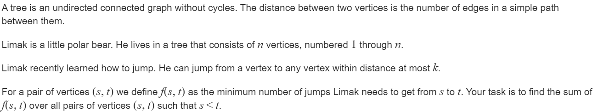

**D. Bear and Tree Jumps**
https://codeforces.com/contest/791/problem/D




#### solve

1. 首先求出总体的$\sum _{s \ne t} f_(s , t))$ 最后除2就是答案。
2. 对一个点， 记录其到其它点为 k*t + i  ， i : 0 .... k - 1的路径的总和： (这样就可以还原， 贡献 ， 避免向上整除的影响)
   1. 处理子树的点非常好处理。
   2. 处理其余的点用换根dp求即可：

**相关状态的定义：**

$f_{i , j}$ 表示子树中， 到i点路径mod  k  余j的路径的总和。

$sum_{i , j}$ , 表示子树中， 到i点路径 mod k  余j的点的总数。

$g_{i ,j }$ : 表示以i点为父亲， 某个儿子外的子树中， 到i点路径mod k 余 j 的 

$sum\__{i , j}$ 面向父亲子树， 意义同sum。

**转移方程:**

1. 综合所有子节点的贡献即可：
2. 贡献为 ： 如下代码  ， 比较复杂：

#### 生长 ： 

1. 换根dp中总是要处理兄弟节点的前缀后缀信息： 要注意掠过父亲节点， 防止其造成的影响。
2. 事实上换根dp是比较难写的 ， 但是其思路非常形式： 并不是非常灵活的dp问题；只要提出换根dp就有大概率解决。

#### code

```cpp
const int inf = 1 << 29;
const ll INF = 1LL << 60;
const int N = 2E5 + 10;

// struct chenxuming {
// 	int to;
// 	int nxt;
// } e[N << 1];
// int head[N] , tot;
// void add(int u , int v) {
// 	e[++tot].to = v;
// 	e[tot].nxt = head[u];
// 	head[u] = tot;
// }
vector<int> g[N];
int sum[N][5];
int sum_[N][5]; // record father's tree;
ll f[N][5];
ll pa[N][5]; // record father's tree;
int n, k;
ll ans;
void dfs1(int u, int fa) {
	for (auto v : g[u]) {
		if (v == fa) continue;
		dfs1(v, u);
		for (int i = 0; i < k; i++) {
			sum[u][(i + 1) % k] += sum[v][i];
			f[u][(i + 1) % k] += f[v][i] + sum[v][i];
		}

	}
	sum[u][0]++;
}
// 换根dp要注意的东西：
// 父亲更上方作为一颗子树时其有效信息。
void dfs2(int u, int fa) {
	// 首先处理自己
	for (int i = 0; i < k; i++) {
		ans += (f[u][i] + pa[fa][(i + k - 1) % k] + sum_[fa][(i + k - 1) % k] - sum[u][i] * i - sum_[fa][(i + k - 1) % k] * i + k - 1) / k + (sum_[fa][(i + k - 1) % k] + sum[u][i]) * (i != 0);
	}
	// 然后处理出父亲的情况。
	vector<array<ll, 5>> pre(sz(g[u]) + 2), sux(sz(g[u]) + 2);
	vector<array<int, 5>> presum(sz(g[u]) + 2), suxsum(sz(g[u]) + 2);
	for (int i = 1; i <= sz(g[u]); i++) {
		int v = g[u][i - 1];
		for (int j = 0; j < k; j++) {
			pre[i][j] += pre[i - 1][j];
			presum[i][j] += presum[i - 1][j];
			if (v == fa)continue;
			pre[i][j] += f[v][j];
			presum[i][j] += sum[v][j];
		}
	}
	for (int i = sz(g[u]); i >= 1; i--) {
		int v = g[u][i - 1];
		for (int j = 0; j < k; j++) {
			sux[i][j] += sux[i + 1][j];
			suxsum[i][j] += suxsum[i + 1][j];
			if (v == fa)continue;
			sux[i][j] += f[v][j];
			suxsum[i][j] += sum[v][j];
		}
	}
	for (int i = 1; i <= sz(g[u]); i++) {
		int v = g[u][i - 1]; if (v == fa)continue;
		for (int j = 0; j < k; j++) {
			pa[u][(j + 1) % k] = pre[i - 1][j] + sux[i + 1][j] + pa[fa][j] + presum[i - 1][j] + suxsum[i + 1][j] + sum_[fa][j];
			sum_[u][(j + 1) % k] = presum[i - 1][j] + suxsum[i + 1][j] + sum_[fa][j];
		}
		sum_[u][0]++;
		dfs2(v, u);
	}
}
signed main()
{
	ios::sync_with_stdio(false);
	cin.tie(0);
	cin >> n >> k;
	for (int i = 1; i < n; i++) {
		int u, v;
		cin >> u >> v;
		g[u].push_back(v);
		g[v].push_back(u);
	}
	dfs1(1, 0);
	dfs2(1, 0);
	cout << ans / 2 << "\n";
}
```