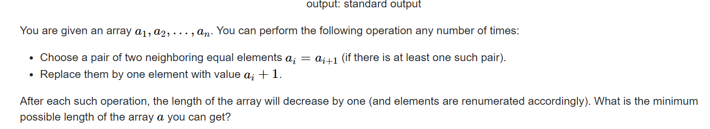

**E. Array Shrinking**
https://codeforces.com/contest/1312/problem/E




#### solve

区间动态规划：
对于一些列的操作： 都是基于一个区间内进行的： 最后的一步 可以看成是两个区间的合并。符合区间dp的特征；

**状态定义：**

$f_{l , r}$表示 l  到   r执行一系列操作后的最小长度。

$w_{l , r}$ 表示区间 l  到   r  执行一系列的操作如果为1 ， 其值的大小（显然如果能够合成一种 ， 无论何种方式  ， 最终的大小都是固定的。）

**转移方程：**
$$
if(f_{l , mid} == 1 \&\& f_{mid + 1 , r} == 1 \&\& w_{l , mid} == w_{mid + 1 , r})\\
f_{l , r} = 1 , w_{l , r} = w_l{l , mid} + 1;\\
else \\
f_{l ,r} = max(f_{l , r} , f_{l , mid} + f_{mid + 1 , r} )\\
$$
**初始化：**

特殊的处理前几项即可；

#### code

```cpp
const int  N  = 510;
int a[N] , f[N][N] , w[N][N];
signed main()
{
	ios::sync_with_stdio(false);
	cin.tie(0);
	int n;
	cin >> n;
	for (int i = 1; i <= n; i++)
		cin >> a[i];
	memset(f , 0x3f , sizeof f);
	for (int i = 1; i <= n; i++) {
		f[i][i] = 1;
		w[i][i] = a[i];
	}
	for (int len = 2; len <= n; len++)
		for (int l = 1; l + len - 1 <= n; l++) {
			int r = l + len - 1;
			for (int m = l; m < r; m++) {
				if (f[l][m] == 1 && f[m + 1][r] == 1 && w[l][m] == w[m + 1][r]) {
					f[l][r] = 1;
					w[l][r] = w[l][m] + 1;
					break;
				} else {
					f[l][r] = min(f[l][r] , f[l][m] + f[m + 1][r]);
				}
			}
		}
	cout << f[1][n] << "\n";
}
```


