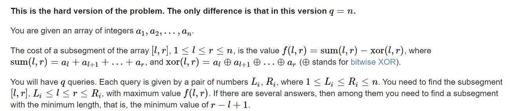

**C2. Sheikh (Hard Version)**
https://codeforces.com/contest/1732/problem/C2



#### solve

首先观察到 ， 上述函数随着区间长度增加 ， 是单调增加的。这样可以求出询问区间内的最大函数值。
对于一个询问的解决方法：：

1. 枚举前缀二分： 复杂度是$nlogn$
1. 转换问题， 去掉的首尾部， 要使得对总贡献影响为0 ， 那么异或不能使0丢失： 意味着， 选定的前后缀中， 其亦或和等于数字之和。根据容斥定理， 至多30个数字，必然有0位置冲突。直接枚举暴力即可。

#### code

```cpp
const int inf = 1 << 29;
const ll INF = 1LL << 60;
const int N = 1E6 + 10;

int a[N];

void work(int testNo)
{
	int n, q;
	cin >> n >> q;
	vector<int> pos;
	for (int i = 0; i < n; i++) {
		cin >> a[i];
		if (a[i])pos.push_back(i);
	}
	int m = sz(pos);
	vector<ll> sum(m + 1), xsum(m + 1);
	for (int i = 0; i < m; i++) {
		sum[i + 1] = sum[i] + a[pos[i]];
		xsum[i + 1] = xsum[i] ^ a[pos[i]];
	}
	while (q--) {
		int L, R;
		cin >> L >> R;
		// 然后定位pos中的内容。
		// 这样搜索到的是实际第一个边界： 在前缀数组中 ， 该值的含义 ， a[L - 1]前缀的和。
		L--;
		int u = L, v = R;
		int l = lower_bound(pos.begin(), pos.end(), L) - pos.begin();
		// 对饮 区间的右边界的第一个下标。在前缀维护的数组中它的含义 就是区间的边界值。
		int r = lower_bound(pos.begin(), pos.end(), R) - pos.begin();
		ll val = sum[r] - sum[l] - (xsum[l] ^ xsum[r]);
		if (!val) {
			v = u + 1;
		}
		for (int i = l; i <= min(r, l + 30); i++)
			for (int j = max(i + 1, r - 30); j <= r; j++) {
				if (sum[j] - sum[i] - (xsum[j] ^ xsum[i]) == val) {
					// 得到对应区间的边界；
					int l = pos[i], r = pos[j - 1] + 1;
					if (r - l < v - u) {
						u = l;
						v = r;
					}
				}

			}
		cout << u + 1 << " " << v << "\n";
	}
}
signed main()
{
	ios::sync_with_stdio(false);
	cin.tie(0);

	int t; cin >> t;
	for (int i = 1; i <= t; i++)work(i);
}
```
