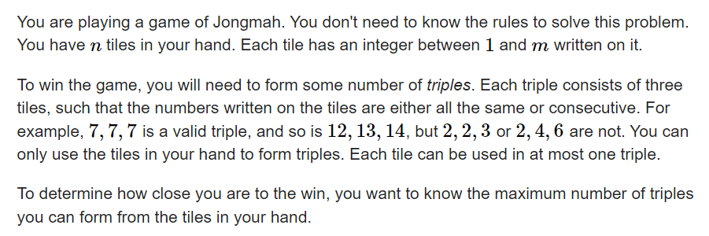

**D. Jongmah**
https://codeforces.com/contest/1110/problem/D



#### solve

1. 首先对解集做一个优化：如果解集中同时存在：

   ```
   i i + 1 i + 2
   i i + 1 i + 2
   i i + 1 i + 2
   ```

   那么可以转换为

   ```txt
   i i i 
   i + 1 i + 1 i + 1
   i + 2 i + 2 i + 2
   ```

   这样不妨对解集做一个等效变化 ， 连续的三个数字同类三元组不存在。

**状态设计：**

$f_{i , j , k}$ 表示：考虑前 i 项： 包含 j 个(i - 1 ,   i    , i + 1) , k 个 （i , i + 1 , i + 2）元组的最大元组数。

**状态转移：**

枚举小的$f_{i - 1 , j , k}$ 更新：$f_{i , k , l}$ 其中l也参与枚举。

**初始化：**

$f_{0 , 0 , 0} = 0$

#### 生长思考：

1. 解集优化， 可以减少记录的解的特征， 有利于状态的设计。

#### code

```cpp
const int N = 1E6 + 10;
int sum[N];
int f[N][3][3];
signed main()
{
	ios::sync_with_stdio(false);
	cin.tie(0);
	int n , m; cin >> n >> m;
	for (int i = 0; i < n; i++) {
		int x; cin >> x;
		sum[x] ++;
	}
	memset(f , 0x88 , sizeof f);
	f[0][0][0] = 0;
	for (int i = 1; i <= m; i++)
		for (int j = 0; j < 3; j++)
			for (int k = 0; k < 3; k++) {
				for (int l = 0; l < 3; l++) {
					if (j + k + l > sum[i])continue;
					f[i][k][l] = max(f[i][k][l] , f[i - 1][j][k] + l + (sum[i] - j - k - l) / 3);
				}
			}
	cout << f[m][0][0] << "\n";
}
```

