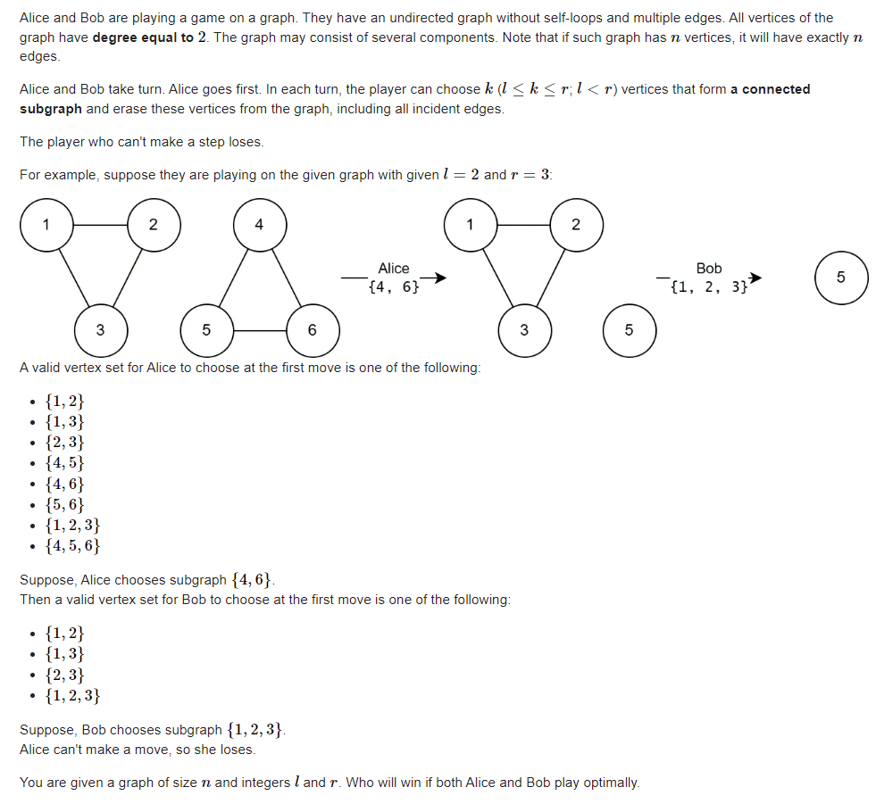

#### E. Removing Graph

https://codeforces.com/contest/1823/problem/E



#### code

嗨 ， 比赛的时候没有看出它是环， 导致以为这个图是一张普通的图。连打表都没有做出来：

1. 首先每一个节点的度数都为2.因此这个图是一个环组成的图。

**sg定义：**

$sg_i$ 长度为i的长度的sg值。

**计算sg函数：**

就是根据sg定理求即可。求出每一个环的sg值。对这些图中的所有环的sg做一个异或和。

#### 打表结果如下：

```txt
l : r :3 4
1       0
2       0
3       1
4       1
5       1
6       2
7       0
8       0


l : r :2 8
1       0
2       1
3       1
4       2
5       2
6       3
7       3
8       4
9       4
10      0
11      0


l : r :5 10
1       0
2       0
3       0
4       0
5       1
6       1
7       1
8       1
9       1
10      2
11      2
12      2
13      2
14      2
15      0
16      0
17      0
18      0
19      0

```

#### code

```cpp
#include<bits/stdc++.h>
using namespace std;

using ll = long long;
using i64 = long long;
using ull = unsigned long long;
using ld = long double;
using uint = unsigned int;
using pii = pair<int , int>;
using pli = pair<ll , int>;
using pll = pair<ll , ll>;


#define dbg(x) cerr << "[" << __LINE__ << "]" << ": " << x << "\n"

#define all(x) (x).begin(),(x).end()
#define sz(x) (int)(x).size()
#define pb push_back
#define fi first
#define se second

const int inf = 1 << 29;
const ll INF = 1LL << 60;
const int N = 1E6 + 10;
struct DSU {
	std::vector<int> f, siz;

	DSU() {}
	DSU(int n) {
		init(n);
	}

	void init(int n) {
		f.resize(n);
		std::iota(f.begin(), f.end(), 0);
		siz.assign(n, 1);
	}

	int find(int x) {
		while (x != f[x]) {
			x = f[x] = f[f[x]];
		}
		return x;
	}

	bool same(int x, int y) {
		return find(x) == find(y);
	}

	bool merge(int x, int y) {
		x = find(x);
		y = find(y);
		if (x == y) {
			return false;
		}
		siz[x] += siz[y];
		f[y] = x;
		return true;
	}

	int size(int x) {
		return siz[find(x)];
	}
};
DSU dsu;

int sg[N];
int l = 3 , r = 4;
int calsg(int x) {
	if (sg[x] != -1) return sg[x];
	//然后变成了链式的情况。
	if (x < l) return sg[x] = 0;
	//然后两个一起用。
	sg[x] = 0;
	set<int> rec;
	for (int i = l; i <= r; i++) {
		for (int j = 0; j + i <= x; j++) {
			rec.insert(calsg(j)^calsg(x - i - j));
		}
	}
	while (rec.count(sg[x]))sg[x]++;
	return sg[x];
}
void solve() {
	cin >> l >> r;
	memset(sg , -1 , sizeof sg);
	cout << "l : r :" << l << " " << r << "\n";
	for (int i = 1; i <= 500; i++) {
		int ans = 0;
		set<int> rec;
		for (int j = l; j <= min(i , r); j++) {
			rec.insert(calsg(i - j));
		}
		while (rec.count(ans)) ans++;
		cout << i  << "\t" <<  ans << "\n";
	}
}

signed main()
{
	ios::sync_with_stdio(false);
	cin.tie(0);
	// solve();
	int n , l , r;
	cin >> n >> l >> r;
	dsu.init(n);
	for (int i = 0; i < n; i++) {
		int u , v;
		cin >> u >> v;
		u-- , v--;
		dsu.merge(u , v);
	}
	int res = 0;
	for (int i = 0; i < n; i++) {
		if (dsu.find(i) == i) {
			int cunt = dsu.size(i);
			res ^= cunt < l || cunt >= l + r ? 0 : cunt / l;
		}
	}
	if (res) cout << "Alice\n";
	else cout << "Bob\n";
}
/* stuff you should look for
* int overflow, array bounds
* special cases (n=1?)
* do smth instead of nothing and stay organized
* WRITE STUFF DOWN
* DON'T GET STUCK ON ONE APPROACH
*/
```

