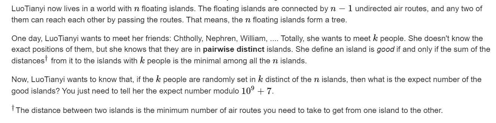

**D2. LuoTianyi and the Floating Islands (Hard Version)**
https://codeforces.com/contest/1825/problem/D2




#### solve

切入角度：

1. 考虑每一个点在所有方案中作为好点的贡献次数：

发现一些现象 ： 

1.  当k为奇数时 ， 对于任意方案 ， 好点的个数有且仅有一个。

   1. 该问题的证明 ： 假设有一个好点， 那么其对于所有点的距离和最小， 假设其向一条边挪动 ， 必然是某一些数目的点与该点的距离＋1 ， 某一些数目的点与该点的距离减少1。距离增加的点必然比距离减少的点更好， 否则矛盾。递推可以证明除非返回原点， 否则距离将不变或者减少。（以某条边为分界线。）
   2. 此时好点的贡献之和 ， 等于方案总数。于是最终的期望大小为1。

2. 当k为偶数时 , 统计方案是 ， 枚举一个点， 枚举其作为好点的方案数， 以一条边为分界： 好点分布与两条边内外划分出的两个子图。该点贡献为： 
   $$
   sum = (_{size_u}^{k/2})*(_{n - size_u}^{k/2})
   $$

#### 生长思考

1. 期望贡献的统计策略：
   1. 现象： 点在方案中的出现次数 ， 产生贡献。于是可以从点的角度出发来枚举一个点， 整体上的贡献情况。

#### code

```cpp
#include<bits/stdc++.h>
using namespace std;
using ll = long long;
using i64 = long long;
using ull = unsigned long long;
using ld = long double;
using uint = unsigned int;
using pii = pair<int, int>;
using pli = pair<ll, int>;
using pll = pair<ll, ll>;
#define dbg(x) cerr << "[" << __LINE__ << "]" << ": " << x << "\n"
#define all(x) (x).begin(),(x).end()
// #define sz(x) (int)(x).size()
#define pb push_back
#define fi first
#define se second
const int mod = 1E9 + 7;
const int inf = 1 << 29;
const ll INF = 1LL << 60;
const int N = 1E6 + 10;
const int N_c = 2E5 + 10;
int fac[N_c], infac[N_c];
ll quickly_pow(ll x, ll n, ll p)
{
	ll res = 1;
	while (n > 0)
	{
		if (n & 1)res = res * x % p;
		x = x * x % p;
		n >>= 1;
	}
	return res;
}
void init() {
	fac[0] = infac[0] = 1;
	for (int i = 1; i < N_c; i++)
	{
		fac[i] = 1LL * fac[i - 1] * i % mod;
		infac[i] = 1LL * infac[i - 1] * quickly_pow(i, mod - 2, mod) % mod;
	}
}
ll c(int a, int b) {
	if (a  == 0 || a < b) return 0 ;
	return 1LL * fac[a] * infac[b] % mod * infac[a - b] % mod;
}
/*
*记得初始化。
*/
int  n, k;
vector<int> g[N];
ll ans = 0;
int sz[N];
void dfs(int u, int fa) {
	sz[u] = 1;
	for (auto v : g[u]) {
		if (v != fa) {
			dfs(v, u);
			sz[u] += sz[v];
		}
	}
}
signed main()
{
	ios::sync_with_stdio(false);
	cin.tie(0);
	cin >> n >> k;
	init();
	for (int i = 1; i < n; i++) {
		int u, v;
		cin >> u >> v;
		g[u].push_back(v);
		g[v].push_back(u);
	}
	dfs(1, 0);
	if (k % 2 == 1) {
		cout << 1 << "\n";
		return 0;
	} else {
		for (int i = 2; i <= n; i++) {
			ans += 1LL * c(sz[i] , k / 2) * c(n - sz[i] , k / 2);
			ans %= mod;
		}
		ans *= quickly_pow(c(n , k ) , mod - 2 , mod) ;
		ans = (ans + 1 ) % mod;
	}
	cout << ans << "\n";
}
```
