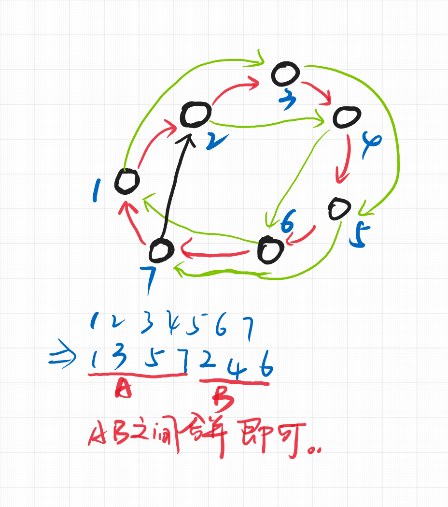

# E. Square Root of Permutation

[Problem - 612E - Codeforces](https://codeforces.com/problemset/problem/612/E)

# Square Root of Permutation

## 题面翻译

给定一个$n$的排列$p_i$，求一个排列$q_i$，使得对于任意$1\leq i\leq n$，$q_{q_i}=p_i$。无解输出$-1$。

$1\leq n\leq10^6$。

## 题目描述
A permutation of length $ n $ is an array containing each integer from $ 1 $ to $ n $ exactly once. For example, $ q=[4,5,1,2,3] $ is a permutation. For the permutation $ q $ the square of permutation is the permutation $ p $ that $ p[i]=q[q[i]] $ for each $ i=1...\ n $ . For example, the square of $ q=[4,5,1,2,3] $ is $ p=q^{2}=[2,3,4,5,1] $ .
This problem is about the inverse operation: given the permutation $ p $ you task is to find such permutation $ q $ that $ q^{2}=p $ . If there are several such $ q $ find any of them.
## 输入格式
The first line contains integer $ n $ ( $ 1<=n<=10^{6} $ ) — the number of elements in permutation $ p $ .
The second line contains $ n $ distinct integers $ p_{1},p_{2},...,p_{n} $ ( $ 1<=p_{i}<=n $ ) — the elements of permutation $ p $ .
## 输出格式
If there is no permutation $ q $ such that $ q^{2}=p $ print the number "-1".
If the answer exists print it. The only line should contain $ n $ different integers $ q_{i} $ ( $ 1<=q_{i}<=n $ ) — the elements of the permutation $ q $ . If there are several solutions print any of them.
```
4 5 1 2 3
```
## solve
将问题转换成一个图上的问题： 具体的建模方式如下： $i -> a_i$

正向考虑， 如果一个排列进行置换。置换后的图，依然进行上述的抽象将会转变成如下形式：

即隔开指向。
考虑这样一个过程求逆运算：
当前图可以按照上述的方式分成若干的奇数偶数环。根据其奇偶性，分别进行一些处理。

**对于奇数环：**

1. 发现奇数环可能是由一个大偶数环分裂而来，也有可能是一个奇数环内部处理。发现大偶数环分裂可行的情况下，内部处理也总是可行的。 奇数环内部处理，肯定有一种方式。
**对于偶数环：**
偶数环必定是由两个奇数环分裂而来的。等大小的环数量必须相等，否则将无解。
==如果上述的条件都得到了满足，具体的构造方式如下：==
**奇数环：**

**偶数环：**

即将两个等大的偶数环错开合并即可。
### code

```cpp
#include<bits/stdc++.h>
using namespace std;
using ll = long long;

#define all(x) (x).begin(),(x).end()
#define sz(x) (int)(x).size()

const int inf = 1E9 + 7;;
const ll INF = 1E18 + 7;
const int N = 1E6 + 10;

int a[N];
bool vis[N];

vector<vector<int>> cycle[N];

signed main()
{
	ios::sync_with_stdio(false);
	cin.tie(0);
	int n; cin >> n;
	for (int i = 1; i <= n; i++) {
		cin >> a[i];
	}
	for (int i = 1; i <= n; i++) {
		if (vis[i]) continue;
		int u = i;
		vector<int> temp;
		while (!vis[u]) {
			vis[u] = true;
			temp.push_back(u);
			u = a[u];
		}
		cycle[sz(temp)].push_back(temp);
	}
	vector<int> ans(n + 1);
	for (int i = 1; i <= n; i++) {
		if (cycle[i].empty()) continue;
		// cerr << i << " \t" << cycle[i].size() << "\n";
		if (i & 1) {
			for (auto cur : cycle[i]) {
				vector<int> b;
				for (int j = 0; j < i / 2; j++) {
					b.push_back(cur[j]);
					b.push_back(cur[i / 2 + j + 1]);
				}
				b.push_back(cur[i / 2]);
				for (int j = 0; j < sz(b); j++) {
					ans[b[j]] = b[(j + 1) % sz(b)];
				}
			}
		} else {
			if (sz(cycle[i]) % 2) {
				cout << -1 << "\n";
				return 0;
			}
			for (int j = 0; j < sz(cycle[i]); j += 2) {
				vector<int> b;
				auto L = cycle[i][j] , R = cycle[i][j + 1];
				for (int k = 0; k < i; k++) {
					b.push_back(L[k]);
					b.push_back(R[k]);
				}
				for (int k = 0; k < sz(b); k++) {
					ans[b[k]] = b[(k + 1) % sz(b)];
				}
			}
		}
	}
	for (int i = 1; i <= n; i++) {
		cout << ans[i] << " \n"[i == n];
	}

	return 0;
}
```


