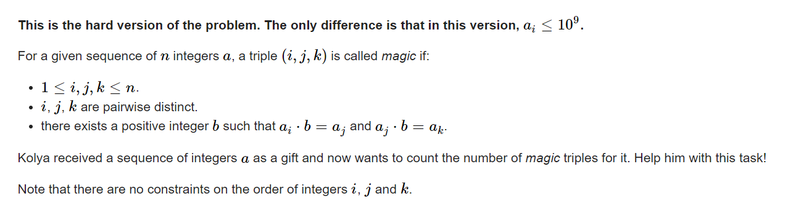

**G2. Magic Triples (Hard Version)**

https://codeforces.com/contest/1822/problem/G2



#### solve

1. 首先这里有一些统计贡献的技巧：

   1. 对于相同值的特殊贡献处理。
      1. $x\times (x - 1)\times (x - 2)$


   2. 一般贡献的处理：

      1. 枚举中间值。

      2. ==枚举b的大小。==
         1. 因数枚举法： 适合1E6以内的数字。最大花费为$\sqrt {10^6}$
         2. 相关数字的上界；因为x*b <= 1E9； 所以只需要枚举1E3即可。
      3. 综上使用值域分块处理的思想： 总复杂度为$n\times \sqrt{1E9}$

#### code

```cpp
#include<bits/stdc++.h>
using namespace std;

using ll = long long;

#define dbg(x) cerr << "[" << __LINE__ << "]" << ": " << x << "\n"

#define all(x) (x).begin(),(x).end()
#define sz(x) (int)(x).size()
#define pb push_back
#define fi first
#define se second

const int inf = 1 << 29;
const ll INF = 1LL << 60;
const int N = 1E6 + 10;
//配合完成分治策略。
const int s = 1E6;

vector<int> get_c(ll x) {
	vector<int> res;
	for (int i = 1; i * i <= x; i++) {
		if (x % i == 0) {
			res.push_back(i);
			if (x != i * i) {
				res.push_back(x / i);
			}
		}
	}
	return res;
}
ll f(ll x) {
	return x * (x - 1) * (x - 2);
}

void work(int testNo)
{
	int n;
	cin >> n;
	map<int , int> mp;
	for (int i = 1; i <= n; i++) {
		int x; cin >> x;
		mp[x] += 1;
	}
	const int mx = 1E9;
	ll res = 0;
	for (auto& [x , y] : mp) {
		// dbg(x);
		// dbg(y);
		res += f(y);
		if (x >= s) {
			for (int i = 2; 1LL * i * x <= mx; i++) {
				if (x % i == 0 && mp.count(x / i) && mp.count(i * x))
					res += 1LL * y * mp[x / i] * mp[x * i];
			}
		} else {
			vector<int> c = get_c(x);
			sort(c.begin() , c.end());
			for (auto b : c) {
				if (b == 1)continue;
				if (1LL * b * x > mx)break;
				if (mp.count(x / b) && mp.count(x * b))
					res += 1LL * y * mp[x / b] * mp[x * b];
			}
		}
	}
	cout << res << "\n";
}

signed main()
{
	ios::sync_with_stdio(false);
	cin.tie(0);

	int t; cin >> t;
	for (int i = 1; i <= t; i++)work(i);
}

/* stuff you should look for
* int overflow, array bounds
* special cases (n=1?)
* do smth instead of nothing and stay organized
* WRITE STUFF DOWN
* DON'T GET STUCK ON ONE APPROACH
*/
```

