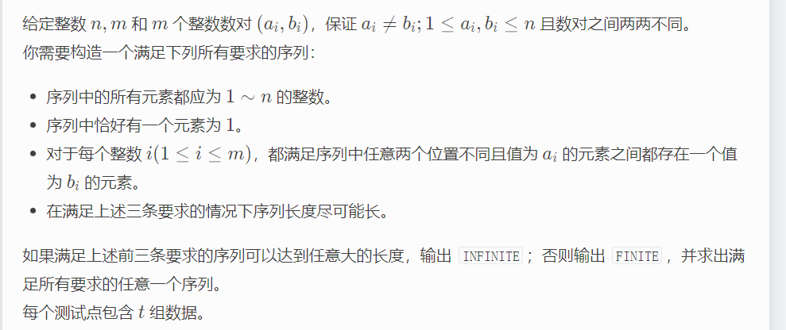
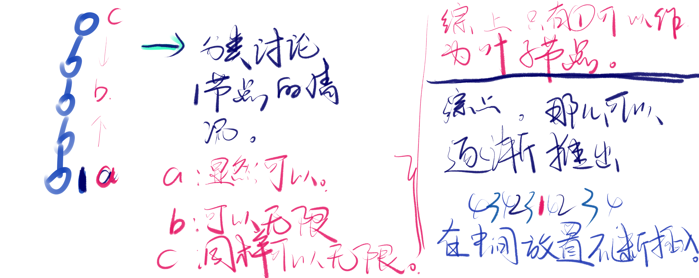

**E. Between**
https://codeforces.com/contest/1816/problem/E



#### solve

从能做的事情开始：

1. 什么时候无限长？
   1. 如果涉及的限制元素$a_i$没有覆盖所有元素 。那么无限长。
   2. 抽象出一种有向图。

众多情况分类讨论如下：



**就当上面随手画画图即可：**

总结出以下规律：

1. 每一个元素都有个数限制。这意味着众多的约束中。它指向了一个明确数量的数字。可以追溯到1

   1. 建立一个图来看。 b->a。那么从1bfs出发。可以到达所有数字。

2. 对于每一个点的数量。就是到达1的最短路。大小加1。记录为$s_i = d_i + 1$

3. 得到上述的信息之后怎么摆放这些元素呢？

   1. 有规律的摆放。
      1. 将所有点按照拓扑序摆放。
      2. 记录每一个点的最短路。表示其可以重复多少次。
   2. 不断按照上述序列放置。该过程中， 不断地剔除掉一些元素数字。
      1. 保证每一个数字都出现了最大可行次数。
      2. 保证了该夹的都夹上去了。
-------
#### code
```cpp
#include<bits/stdc++.h>
using namespace std;
typedef long long ll;

const int inf = 0x3f3f3f3f;
const int N = 1700;

void work(int testNo)
{
    int n , m;
    cin >> n >> m;
    vector<vector<int>> g(n);
    vector<int>d(n , 0);
    for (int i = 0; i < m; i++) {
        int u , v;
        cin >> u >> v;
        u--; v--;
        g[v].push_back(u);
    }
    vector<int> ans;
    auto bfs = [&]() {
        queue<int> que;
        vector<bool> vis(n , false);
        que.push(0);
        d[0] = 1;
        vis[0] = true;
        while (que.size()) {
            int u = que.front(); que.pop();
            for (auto v : g[u]) {
                if (vis[v])continue;
                d[v] = d[u] + 1;
                vis[v] = true;
                que.push(v);
            }
        }
    };
    bfs();
    vector<int>id(n);
    iota(id.begin() , id.end() , 0);
    sort(id.begin() , id.end() , [&](int x , int y) {
        return d[x] > d[y];
    });
    int sum = 0;
    for (int i = 0; i < n; i++) {
        if (d[i] == 0) {
            cout << "INFINITE\n";
            return;
        }
        sum += d[i];
    }
    cout << "FINITE\n";
    cout << sum << "\n";
    for (int i = 1; i <= d[id[0]]; i++) {
        for (auto j : id) {
            if (d[j] < i)break;
            cout << j + 1 << " ";
        }
    }
    cout << "\n";
}


int main()
{
    ios::sync_with_stdio(false);
    cin.tie(0);

    int t; cin >> t;
    for (int i = 1; i <= t; i++)work(i);
}

/* stuff you should look for
* int overflow, array bounds
* special cases (n=1?)
* do smth instead of nothing and stay organized
* WRITE STUFF DOWN
* DON'T GET STUCK ON ONE APPROACH
*/
```

