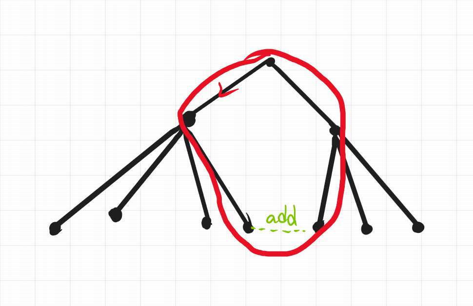

# E. Minimum spanning tree for each edge[Problem - E - Codeforces](https://codeforces.com/contest/609/problem/E)

给出了没有自循环和多条边的连接无向加权图。
对于每条边 (*u*, *v*)，求包含边 (*u*, *v*) 的生成树的最小权重。
生成树的权重是生成树中所有边的权重之和。

### solve

**1. 关注整体没有限制情况下的最小生成树：**
考虑没有必选限制下的最小生成树：该生成树定义为A。
**2.整体上的最小生成树，和边限制下的最小生成树之间有什么关系？**
考虑某条边必选限制下的最小生成树： 该生成树定义为B。

关注kruskal的思想：同时我们将限制边上的两个点合并。于是就递归成了一个kruskal问题：
然后基于当前抽象出来的图，进行一个kruskal的过程： 



容易发现，新的生成树，就是在当前环上重新断掉一条最长的边。而环之外的结构是不变的。

证明如下：

1. 环之外的边结构不变：
   1. 假如环外边结构发生改变。那么至少有新的边加入了该生成树。并且这条边的大小排位是在n之后的。将原来的边重新加入，不断替换，结果总是最优秀。
2. 由1同时可以推出，要尽量保持原来的边结构。因此最终只会删掉一条原来的边，形成的环被破坏掉。显然就是环上除了add外的最短边。

**具体实现方法：**

1. 首先构建出最短生成树。

于是就转变成了树上经典的两点路径之间最长边的查询问题：


### code

```cpp
#pragma GCC optimize(2)

#include<bits/stdc++.h>
using namespace std;
using ll = long long;

#define all(x) (x).begin(),(x).end()
#define sz(x) (int)(x).size()

const int inf = 1E9 + 7;;
const ll INF = 1E18 + 7;
const int N = 2E5 + 10;

int n , m;

vector <pair<int, int>> tree[N];
bool intree[N];
int father[N];
int find(int x) {
    return father[x] = ((father[x] == x) ? x : find(father[x]));
}
void merge(int x , int y) {
    x = find(x);
    y = find(y);
    father[x] = y;
}
bool same(int x , int y) {
    x = find(x);
    y = find(y);
    return x == y;
}
void init() {
    for (int i = 1; i <= n; i++)
        father[i] = i;
}

const int LOGN = 18;
int dep[N], par[LOGN + 1][N], val[LOGN + 1][N];
vector<pair<int, int>> e[N];

void dfs(int u, int f) {
    dep[u] = dep[f] + 1;
    for (auto p : tree[u]) {
        int v = p.first;
        if (v == f) continue;
        par[0][v] = u;
        val[0][v] = p.second;
        dfs(v, u);
    }
}
int query(int u, int v) {
    int ans = 0;
    if (dep[u] > dep[v]) swap(u, v);
    int d = dep[v] - dep[u];
    for (int j = LOGN; j >= 0; j--) if (d & (1 << j)) {
            ans = max(ans, val[j][v]);
            v = par[j][v];
        }
    if (u == v) return ans;
    for (int j = LOGN; j >= 0; j--) if (par[j][u] != par[j][v]) {
            ans = max(ans, max(val[j][u], val[j][v]));
            u = par[j][u];
            v = par[j][v];
        }
    ans = max(ans, max(val[0][u], val[0][v]));
    return ans;
}

signed main()
{
    ios::sync_with_stdio(false);
    cin.tie(0) , cout.tie(0);
    cin >> n >> m;
    vector<array<int , 3>> edge;
    auto cmp =  [&](int x , int y) {
        return edge[x][0] < edge[y][0];
    };
    for (int i = 0; i < m; i++) {
        int u , v , w;
        cin >> u >> v >> w;
        edge.push_back({w , u , v});
    }

    vector<int> id(m);
    iota(all(id) , 0);
    sort(all(id) , cmp);
    ll sum = 0;
    init();
    for (int i = 0; i < m; i++) {
        auto [w , u , v] = edge[id[i]];
        if (same(u , v)) continue;
        intree[id[i]] = true;
        merge(u , v);
        sum += w;
        tree[u].push_back({v , w});
        tree[v].push_back({u , w});
    }
    // 然后就是求公共祖先了：
    dfs(1, 0);
    for (int j = 1; j <= LOGN; j++) {
        for (int u = 1; u <= n; u++) {
            par[j][u] = par[j - 1][par[j - 1][u]];
            val[j][u] = max(val[j - 1][u], val[j - 1][par[j - 1][u]]);
        }
    }
    for (int i = 0; i < m; i++) {
        if (intree[i]) {
            cout << sum << "\n";
            continue;
        }
        auto [w , u , v] = edge[i];
        cout << sum - query(u , v) + w << "\n";
    }
}
/* stuff you should look for
* int overflow, array bounds
* special cases (n=1?)
* do smth instead of nothing and stay organized
* WRITE STUFF DOWN
* DON'T GET STUCK ON ONE APPROACH
*/
```


