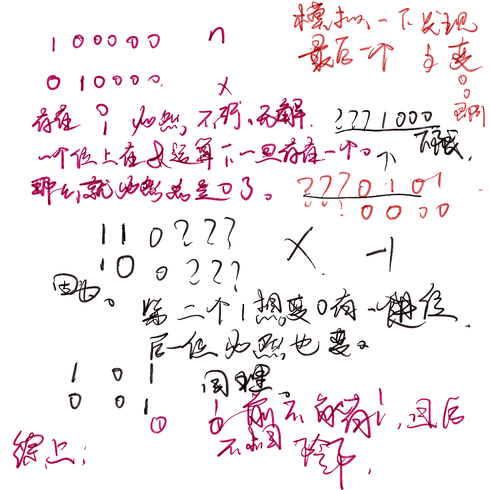

https://codeforces.com/contest/1775/problem/C

给定n,x;

运算(n)&(n+1)&(n+2)....&(m)=x；

找出最小m。否则输出-1.




##### 生长思考

- 连续变化数字的位运算。掌握连续变化的位置上比特的数量。来推导出比特位的数量情况。


#### 重点wa

傻了的点。小心溢出。移位运算中，最终结果类型，取决于被移位对象的类型。

1LL << 60

```cpp
#include<bits/stdc++.h>
using namespace std;
typedef long long ll;
typedef unsigned long long ull;


const int oo = 0x0fffffff;
const int N = 1E6 + 10;

void work(int testNo)
{
	ull n, x;
	cin >> n >> x;
	ull temp = 0;
	int pos10 = -1;
	bool has11 = false;
	int pre = -2;
	for (int i = 0; i <= 62; i++) {
		if (((n >> i) & 1) == 1 && ((x >> i) & 1) == 1) {
			has11 = true;;
			if (pre == i - 1) {
				cout << "-1\n";
				return;
			}
			temp += (1ULL << i);//保留什么？
		}
		else if (((n >> i) & 1) == 1 && ((x >> i) & 1) == 0) {
			if (has11) {
				cout << -1 << '\n';
				return;
			}
			pos10 = i;
			pre = i;
		}
		else if (((n >> i) & 1) == 0 && ((x >> i) & 1) == 1) {
			cout << -1 << '\n';
			return;
			//pos10 = i;
		}
	}
	//cout << testNo << ": " << pos10 << ' ' << temp  << '\n';
	if (pos10 == -1) {
		cout <<  n << '\n';
	}
	else {
		cout << temp + (1ULL << (pos10 + 1)) << '\n';
	}
}

int cunt;
void print(ull x) {
	if (x == 0)return;
	print(x / 2);
	cunt++;
	cout << x % 2;
}


int main() {
	ios::sync_with_stdio(false);
	cin.tie(0);
	// print(1000000000000000000);
	// cout << '\n' << cunt << '\n';
	int t; cin >> t;
	for (int i = 1; i <= t; i++)work(i);
}

/* stuff you should look for
* int overflow, array bounds
* special cases (n=1?)
* do smth instead of nothing and stay organized
* WRITE STUFF DOWN
* DON'T GET STUCK ON ONE APPROACH
*/
```


#### 生长

小心溢出！！。

不仅仅是一般的整数加减乘除的溢出。也是这里边的移位运算的溢出。

