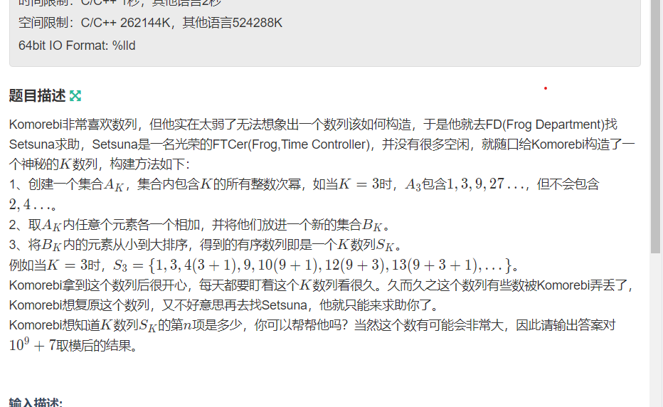

**Setsuna的K数列**

[D-Setsuna的K数列_2022年中国高校计算机大赛-团队程序设计天梯赛（GPLT）上海理工大学校内选拔赛 (nowcoder.com)](https://ac.nowcoder.com/acm/contest/30532/D)



#### solve

观察出一些现象，

1. 假定一个具体的值 $k^a$,对于$k^{0....a-1}$无论如何组合，都小于当前的数。
2. 类比二进制串：

然后找到一个严格的偏序关系。其实第 n大，各种数字的选择组合情况，就是n所表示的二进制的1上的情况。

#### code

```cpp
#include<bits/stdc++.h>
using namespace std;
using ll = long long;

const int N = 1E6 + 10;
const int mod = 1E9 + 7;

int main()
{
	ios::sync_with_stdio(false);
	cin.tie(0);

	int n , k; cin >> n >> k;
	ll  now = 1;
	ll ans = 0;
	while (n) {
		if (n % 2) {ans = (ans + now) % mod;}
		n /= 2;
		now = now * k % mod;
	}
	cout << ans << '\n';
}
```

