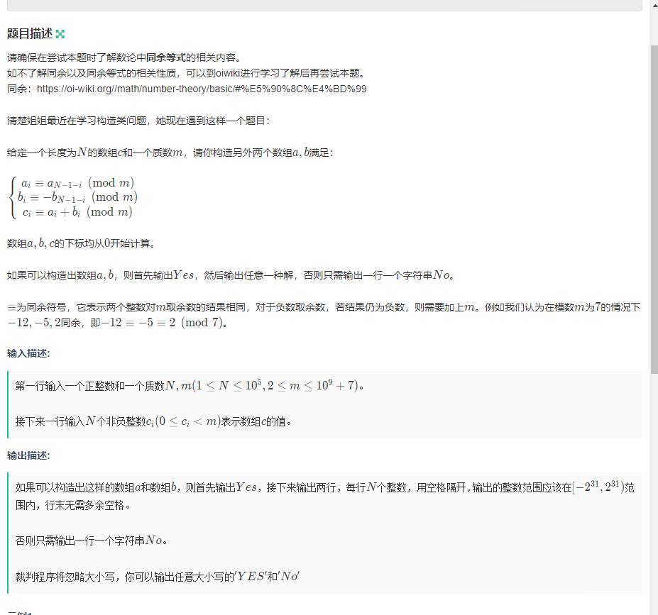

[B-清楚姐姐学构造_2023牛客寒假算法基础集训营4 (nowcoder.com)](https://ac.nowcoder.com/acm/contest/46812/B)




#### solve

首先是根据同余的性质，以及逆元尝试解出$a_i,b_i$

根据关系：
$$
a_i\equiv a_{N-1-i}(mod \quad p)
$$

$$
a_i + b_i \equiv c_i(mod \quad p)
$$

$$
b_i \equiv b_{N-1-i}(mod\quad p)
$$

$$
由(1)+(3)\\
a_i+b_i\equiv a_{N-1-i}+b_{N-1-i}(mod \quad p)\\
$$

$$
由(3)(4)\\
c_i \equiv a_{N-1-i}+b_{N-1-i}(mod\quad p)
$$

$$
同理可以推出\\
c_{N-1-i}\equiv a_{i}+b_i(mod \quad p)
$$

$$
由(5)+(6)\\
c_i + c_{N-1-i}\equiv a_i+a_{N-1-i}+b_i+b_{N-1-i}(mod\quad p)
$$

$$
由(1)(2)(7)\\
c_i + c_{N-1-i}\equiv 2\times a_i\\
a_i = (c_i+c_{N-1-i})\times inv(2)
$$


$$
同理由(5)-(6)容易推出\\
b_i \equiv(c_i-c_{N-1-i})\times inv(2)
$$
 综合

注意上述(8),(9)的前提是逆元存在。a与m互质。

该问题中求逆元的对象一直是2.

当m等于2时，2不存在逆元。所以不可以通过上述（8），（9）计算；

但是2的情况可以暴力。

可以将它们投射到小的域 0 ，1

所以不过只有几个组合.直接构造即可。

a：$c[i]$

b:  0 

该情况下：

如果$c[i]!=c[N-1-i]$

对于2而言，显然无解。

因为$a$拿走一些。剩下的b依然是不同模。

一个1 ，一个0.不符合题意。

唯有两个都是0.

反过来。两个b%mod只能等于1或者等于0.

即两个余数相等。

##### code

##### 实现：逆元怎么求？

由于是素数。所以这里使用快速幂的方法求逆元。
$$
a\times x \equiv 1 (mod \quad p)\\
a^{p-1}\equiv1(mod \quad p)
$$
前提是p是质数。


```cpp
#include<bits/stdc++.h>
using namespace std;
using ll = long long;

const int N = 1E6 + 10;


ll n , mod;
ll c[N];
ll a[N] , b[N];
bool ans ;
//求逆元程序。
ll qpow( ll x , ll n , ll p = mod)
{
    ll res = 1;
    while (n > 0) {
        if (n & 1) res = res * x % p;
        x = x * x % mod;
        n >>= 1;
    }
    return res;
}

ll inv(ll x , ll p = mod)
{
    // cout  << mod << '\n';
    return qpow( x , p - 2);
}
/*
* 1. mod定义
* 2. 使用前提：p是质数，且x，p互质。
*/
void solve2()
{
    for (int i = 0; i < (n + 1) / 2; i++)
        if (c[i] != c[n - 1 - i])ans = true;
        else a[i] =  a[n - 1 - i ] =  c[i] , b[i] = b[n - 1 - i] = 0;
}

void solve1()
{
    ll inv2 =  inv(2);
    //cout << inv2 << '\n';
    for (int i = 0; i < (n + 1) / 2; i++)
    {
        a[i] = a[n - i - 1] = (c[i] + c[n - 1 - i]) * inv2 % mod;
        b[i] = (c[i] - c[n - 1 - i] + mod) * inv2 % mod;
        b[n - 1 - i] = (mod - b[i] + mod) % mod;
    }
}

int main()
{
    ios::sync_with_stdio(false);
    cin.tie(0);
    cin >> n >> mod;

    for (int i = 0; i < n; i ++ )
    {
        cin >> c[i];
    }
    if (mod == 2)solve2();
    else solve1();
    if (ans)cout << "No\n";
    else {
        cout << "Yes\n";
        for (int i = 0; i < n; i++) cout << a[i] << " \n"[i == n - 1];
        for (int i = 0; i < n; i++) cout << b[i] << " \n"[i == n - 1];
    }
}

/* stuff you should look for
* int overflow, array bounds
* special cases (n=1?)
* do smth instead of nothing and stay organized
* WRITE STUFF DOWN
* DON'T GET STUCK ON ONE APPROACH
*/
```


