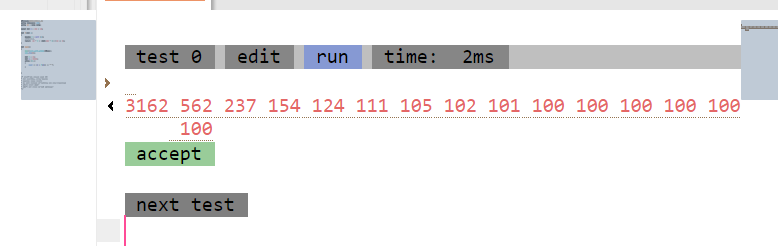
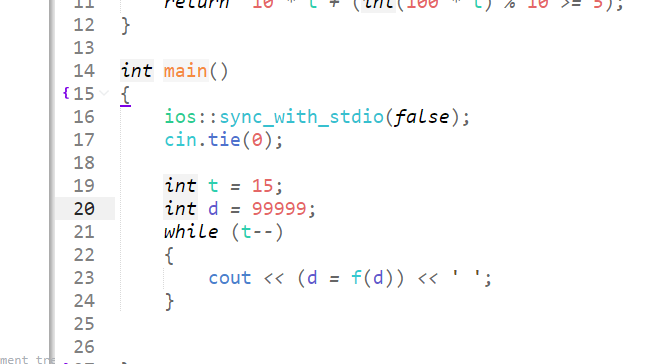

https://ac.nowcoder.com/acm/contest/46800/G





用这一些代码来测一测，发现存在一些规律数字都会达到一个循环。最后进行操作时候就会不再变化。


比如说 100  0  99 等等；

于是于是区间就容易维护了

似乎有三很多种数据结构维护多种情形。set ， 线段树 ， 并查集等等。
每一次操作中，快速的定位哪一些区间是否已经到达问稳定状态。


#### 用set来维护。

用set维护一段依然处于未稳定状态的集合。查询一个区间时用lower_bound.快速定位进行处理。

可以保证每一个数字其实只要经过20次以内处理就可以来到稳定的状态。

查询的花费为log。可行。

##### code

```cpp
#include<bits/stdc++.h>
using namespace std;
using ll = long long;

const int N = 1E5 + 10;

int a[N];
set <int>rec;
ll sum = 0;


int f(int x)
{
	double t = sqrt (x);
	//四舍五入。
	return  10 * t + (int(100 * t) % 10 >= 5);
}

int main()
{
	ios::sync_with_stdio(false);
	cin.tie(0);

	int n , m;
	cin >> n >> m;

	for (int i = 1; i <= n; i++) {cin >> a[i]; sum += a[i]; rec.emplace(i);}

	for (int i = 1; i <= m; i++)
	{
		int ty;
		cin >> ty;
		if (ty == 1)
		{
			int l , r , k;
			cin >> l >> r >> k;
			auto it = rec.lower_bound(l);
			while (it != rec.end() && *it <= r)
			{
				sum -= a[*it];
				for (int j = 1; j <= k && a[*it] != f(a[*it]); j++)
				{
					a[*it] = f(a[*it]);
				}
				sum += a[*it];
				if (a[*it] == f(a[*it]))rec.erase(it++);
				else it++;
			}
		}
		else cout << sum << '\n';
	}
}


/* stuff you should look for
* int overflow, array bounds
* special cases (n=1?)
* do smth instead of nothing and stay organized
* WRITE STUFF DOWN
* DON'T GET STUCK ON ONE APPROACH
*/
```

#### 并查集维护

维护一大块已经达到稳定状态的区间。如果当前的区间已经达到稳定状态。

就和前后的区间并在一起，同时注意保存集合的祖先为最右区间方便快速定位。

```cpp
#include<bits/stdc++.h>
using namespace std;
using ll = long long;

const int N = 1E5 + 10;

int a[N];
int n, m;
ll sum = 0;

int fa[N];
bool flag[N];//说明当前是否为稳定态。

void init()
{
	iota(fa, fa + 1 + n, 0);
}

int find(int x)
{
	return fa[x] = (fa[x] == x ? x : find(fa[x]));
}

void merge(int x, int y)
{
	x = find(x);
	y = find(y);
	if (x > y)swap(x, y);
	fa[x] = y;
}

int f(int x)
{
	double t = sqrt(x);
	//四舍五入。
	return  10 * t + (int(100 * t) % 10 >= 5);
}


int main()
{
	ios::sync_with_stdio(false);
	cin.tie(0);


	cin >> n >> m;
	init();

	for (int i = 1; i <= n; i++) { cin >> a[i]; sum += a[i]; }

	for (int i = 1; i <= m; i++)
	{
		int ty;
		cin >> ty;
		if (ty == 1)
		{
			int l, r, k;
			cin >> l >> r >> k;
			int now = l;
			while (now <= r)
			{
				if (flag[now])
				{
					if (flag[now - 1])merge(now, now - 1);
					if (flag[now + 1])merge(now, now + 1);
					now = fa[now] + 1;
				}
				//如果不是就行行处理
				else
				{
					for (int j = 1; j <= k && f(a[now]) != a[now]; j++)
					{
						sum -= a[now];
						a[now] = f(a[now]);
						sum += a[now];
					}
					if (f(a[now]) == a[now])
						flag[now] = true;
					else now++;
				}
			}

		}
		else cout << sum << '\n';
	}
}


/* stuff you should look for
* int overflow, array bounds
* special cases (n=1?)
* do smth instead of nothing and stay organized
* WRITE STUFF DOWN
* DON'T GET STUCK ON ONE APPROACH
*/
```


#### 线段树维护

线段树维护在此问题的情境下.

```cpp
#include<bits/stdc++.h>
using namespace std;
using ll = long long;

const int N = 1E5 + 10;

int a[N];
ll c[N << 2];		//记录和。
bool f[N << 2];	//记录稳定标记。

int n, m, k;
int g(int x)
{
	double t = sqrt(x);
	//四舍五入。
	return  10 * t + (int(100 * t) % 10 >= 5);
}


ll build(int no, int l, int r)
{
	if (l == r)return c[no] = a[l];
	int mid = (l + r) >> 1;
	return c[no] = build(no << 1, l, mid) + build(no << 1 | 1, mid + 1, r);
}
bool update(int no)
{
	for (int i = 1; i <= k && c[no] != g(c[no]); i++)
	{
		c[no] = g(c[no]);
	}
	return c[no] == g(c[no]);
}

//修改的区间。如果遇到稳定的元素就返回，否则继续修改。
void modify(int no, int ql, int qr, int l, int r)
{
	if (f[no])return;
	if (l == r) {
		f[no] = update(no);
		return;
	}
	int mid = (l + r) >> 1;
	ll sum = 0;
	if (l <= qr && mid >= ql)
		modify(no << 1, ql, qr, l, mid);
	if (mid + 1  <= qr && r >= ql)
		modify(no << 1 | 1, ql, qr, mid + 1, r);
	f[no] = f[no << 1] && f[no << 1 | 1];
	c[no] = c[no << 1] + c[no << 1 | 1];
}


int main()
{
	ios::sync_with_stdio(false);
	cin.tie(0);
	cin >> n >> m;
	for (int i = 1; i <= n; i++)cin >> a[i];

	build(1, 1, n);
	for (int j = 1; j <= m; j++)
	{
		int ty;
		cin >> ty;
		if (ty == 1)
		{
			int l, r;
			cin >> l >> r >> k;
			modify(1, l, r, 1, n);
		}
		else
		{
			cout << c[1] << '\n';
		}
	}


}

/* stuff you should look for
* int overflow, array bounds
* special cases (n=1?)
* do smth instead of nothing and stay organized
* WRITE STUFF DOWN
* DON'T GET STUCK ON ONE APPROACH
*/
```


