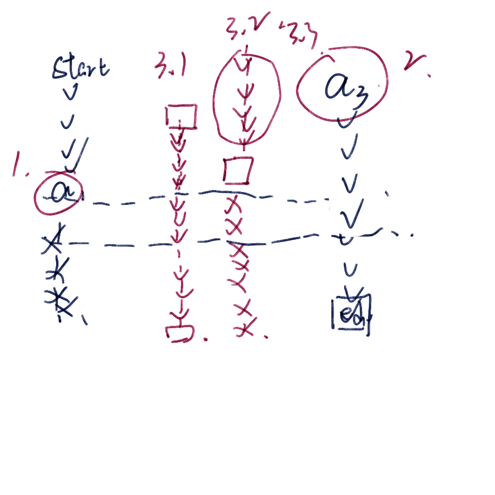
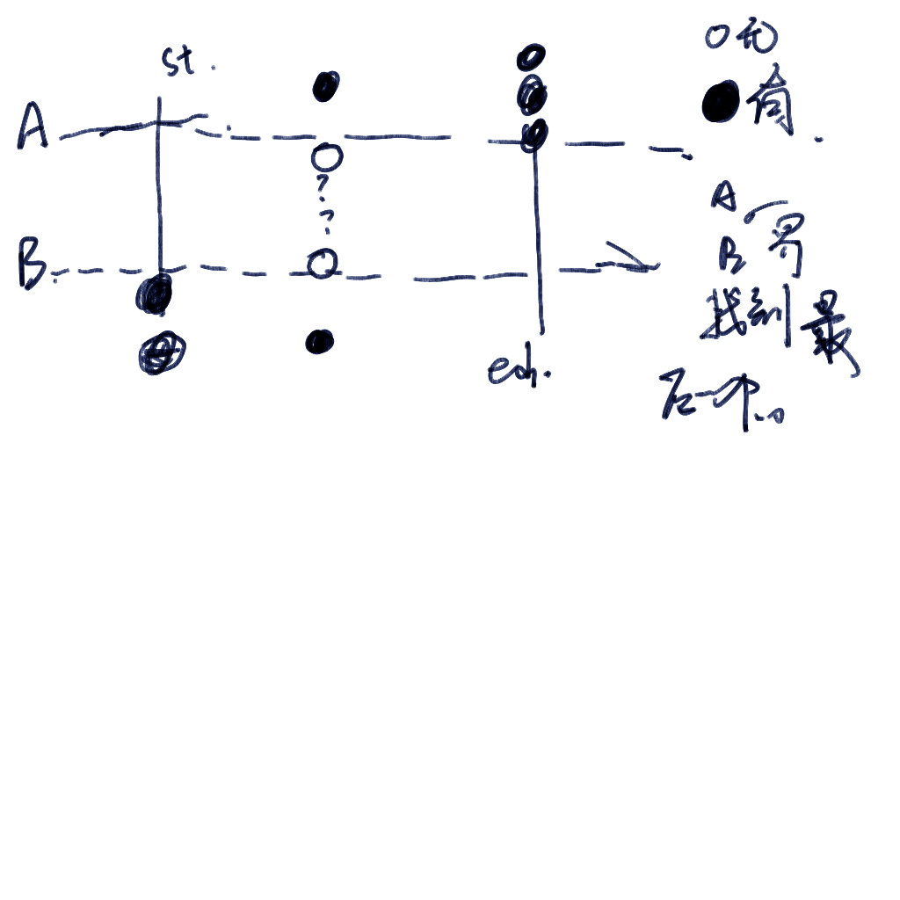

https://ac.nowcoder.com/acm/contest/46810/G

### solve

由于只有三列。比较容易算出可达点。

##### 三类

1. 第一列上，一个妖怪一下。所有点都不可达。
2. 最后一列上，最后一个妖怪以上所有点不可达。
3. 中间分布的几种影响：

情况一：


这种情况下，$S_{2,a_1-1}=1||s_{2,a3+1=1}$

$ans=a_3 + l(a_3--b_3) + n-b_3$

这里$a_3,b_3$是指边界情况。

如果当前的


情况二：

这种情况下： $ans = l_1+l_2+sum-c_{i,j}$

#### 子问题：

1. 怎么定位到位置。

第一类，好定位。lower_bound;

第二类，同理。

第三类中定位：

​	维护0的位置。然后可以利用lower_bound来计算目标坐标。

2. 维护中间某一段位置中的0的点。

方法：树状数组或者线段树维护即可。


##### 生长思考：

思路是很容易明白的。

但是总是被一些模糊的边界条件搞晕。

比方说

全封，中间不可过等等情况。

并且自己的写法关注的点是边界0而不是边界1.

这样和下面的题解相比，可能造成的影响有：

1. a1,a2。可能不存在。此时a1 = a2等于0.这意味着什么？

反正就是自己的一切bug。可能都是源自于当前的变量定义使用情况。


生长思考点；

关于set的使用，尤其是lower_bound的理解发现一个新大陆。

并且大佬的命名规范具有自明性。可以学一下。

这里放在set中总结。

比方说  m1 , m2。表示中间列的分布上下的两个情况。

s12  s21。12 ，21代表了一个方向。


##### code

```cpp
#include<bits/stdc++.h>
using namespace std;
typedef long long ll;

const int oo = 0x0fffffff;
const int N = 5E5 + 10;

int f[N][5];
int n;

int c[N];
//将x上加上d。
void modify(int x, int d)
{
	for (; x <= n; x += x & -x)
		c[x] += d;
}

int query(int x)
{
	x = min(n, x);
	int ans = 0;
	for (; x > 0; x -= x & -x)
		ans += c[x];
	return ans;
}


void work(int testNo)
{
	int  k;
	cin >> n >> k;
	set<int>s1 , s12 , o12;
	set<int , greater<int>> s21 , o21 , s3;
	s1.insert( n + 1);
	s12.insert(n + 1);

	s21.insert(0);
	s3.insert(0);

	for (int i = 0; i <= n + 1; i++) {
		//插入0.
		o21.insert(i);
		o12.insert(i);
		c[i] = 0;
		for (int j = 1; j <= 3; j++)
		{
			f[i][j] = 0;
		}
	}
	for (int i = 1; i <= n; i++)
		modify(i, 1);

	for (int i = 1; i <= k; i++)
	{
		int h, w;
		cin >> h >> w;
		if (f[h][w])
		{
			if (w == 1)
				s1.erase(h);
			else if (w == 2)
			{
				s21.erase(h);
				s12.erase(h);
				o12.insert(h); // 当前位置上变成了0；
				o21.insert(h);
				modify(h, 1);
			}
			else if (w == 3)
				s3.erase(h);

		}
		else
		{
			if (w == 1)
			{
				s1.insert(h);
			}
			else if (w == 2)
			{
				s21.insert(h);
				s12.insert(h);
				o21.erase(h);
				o12.erase(h);
				modify(h, -1);
			}
			else s3.insert(h);

		}
		f[h][w] ^= 1;

		int a1 = *s1.begin();
		int a3 = *s3.begin();
		int m1 = *s21.lower_bound(a3);
		int m2 = *s12.lower_bound(a1);

		if (f[a1 - 1][2])
		{
			m2 = *(o21.lower_bound(a1 - 1)) + 1;

		}
		if (f[a3 + 1][2])
		{
			m1 = *(o12.lower_bound(a3 + 1)) - 1;
		}

		if (m2 - 1 <= m1)
		{
			cout << 0 << '\n';
			continue;
		}
		int one = min(a1 , m2) - 2;
		int two = query(m2) - query(m1) ;
		int three = n - max (a3 , m1);
		cout << one + two + three << '\n';
	}
}


int main()
{
	ios::sync_with_stdio(false);
	cin.tie(0);

	int t; cin >> t;
	for (int i = 1; i <= t; i++)work(i);
}

/* stuff you should look for
* int overflow, array bounds
* special cases (n=1?)
* do smth instead of nothing and stay organized
* WRITE STUFF DOWN
* DON'T GET STUCK ON ONE APPROACH
*/

```


##### 来一份看了好几天还没看出问题的bug

```cpp
#include<bits/stdc++.h>
using namespace std;
typedef long long ll;

const int oo = 0x0fffffff;
const int N = 5E5 + 10;

int f[N][5];
int n;

int c[N];
//将x上加上d。
void modify(int x, int d)
{
	for (; x <= n; x += x & -x)
		c[x] += d;
}

int query(int x)
{
	x = min(n, x);
	int ans = 0;
	for (; x > 0; x -= x & -x)
		ans += c[x];
	return ans;
}


void work(int testNo)
{

	int  k;
	cin >> n >> k;
	set<int> s1, s2, o2;
	set<int, greater<int>>s3;//这样定义，意味着相对应指向的位置是什么。
	s1.insert(n + 1);
	s2.insert({ 0 , n + 1 });
	o2.insert({ 0 , n + 1 });
	s3.insert(0);
	//s3.insert({0 , n + 1});
	for (int i = 1; i <= n; i++) {
		//插入0.
		o2.insert(i);
		c[i] = 0;
		for (int j = 1; j <= 3; j++)
		{
			f[i][j] = 0;
		}
	}
	for (int i = 1; i <= n; i++)
		modify(i, 1);


	//定义多个rec来管理这个图上的情况。
	//第一列s1
	//第二列s2。
	//s2_1,s2_2;分别用来管理另外一种情况。
	//第三列。s3;


	//先进行一个初始化。
	// cout << query(n) << '\n';
	for (int i = 1; i <= k; i++)
	{
		//当前操作修改l，r位置。
		int h, w;

		cin >> h >> w;
		//1.管理这种change.接下来就是求相关量。
		//变化前有怪兽
		if (f[h][w])
		{
			if (w == 1)
				s1.erase(h);
			else if (w == 2)
			{
				s2.erase(h);
				o2.insert(h); // 当前位置上变成了0；
				modify(h, 1);
			}
			else if (w == 3)
				s3.erase(h);

		}
		else
		{
			if (w == 1)
			{
				s1.insert(h);
			}
			else if (w == 2)
			{
				s2.insert(h);
				o2.erase(h);
				modify(h, -1);
			}
			else s3.insert(h);

		}
		f[h][w] ^= 1;
		//定位到了两个边界。
		int a1 = *s1.begin() - 1, a3 = *s3.begin() + 1; //关注的0的位置
		//接下来处理中间情况。
		int m1 = *s2.lower_bound(a1);
		int m2 = *(--s2.lower_bound(a3));
		//现在看第四类。
		//这里是定位到了0的位置了。
		if (f[a1][2])
		{
			m1 = *(--o2.lower_bound(a1));

		}
		if (f[a3][2])
		{
			m2 = *(o2.lower_bound(a3));//有可能定位到了最后一个位置得到一个无效的野指针。
		}
		//也许已经定位完成了吧。
		if (m1 < m2)
		{
			cout << 0 << '\n';
			continue;
		}
		//统一几种情况分类
		//如果是中间没有卡。 —— 》 ans = a1 - 2 + n - a3 + c[m1][m2]
		//如果是中间有卡。	  ___ > ans = m1 - 1 + n - m1 + c[m1][m2]
		//所以只是取MIN的问题
		if (a1 == 0 || a3 == n + 1)
		{
			cout << 0 << '\n';
			continue;
		}
		int one = min(a1, m1) - 1, two = n - max(a3, m2) + 1, three = query(m1) - query(m2 - 1);
		// cout << query(m1) << '\n';
		// cout << query(m2 - 1) << '\n';
		if (one <= 0 || two <= 0 || three <= 0)
		{
			cout << 0 << '\n';
			continue;
		}
		int ans = one + two + three;
		cout << ans << '\n';
	}
}


int main()
{
	ios::sync_with_stdio(false);
	cin.tie(0);

	int t; cin >> t;
	for (int i = 1; i <= t; i++)work(i);
}

/* stuff you should look for
* int overflow, array bounds
* special cases (n=1?)
* do smth instead of nothing and stay organized
* WRITE STUFF DOWN
* DON'T GET STUCK ON ONE APPROACH
*/

```


