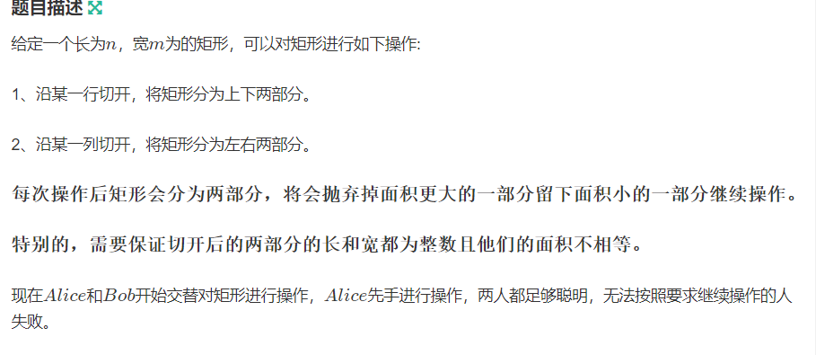
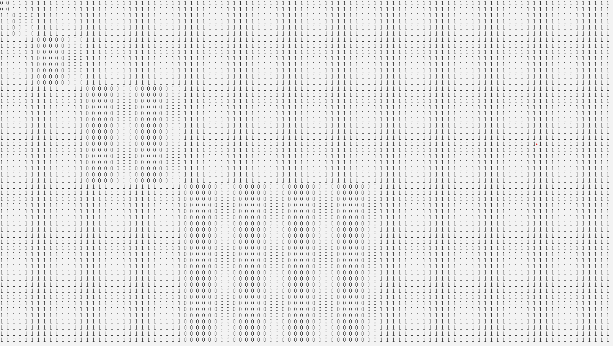

**小d的博弈**
https://ac.nowcoder.com/acm/contest/53366/E



#### solve

用dp暴力打表如下：



或者用sg函数。这个还得学学。
着重找出x 、 y之间的关系。
x ， y满足什么条件才在一块正方形中？发现这些一块一块的正方形有一些规律， 对于每一块正方形分段，计算出x ,y边界：。
$$
x(1) , y(1)->[1 , 2]\\
s(i)表示以2^i等比数列的前缀和。\\
x(i),y(i)->[s(i -1) + 1 , s(i)]\\
[2^{i} -1 , 2^{i + 1} - 2]
$$
发现往上偏移一位之后 ，二进制长度相同即可。

#### code

```cpp
#include<bits/stdc++.h>
using namespace std;
typedef long long ll;
const int oo = 0x0fffffff;
const int N = 1E6 + 10;
int len(int x) {
	int l = 0;
	while (x) {
		x /= 2;
		l++;
	}
	return l;
}
void work(int testNo)
{
	int a , b;
	cin >> a >> b;
	if (len(a + 1) == len(b  + 1)) {
		cout << "Bob\n";
	} else cout << "Alice\n";
}
int main()
{
	ios::sync_with_stdio(false);
	cin.tie(0);

	int t; cin >> t;
	for (int i = 1; i <= t; i++)work(i);
}
```

#### 打表函数

```cpp
#include<bits/stdc++.h>
using namespace std;
using ll = long long;
const int N =  1000;
bool f[N][N];
int main(){
	ios::sync_with_stdio(false);
	cin.tie(0);
	f[1][1] = f[1][2] = 0;
	int n = 100;
	for (int i = 1; i <= n; i++)
		for (int j = 1; j <= n; j++) {
			for (int k = 1; k <= n; k++) {
				if (k <= (j + 1) / 2 - 1) {
					int t = max(k , i);
					int tt = min(k , i);

					f[i][j] |= (!f[tt][t]);
				}
				if (k <= (i + 1) / 2 - 1) {
					int t = max(k , j);
					int tt = min(k , j);
					f[i][j] |= !f[tt][t];
				}
			}
		}
	for (int i = 1; i <= n; i++)
		for (int j = 1; j <= n; j++) {
			cout << f[i][j] << " \n"[j == n];
		}
}
```

