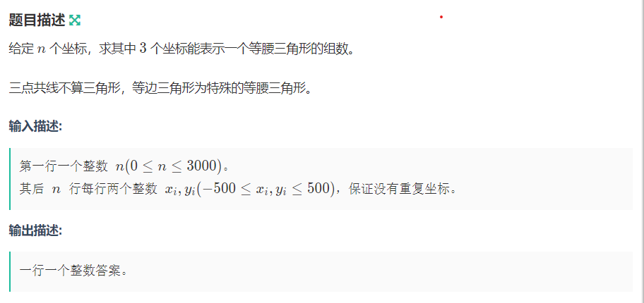

**等腰三角形(hard)**

[F-等腰三角形(hard)_牛客小白月赛69 (nowcoder.com)](https://ac.nowcoder.com/acm/contest/52441/F)

#### 简介：



#### solve

**关键结论：**

1. 网格上，3整数点不可能会组成等边三角形。

-----

**证明：**


----

所以不需要考虑对等边三角形去重。统计等腰三角形，以及对共线的情况做容斥即可。

#### code

```cpp
#include<bits/stdc++.h>
using namespace std;
using ll = long long;
const int N = 3E3 + 10;
int x[N] , y[N];
bool f[N][N];
ll g(int i, int j) {
	return (x[i] - x[j]) * (x[i] - x[j]) + (y[i] - y[j]) * (y[i] - y[j]);
}
long double check(int i , int j) {
	if (x[i] == x[j]) return 1E9;
	return (y[i] - y[j]) / (1.0 * (x[i] - x[j]));
}
int main()
{
	ios::sync_with_stdio(false);
	cin.tie(0);
	int n; cin >> n;
	for (int i = 1; i <= n; i++) {
		cin >> x[i] >> y[i];
		f[x[i] + 1500][y[i] + 1500] = true;
	}
	ll ans = 0;
	for (int i = 1; i <= n; i++) {
		vector<int> a;
		int cunt = 0;//统计多少种贡献情况。
		for (int j = 1; j <= n; j++) {
			a.push_back(g(i , j));
			int dx = x[j] - x[i];
			int dy = y[j] - y[i];
			if (f[x[i] - dx + 1500][y[i] - dy + 1500])
				cunt++;
		}
		a.push_back(1E9);
		sort(a.begin() , a.end());
		//然后扫描一遍统计个数。
		//然后统计个数。
		for (int j , i = 1; i < n; i = j) {
			for ( j = i + 1; j <= n; j++) {
				if (a[i] != a[j])break;
			}
			ans += (j - i) * (j - i - 1) / 2;
		}
		ans -= cunt / 2;
	}
	cout << ans << '\n';
}
```


#### 生长思考：

1. 首先是这个结论。在实际解决问题的过程中，有两种思路。
   1. 怎么去除贡献。
   2. 这种情况真的存在吗？
2. 赛时采取map大法。但是由于关键字比较复杂，因此没有卡过去。


