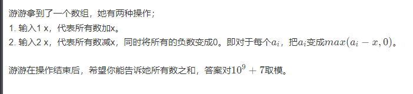

# 游游的整数操作

[C-游游的整数操作_牛客周赛 Round 4 (nowcoder.com)](https://ac.nowcoder.com/acm/contest/61571/C)



### solve

考虑一个点的变化历程，减到最低点之后，其最终是不断变高的。结论是：

1. 这个点没有低于0 ， 那么$final = a[i] + sum$

2. 这个点曾经低于0 ， $final = sum - mi$


### code

```cpp
int a[N];
signed main()
{
	ios::sync_with_stdio(false);
	cin.tie(0);
	int n , k;
	cin >> n >> k;
	for (int i = 0; i < n; i++)
		cin >> a[i];
	ll sum = 0 , mi_sum = INF;
	for (int i = 0; i < k; i++) {
		int x , y; cin >> x >> y;
		if (x == 1) sum += y;
		else mi_sum = min(mi_sum , (sum -= y));
	}
	ll ans = 0;
	for (int i = 0; i < n; i++) {
		if (a[i] + mi_sum >= 0) (ans += a[i] + sum) %= mod;
		else (ans += sum - mi_sum) %= mod;
	}
	cout << ans << "\n";
}
```

