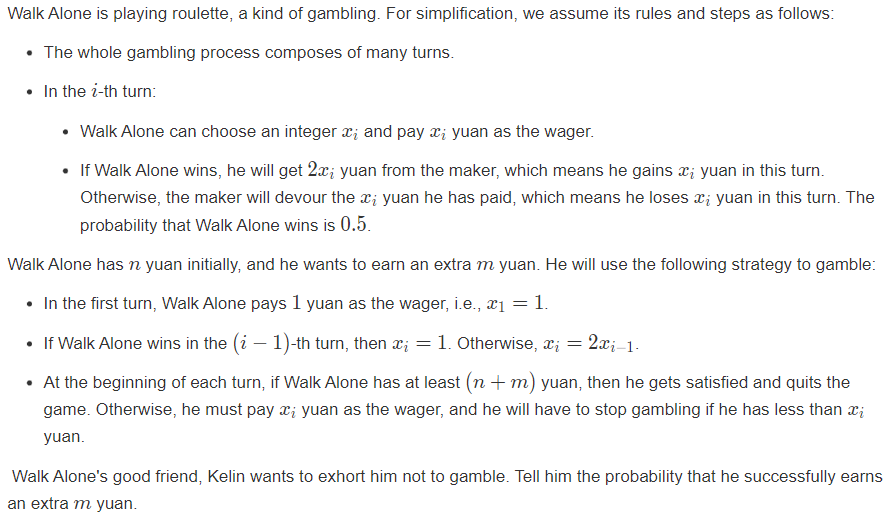

# ==多校1==

反思总结：

1. 签到卡了： 关于数学上的一些小计算，边界问题，没能够很好的处理。
2. 分类讨论应该沉下心来慢慢做：
3. 1 << 29 并没有1e9 ， 有时候并不可以作为题意中的无穷大。一般而言定义为1E9 + 7是最保险的。因为这个问题卡了一个小时。导致精力白白消耗：

# J Roulette

[J-Roulette_“范式杯”2023牛客暑期多校训练营1 (nowcoder.com)](https://ac.nowcoder.com/acm/contest/57355/J)



### solve

首先发现一个事实： 每赢一次其只赚一个金币： 于是对这一个解空间做一个全面把握：

1. 一共打了多少场？
2. 每一场的最多可以打多少场？ 

枚举每一场的所有可能事件， 于是最终就可以用一块$()\times () \times ()...\times()$ 计算。

**反思 ，总结：**

场上处理一些边界问题，用了非常多时间： 例如：

1. 确定当前金币下，最多可以打多少场：
   1. 二分即可：但是场上一直找规律，留在原地前进不了。
2. 计算等比数列的和：
3. 求逆元：

最后在170mins的才解决这个问题，如果能够省下精力解决其它问题，应该可以开出M题：

```cpp
const int inf = 1 << 29;
const ll INF = 1LL << 60;
const int N = 1E6 + 10;
const ll mod = 998244353;
ll qmi(ll a, ll b)
{
	ll res = 1;
	while (b)
	{
		if (b & 1)res = a * res % mod;
		a = a * a % mod;
		b >>= 1;
	}
	return res;
}

ll sum[50];

signed main()
{
	ios::sync_with_stdio(false);
	cin.tie(0);

	ll p = 1;
	sum[1] = 0;
	for (int i = 1; i <= 40; i++) {
		sum[i] += sum[i - 1] + p;
		p *= 2;
	}

	ll n, m;
	cin >> n >> m;
	ll ans = 1;
	for (ll l = n; l < n + m; l++) {
		// 首先求出这一块的有边界；
		// l - r;
		// 等比数列求和。
		// 0.5 ... 0.5^(x + 1)
		int id = upper_bound(sum + 1, sum + 32, l) - sum - 1;
		// ll r = min((1LL << (x + 1)) - 2, n + m - 1);
		ll r = min(sum[id + 1] - 1, n + m - 1);
		ll u = qmi(2, id) - 1;
		u = u * qmi(u + 1, mod - 2) % mod;
		ans = (ans * qmi(u, (r - l + 1)) % mod + mod) % mod;
		l = r;
	}
	cout << ans << "\n";
}
```


# A.


鉴定为赛时做不出来的构造：


### 生长思考：

1. 关注01比特的位置序列：~~好了，没有其它角度了：~~
2. 对其余字符串进行分类：
   1. |$S_0$| 更大的。
   2. |$S_0$| 更小的。
3. 针对一个字符串的|$S_0$| 做一些交换操作。
4. 总体上，先做到什么样的局部排序，然后再根据|$S_0$|的特征做出一些交换排序操作。


```cpp
#include<bits/stdc++.h>
using namespace std;
using ll = long long;
#define dbg(x) cerr << "[" << __LINE__ << "]" << ": " << x << "\n"
#define all(x) (x).begin(),(x).end()
#define sz(x) (int)(x).size()
const int inf = 1E9 + 7;
const ll INF = 1E18 + 7;
const int N = 1E6 + 10;

void work(int testNo)
{
	int n;
	cin >> n;
	string s;
	cin >> s;
	vector<int> s0 , s1;
	vector<pair<int , int>> ans;
	for (int i = 0; i < n; i++) {
		if (s[i] == '0') s0.push_back(i + 1);
		else s1.push_back(i + 1);
	}
	//为了将该元素移动到最后，必须反序。
	reverse(all(s1));

	int l = s1.back()  , r = s0.back();
	// 第一步，内部将l , r移动。
	for (auto x : s0) if (x != r) ans.emplace_back(x , r);
	//将0移动到最右边。
	for (auto x : s1) if (x != l) ans.emplace_back(x , l);
	// 将l ， r外的元素正常排序。
	for (int i = 1; i <= n; i++) {
		if (i == l || i == r) continue;
		for (int j = i + 1; j <= n; j++) {
			if (j == l || j == r) continue;
			ans.emplace_back(i , j);
		}
	}
	//第三步：
	int len = sz(s0);
	// 必须是其中一个先手？
	for (int i = len + 1; i < r; i++)
		ans.emplace_back(r , i);
	for (int i = n; i > r; i--)
		ans.emplace_back(r , i);
	for (int i = len; i > l; i--)
		ans.emplace_back(l , i);
	for (int i = 1; i < l; i++)
		ans.emplace_back(l , i);
	cout << sz(ans) << "\n";
	for (auto [x , y] : ans) {
		// 为什么要排序一遍？ 规定了其情况。
		// 因此反序必然是互换位置的。
		if (x > y) swap(x , y);
		cout << x << " " << y << "\n";
	}
}
signed main()
{
	ios::sync_with_stdio(false);
	cin.tie(0);

	int t; cin >> t;
	for (int i = 1; i <= t; i++)work(i);
}
```

# D

[D-Chocolate_“范式杯”2023牛客暑期多校训练营1 (nowcoder.com)](https://ac.nowcoder.com/acm/contest/57355/D)

### solve:

正解：挺难的：


# H  Matches

题意朴素的一道题：


任何解集都可以转换成只在一个维度上的交换：

**集中精力解决的问题：**

1.  各种交换下的变化： 为了摸清细节： 进行一些概念的抽象：
   1. 抽象出两线段，来形象表述交换后的变化：
   2. 定义直线的方向： 
      1. 如果a大于b 为正 ，否则为负：
   3. 定义直线之间的关系：
      1. 正序关系， 同向：
      2. 偏序关系： 反向：
      3. 直线相交： 形象表述 
      4. 包含：     形象表述
      5. 分离       形象表述：
2.  讨论各种方式之后得到如下结论：
   1.  一共有6种情形，一一模拟之后发现只有两种情况是使总和变小的： 分别是
      1.  反向相交
      2.  反向包含：

   2.  减少的就是交集长度：


因此解决问题的方法是, 维护两个方向的直线，枚举一个方向的直线，然后找出另外一个方向与之相交的直线，于是找出最大交集：

维护方法：

1. 将直线pair<int , int>的比较符号进行一个排序：
2. 然后枚举一个方向的直线： 
   1. 在另一个方向的直线体系中 ， 二分找到第一个右端点大于直线低端的直线：于是找到了下界：
   2. 在另一个方向的直线体系中， 二分找到第一个第左端点在当前枚举至西安右端点之外的至西安，于是找到了上界：
3. 上述的复杂度挺假的，因为涉及到了暴力枚举： 但是这个应该可以用线段树优化：但是离散化什么的细节都很麻烦：

### code

```cpp
#include<bits/stdc++.h>
using namespace std;

using ll = long long;
using i64 = long long;
using ull = unsigned long long;
using ld = long double;
using uint = unsigned int;
using pii = pair<int, int>;
using pli = pair<ll, int>;
using pll = pair<ll, ll>;


#define dbg(x) cerr << "[" << __LINE__ << "]" << ": " << x << "\n"

#define all(x) (x).begin(),(x).end()
#define sz(x) (int)(x).size()
#define pb push_back
#define fi first
#define se second

const int inf = 1 << 29;
const ll INF = 1LL << 60;
const int N = 1E6 + 10;

int a[N], b[N];

signed main()
{
	ios::sync_with_stdio(false);
	cin.tie(0);
	int n;
	cin >> n;
	for (int i = 1; i <= n; i++) {
		cin >> a[i];
	}
	for (int i = 1; i <= n; i++) {
		cin >> b[i];
	}
	//分别维护两种方向的。
	vector<pair<ll, ll>> A, B;
	ll ans = 0;
	for (int i = 1; i <= n; i++) {
		int  x = a[i], y = b[i];
		ans += abs(x - y);
		if (x < y) A.push_back({ x , y });
		else B.push_back({ y , x });
	}
	sort(all(A));
	ll rr = -1E18;
	vector<ll> x, y, len;
	for (auto t : A) {
		int l = t.first;
		int r = t.second;
		if (r <= rr)
			continue;
		else {
			x.push_back(l);
			y.push_back(r);
			len.push_back(r - l);
			rr = r;
		}
	}
	ll res = 0;
	n = len.size();
	for (auto temp : B) {
		ll s = temp.first;
		ll t = temp.second;
		int idl = upper_bound(x.begin(), x.end(), s) - x.begin();
		int idr = lower_bound(y.begin(), y.end(), t) - y.begin();
		if (idl > 0)
			res = max(res, min(y[idl - 1] , t) - s);// 反序交叉。
		if (idr < n)
			res = max(res, t - max(x[idr] , s));
		if (idl < idr)
			res = max(res, *max_element(len.begin() + idl, len.begin() + idr));
	}
	cout << ans - 2 * res << "\n";
}
```


