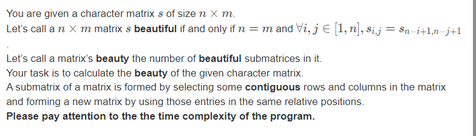

# 多校第三场：

sum : 5/ ranks : 153

凭运气做了一道140人过的题: 

# E Koraidon, Miraidon and DFS Shortest Path

[E-Koraidon, Miraidon and DFS Shortest Path_2023牛客暑期多校训练营3 (nowcoder.com)](https://ac.nowcoder.com/acm/contest/57357/E)

## solve
转换题意: 要求无论什么顺序dfs,都得到一颗只由简单路径组成的树:
1. 先根据实际的最小距离处理出一个图: 发现分层图需要满足以下的原则:
   当访问一条边(u, v)时:
   1. u , v在同一层(即d[u] = d[v]) ,那么显然答案是错误的.
   2. d[u] = d[v] - 1 , 显然没有影响:
   3. d[v] < d[u]; 要分析v是否为当前点的支配点:
      1. 实现方式: 支配树.


jls的写法:

1. 判断每个环上除了根以外的点,不能从根的子树外到达:

   然后就是个非常复杂的模拟了:

   ```cpp
   #include <bits/stdc++.h>
   
   using i64 = long long;
   
   // 并查集的作用？
   struct DSU {
   	std::vector<int> f, siz;
   	DSU() {}
   	DSU(int n) {
   		init(n);
   	}
   
   	void init(int n) {
   		f.resize(n);
   		std::iota(f.begin(), f.end(), 0);
   		siz.assign(n, 1);
   	}
   
   	int find(int x) {
   		while (x != f[x]) {
   			x = f[x] = f[f[x]];
   		}
   		return x;
   	}
   
   	bool same(int x, int y) {
   		return find(x) == find(y);
   	}
   
   	bool merge(int x, int y) {
   		x = find(x);
   		y = find(y);
   		if (x == y) {
   			return false;
   		}
   		siz[x] += siz[y];
   		f[y] = x;
   		return true;
   	}
   
   	int size(int x) {
   		return siz[find(x)];
   	}
   };
   
   
   void solve() {
   	int n, m;
   	std::cin >> n >> m;
   
   
   	std::vector<std::vector<int>> adj(n);
   	for (int i = 0; i < m; i++) {
   		int u, v;
   		std::cin >> u >> v;
   		u--, v--;
   		adj[u].push_back(v);
   	}
   
   
   	// 深度， 父亲 ， ？？ ？？
   	std::vector<int> dep(n, -1), parent(n, -1), in(n), out(n);
   	std::vector<bool> vis(n);
   
   
   	// ？？
   	std::vector<int> lim(n, 0);
   
   	bool ok = true;
   	DSU dsu(n);
   	int cur = 0;
   
   	// dfs解决几个问题：
   	/*
   	1.dfs序中的l , r记录了非路径上的可达点。。
   	*/
   	std::vector<std::pair<int, int>> e;
   	auto dfs = [&](auto self, int x) -> void {
   		in[x] = cur++;
   		for (auto y : adj[x]) {
   
   			// 没有遍历过的边。
   			if (dep[y] == -1) {
   				dep[y] = dep[x] + 1;
   				parent[y] = x;
   				self(self, y);
   
   			}
   			// 已经处理完可达点的边。
   			else if (vis[y]) {
   
   				// vis 打的也很有特色： 将所有点都遍历完之后才打标记：
   				// 下面说明指向了其它树而且指向点的路径长度不同： 说明受到了顺序的影响：
   				if (dep[y] != dep[x] + 1) {
   					ok = false;
   				}
   			} else {
   
   				// 遍历过未处理完的边，即当前的返祖边。
   				e.emplace_back(x, y);
   			}
   		}
   		vis[x] = true;
   		out[x] = cur;
   	};
   	dep[0] = 0;
   	dfs(dfs, 0);
   
   
   	// 对边进行一个排序： 按照到达点的深度降序。
   	std::sort(e.begin(), e.end(), [&](auto a, auto b) {
   		return dep[a.second] > dep[b.second];
   	});
   
   
   	// 检查每一个返祖边：
   	for (auto [x, y] : e) {
   		for (int i = dsu.find(x); dep[i] > dep[y]; i = dsu.find(i)) {
   			dsu.merge(parent[i], i);
   
   			// lim数组是什么意思呢？
   			// 一步一步往上爬：
   			// 环的顶点
   			// 这一大块都是处理环：
   
   			// 记录环的头顶：
   			lim[i] = y;
   		}
   	}
   
   	for (int i = 0; i < n; i++) {
   		for (auto j : adj[i]) {
   			//检查每一条边：
   
   			// 判断当前i是否为j节点上的环外的点。
   
   			// 如果没有环就是根。 可以覆盖所有点，同时保证有解，是比较厉害的归纳技巧：
   			if (in[i] < in[lim[j]] || in[i] >= out[lim[j]]) {
   				ok = false;
   			}
   		}
   	}
   
   	if (ok) {
   		std::cout << "Yes\n";
   	} else {
   		std::cout << "No\n";
   	}
   }
   
   int main() {
   	std::ios::sync_with_stdio(false);
   	std::cin.tie(nullptr);
   
   	int t;
   	std::cin >> t;
   
   	while (t--) {
   		solve();
   	}
   
   	return 0;
   }
   ```

   

### 生长:

1. 从jls的代码中,可以学到一般图的环的处理; 同时借助dfs序,对dfs过程分出多个块,然后可以找出环与环相关的点的关系.

## B (DP)

[B-Auspiciousness_2023牛客暑期多校训练营3 (nowcoder.com)](https://ac.nowcoder.com/acm/contest/57357/B)


## solve

定义小数($x<= n$) 大数($y \gt n$)

考察所有解的一个解集: 
发现贡献的前缀满足一个性质: 

1. 连续递增的小数,连续递减的大数段组成.


**状态设计:** 

$dp_{i , j , k}$ 表示: 大数已经放了i个 , 小数放了j个 , 当前结尾为小大数0/1 情形下的方案数:

**状态转移**
$$
dp_{i , j ,0} , 枚举前面的k长度的连续减少的段;\\
dp_{i , j , 0} += dp_{i -k, j , 1} \times C(k , n +k - i)
$$

$$
dp_{i , j ,1} 同上:\\
dp_{i , j ,1} +=  dp_{i , j - k , 0} \times C(k , n + k - j)
$$

注意k的范围:

**计算ans**

每次基于当前前缀下的合法方案总数:当前的位置考虑前缀下: 当前(i + j + 1)位贡献的总数:
$$
ans += (dp_{i , j , 0} + dp_{i , j ,1}) \times A(2\times n - i - j)
$$
注意：特殊的 0 0不做贡献。
 **初始化:**

$dp_{0 , 0 ,0} = 1 , dp_{0 , 0 , 1} = 1$
$ans = A(2\times n)$

### code

```cpp
#include<bits/stdc++.h>
using namespace std;
using ll = long long;

#define all(x) (x).begin(),(x).end()
#define sz(x) (int)(x).size()

const int inf = 1E9 + 7;
const ll INF = 1E18 + 7;
const int N  = 310;

ll c[N][N];
ll a[N];
ll f[N][N][2];
void C_init(const ll mod , const int N_c) {
	for (int i = 1; i <= N_c; ++i) {
		c[i][0] = c[i][i] = 1;
		for (int j = 1; j < i; ++j) {
			c[i][j] = (c[i - 1][j] + c[i - 1][j - 1]) % mod;
		}
	}
	a[0] = 1;
	for (int i = 1; i <= 2 * N_c; i++)
		a[i] = a[i - 1] * i % mod;
}
//注意范围
//小心me
void work(int testNo){
	int n , mod;
	cin >> n >> mod;
	C_init(mod , n);
	vector<vector<array<ll , 2>>> f(n + 1 , vector<array<ll , 2>>(n + 1 , {0}));
	// memset(f , 0 , sizeof f);
	f[0][0][0] = f[0][0][1] = 1;
	ll ans = a[2 * n];
	for (int i = 0; i <= n; i++) {
		for (int j = 0; j <= n; j++) {
			for (int k = 1; k <= i; k++) {
				(f[i][j][0] += f[i - k][j][1] * c[n + k - i][k]) %= mod;
			}
			for (int k = 1; k <= j; k++) {
				(f[i][j][1] += f[i][j - k][0] * c[n + k - j][k]) %= mod;
			}
			if ((i == 0 && j == 0) || (i == n && j == n)) continue;
			(ans += (f[i][j][0] + f[i][j][1]) * a[2 * n - i - j]) %= mod;
		}
	}
	cout << ans << "\n";
}
signed main(){
	ios::sync_with_stdio(false);
	cin.tie(0);
	int t; cin >> t;
	for (int i = 1; i <= t; i++)work(i);
}
```
### 生长：
1. 明确的，看复杂度可以看出这是个$N^3$的dp。
2. 沾点组合数。
把握解集合这一步很精彩：
1. 合法的前缀（通过策略可以胜利）, 满足相关的性质：
   1. 由上升小数段和下降大数段组合而成。

## G

[G-Beautiful Matrix_2023牛客暑期多校训练营3 (nowcoder.com)](https://ac.nowcoder.com/acm/contest/57357/G)


