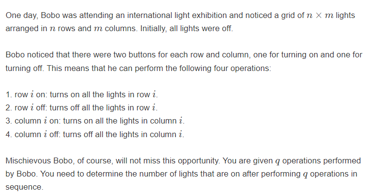

# 多校第四场

太难了， 补不动：

### H ： Merge the squares!

[H-Merge the squares!_2023牛客暑期多校训练营4 (nowcoder.com)](https://ac.nowcoder.com/acm/contest/57358/H)

### solve

~~满脑子想着构造：~~

但是正解是： （题解以及jls的code：）

1. 算出某种构造方式中的最小最小操作值： 然后根据这个最小操作值，进行一个操作的转移分割：


==**challenge1**==

有两种方式：（第一个突破点：就是寻找一种简单的分割方式：）

1. 如下jls的辗转相除法：
2. 其中一些结论得通过数学功底看出来。如果看出这种方式就可以得到优解 ， 那就转成下述问题：

==challenge2==

知道了上述的构造方式之后，通过已经算出的每种状态下的处理方式，得到特定解：

### code

jls代码

```cpp
#include <bits/stdc++.h>

using i64 = long long;

int main() {
    std::ios::sync_with_stdio(false);
    std::cin.tie(nullptr);
    
    std::vector<int> f(1001);
    for (int i = 2; i <= 1000; i++) {
        for (int j = 1; j < i; j++) {
            int cnt = 1;
            int a = j, b = i - j;
            while (b) {
                cnt += a / b;
                a %= b;
                std::swap(a, b);
            }
            if (cnt <= 25) {
                f[i] = j;
                break;
            }
        }
        assert(f[i] != 0);
    }
    std::vector<std::array<int, 3>> ans;
    int n;
    std::cin >> n;
    
    auto solve = [&](auto self, int x1, int y1, int x2, int y2) -> void {
        if (x2 - x1 == y2 - y1) {
            if (x2 - x1 == 1) {
                return;
            }
            int k = f[x2 - x1];
            self(self, x1, y1, x1 + k, y1 + k);
            self(self, x1 + k, y1 + k, x2, y2);
            self(self, x1, y1 + k, x1 + k, y2);
            self(self, x1 + k, y1, x2, y1 + k);
            ans.push_back({x1, y1, x2 - x1});
            return;
        }
        if (x2 - x1 > y2 - y1) {
            int d = y2 - y1;
            self(self, x1, y1, x1 + d, y2);
            self(self, x1 + d, y1, x2, y2);
        } else {
            int d = x2 - x1;
            self(self, x1, y1, x2, y1 + d);
            self(self, x1, y1 + d, x2, y2);
        }
    };
    solve(solve, 0, 0, n, n);
    
    std::cout << ans.size() << "\n";
    for (auto [x, y, k] : ans) {
        std::cout << x + 1 << " " << y + 1 << " " << k << "\n";
    }
    
    return 0;
}
```


my code

```cpp
#include<bits/stdc++.h>
using namespace std;
using ll = long long;

#define all(x) (x).begin(),(x).end()
#define sz(x) (int)(x).size()

const int inf = 1E9 + 7;;
const ll INF = 1E18 + 7;
const int N = 1010;
int f[N] , mx[N];
vector<array<int , 3>> ans;

void dfs(int x1 , int y1 , int x2 , int y2) {
	// 正方形：
	if (x2 - x1 == y2 - y1) {
		// 不需要递归了：
		if (x2 - x1 == 1) return;
		// 分割的情况：
		int k = f[x2 - x1];
		//左上正方形：
		dfs(x1 , y1 , x1 + k , y1 + k);
		//右下正方形
		dfs(x1 + k , y1 + k , x2 , y2);
		//左下矩形
		dfs(x1 , y1 + k , x1 + k , y2);
		// 右上矩形
		dfs(x1 + k , y1 , x2 , y1 + k);
		ans.push_back({x1 , y1 , x2 - x1});
	}
	//当前是长方形
	else if (x2 - x1 > y2 - y1) {
		//长方形的辗转分割：
		int d = y2 - y1;
		dfs(x1 , y1 , x1 + d , y1 + d);
		dfs(x1 + d , y1 , x2 , y2);
	} else {
		int d = x2 - x1;
		dfs(x1 , y1 , x1 + d , y1 + d);
		dfs(x1 , y1 + d , x2 , y2);
	}
}

signed main()
{
	ios::sync_with_stdio(false);
	cin.tie(0);
	int n;
	cin >> n;
	memset(mx , 0x3f , sizeof mx);
	for (int i = 2; i <= n; i++) {
		for (int j = 1; j < i; j++) {
			// 最后必然合并：
			int cnt = 1;
			// 长方形的两条边：
			int a = i , b = i - j;
			while (b) {
				// 区分，合并成多少次：
				cnt += a / b;
				// 辗转相除法：
				a %= b;
				swap(a , b);
			}
			if (cnt < mx[i]) {
				// 记录当前状态的最优划分：比较优秀的划分：
				// 为什么是25？
				// 可能是处于一些定理的应用，计算。
				// 是否可以确定最后不超？
				// 黄金分割附近是优秀的。。
				// 那么m <= 1E6 是否可以得到保证呢？
				// 不懂》平时这种分割去思考下斐波那契，黄金分割等东西吧：
				mx[i] = cnt;
				f[i] = j;
			}
		}
	}
	dfs(0 , 0 , n , n);
	cout << sz(ans) << '\n';
	for (auto [x , y , z] : ans) {
		cout << x + 1 << " "  << y + 1 <<  " " << z << "\n";
	}
}
/* stuff you should look for
* int overflow, array bounds
* special cases (n=1?)
* do smth instead of nothing and stay organized
* WRITE STUFF DOWN
* DON'T GET STUCK ON ONE APPROACH
*/
```


### L We are the Lights



经典的逆向思维： 铺地毯问题；但是全队都差点被卡死，有点离谱：

```cpp
#include<bits/stdc++.h>
using namespace std;
using ll = long long;

#define all(x) (x).begin(),(x).end()
#define sz(x) (int)(x).size()

const int inf = 1E9 + 7;;
const ll INF = 1E18 + 7;
const int N = 1E6 + 10;

signed main()
{
	ios::sync_with_stdio(false);
	cin.tie(0);
	int n, m, k;
	cin >> n >> m >> k;
	vector<array<int, 3>> op(k + 1);
	for (int i = 0; i < k; i++) {
		string s;
		int c;
		string t;
		cin >> s >> c >> t;
		if (s == "row")  op[i][0] = 0;
		else op[i][0] = 1;
		op[i][1] = c;
		if (t == "on") op[i][2] = 1;
		else op[i][2] = 0;
	}
	set<int> rec1[2], rec0[2];
	ll ans = 0;
	for (int i = k - 1; i >= 0; i--) {
		//auto [a, b, c] = op[i];
		int a = op[i][0], b = op[i][1], c = op[i][2];
		// 列操作
		if (a == 1) {
			// 关闭：
			if (c == 0) {
				// 之前打开过：
				if (rec1[1].count(b)) continue;
				rec1[0].insert(b);
				continue;
			}
			//打开
			else if (c == 1) {
				// 之前关闭过一行, 或者打开过
				if (rec1[1].count(b) || rec1[0].count(b)) {
					continue;
				}
				else {
					// 打开了多少行：
					ans += n - rec0[1].size();
					// 关闭过多少行。
					ans -= rec0[0].size();
				}
				rec1[1].insert(b);
			}
		}
		else {
			// 关闭：
			if (c == 0) {
				if (rec0[1].count(b)) continue;
				rec0[0].insert(b);
				continue;
			}
			else if (c == 1) {
				// 之前关闭过一行, 或者打开过
				if (rec0[1].count(b) || rec0[0].count(b)) {
					continue;
				}
				else {
					// 打开了多少行：
					ans += m - rec1[1].size();
					// 关闭过多少行。
					ans -= rec1[0].size();
				}
				rec0[1].insert(b);
			}
		}
	}
	cout << ans << '\n';
}
```


