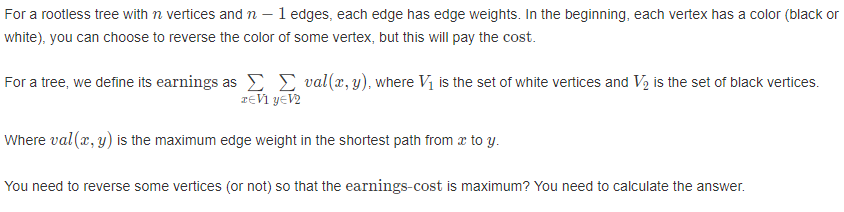
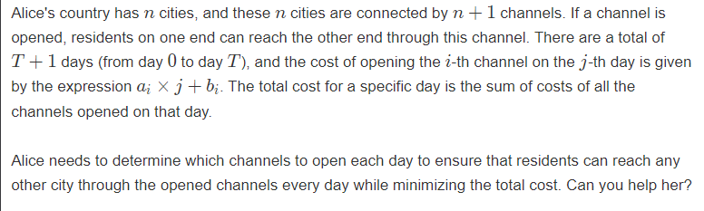

# 多校6

AC/4 rank/371

## [A-Tree_2023牛客暑期多校训练营6 (nowcoder.com)](https://ac.nowcoder.com/acm/contest/57360/A?&headNav=acm)



### solve

单纯做一个dp ， 
对边进行一个排序，然后考虑结合边的顺序做一个dp。

如果朴素的去做一个dp ： 即朴素的树形dp。考虑状态为：$f_{i , j}$ ， 表示i节点所代表的子树中j个黑色节点的最大价值。然后发现是转移不了 的，因为子树外的点对，的贡献情况是变化的，且不可知的。‘

因此，如果走dp的路，必须集中精力解决顺序的问题：对结构进行以下角度的关注：

1. 将边对点对的“支配”关系一个做更加明确的刻画：

   然后惊奇的发现，分成若干块，不会有相交关系。

   ==启发：==

   因此顺序可以考虑成处理较小的块再处理更大的块。感受一下大规模问题对于小规模问题是没有后效性的。

2. 因此考虑将顺序控制为：从小到大对边处理。再内部将边合并。类似于并查集，于是就能做以下的动态规划设计：

**状态定义：**

$f_{i , j}$ 表示当前合并顺序下，当前连通块的黑色节点数量为j时，的最大收益。

$sz_{i ,j}$表示当前顺序下，当前连通块的节点总数：

**状态转移方程：**

这个类似于树形背包，对它做同等的复杂度分析，发现最终的复杂度是$O(N^2)$的。
$$
g_{i + j} = max(f_{x,i} + f_{y,j} + i*(sz(y) - j) *w+ j * (sz(x) - i)*w)
$$


### code

```cpp
#include<bits/stdc++.h>
using namespace std;
using ll = long long;

#define all(x) (x).begin(),(x).end()
#define sz(x) (int)(x).size()

const int inf = 1E9 + 7;;
const ll INF = 1E18 + 7;
const int N = 3010;

int cost[N];
ll f[N][N];
int fa[N] , sz[N] , col[N];

int find(int x) {
	return fa[x] = (fa[x] == x ? x : find(fa[x]));
}
signed main()
{
	ios::sync_with_stdio(false);
	cin.tie(0);
	int n;
	cin >> n;
	for (int i = 1; i <= n; i++) {
		cin >> col[i];
	}
	for (int i = 1; i <= n; i++) {
		cin >> cost[i];
		fa[i] = i;
		sz[i] = 1;
		if (col[i] == 1) {
			f[i][1] = 0;
			f[i][0] = -cost[i];
		} else {
			f[i][0] = 0;
			f[i][1] = -cost[i];
		}
	}
	vector<array<int , 3>> edge;
	for (int i = 1; i < n; i++) {
		int u , v, w;
		cin >> u >> v >> w;
		edge.push_back({w , u , v});
	}

	ll ans = 0;
	sort(all(edge));
	for (auto [w , u , v] : edge) {
		int x = find(u);
		int y = find(v);
		vector<ll> g(sz[x] + sz[y] + 1 , -INF);
		for (int i = 0; i <= sz[x];  i++) {
			for (int j = 0; j <= sz[y]; j++) {
				ll v1 = 1LL * (sz[x] - i) * j * w;
				ll v2 = 1LL * (sz[y] - j) * i * w;
				g[i + j] = max(g[i + j] , f[x][i] + f[y][j] + v1 + v2);
			}
		}
		sz[x] += sz[y];
		fa[y] = x;
		// cout << "  x "  <<  x << "\n";
		for (int j = 0; j <= sz[x]; j++) {
			f[x][j] = g[j];
			// cout << g[j] << "\n";
		}
	}
	int root = find(1);
	for (int i = 0; i <= n; i++) {
		ans = max(f[root][i] , ans);
	}
	cout << ans << '\n';
}
/* stuff you should look for
* int overflow, array bounds
* special cases (n=1?)
* do smth instead of nothing and stay organized
* WRITE STUFF DOWN
* DON'T GET STUCK ON ONE APPROACH
*/
```


## traffic
李超线段树：
[H-traffic_2023牛客暑期多校训练营6 (nowcoder.com)](https://ac.nowcoder.com/acm/contest/57360/H)



### solve
思路很容易就能看出来 ： 就是构造生成树即可：其关键在于断开两个环；关注两个环的关系，然后对此做出一些处理：

1. 两个环是不相交的： 选择这两个环断开一条边即可。
2. 两个环相交： 选择三条链。然后在这三条链之中，选出两个最大断开即可：

整体的思想： 求出$\sum a x + \sum b$ ,然后减去上述求出的两个最长边即可。
上述可以使用李超线段树实现：

### 生长：

1. 李超线段的板子调了好久：

2. 还要学习更加优美的找环的方式：我使用的方式是断边重建：

   1. 使用tarjan找强连通分量。然后根据这个分量，将环分离：找出来后就容易实现了。

   2. jls的方式：

   ```cpp
    td::vector<int> pe(n, -1), parent(n, -1), dep(n, -1), w(n);
   int cur = 1;
   std::vector<int> e[4];
   auto dfs = [&](auto self, int x) -> void {
       for (auto [y, i] : adj[x]) {
           if (i == pe[x]) {
               continue;
           }
           if (dep[y] == -1) {
               dep[y] = dep[x] + 1;
               pe[y] = i;
               parent[y] = x;
               self(self, y);
               w[x] ^= w[y];
           } else if (dep[y] < dep[x]) {
               //标记属于第几个环：打上标记
               // 关注返祖边：
               // w数组的作用：
               // 标记了属于第几个环；
               w[x] ^= cur;
               // 类似于树上差分： 还原：标记： 标记当前父亲不属于环上：
               // 并且顶点以及边及时记录：
               w[y] ^= cur;
               e[cur].push_back(i);
               cur <<= 1;
           }
       }
   };
   dep[0] = 0;
   dfs(dfs, 0);
   for (int i = 1; i < n; i++) {
       if (w[i]) {
           e[w[i]].push_back(pe[i]);
       }
   }
   ```

   解读：

   

   3. 一个类似的问题： [3多校第三场.md](3多校第三场.md)   ==其中支配树问题中==

   
   
   
   
   
   
   

### code

```cpp
#include<bits/stdc++.h>
using namespace std;
using ll = long long;
#define int ll

#define all(x) (x).begin(),(x).end()
#define sz(x) (int)(x).size()

const int inf = 1E9 + 7;;
const ll INF = 1E18 + 7;
const int N = 1E6 + 10;


vector<array<int, 2>> g[N];
vector<array<int, 4>> edge;

int n, T;
vector<array<int, 2>> rec;
bool vis[N];
vector<int> cycle;
bool dfs(int u, int preid) {
	vis[u] = true;
	for (auto t : g[u]) {
		int v = t[0], id = t[1];
		if (id == preid) continue;
		if (vis[v]) {
			cycle.push_back(id);
			while (rec.size()) {
				int s = rec.back()[0];
				int t = rec.back()[1];
				// auto [s , t] = rec.back();
				rec.pop_back();
				cycle.push_back(t);
				if (s == v) return true;
			}
			return true;
		}
		else {
			rec.push_back({ u , id });
			// 已经找到了环。
			if (dfs(v, id)) return true;
			rec.pop_back();
		}
	}
	vis[u] = false;
	// 与它相关的谱系中没有找到环:
	return false;
}

/* 李超线段树维护代码块：
begin :
*/

const double eps = 1E-12;
const int maxn = (int)1E5 + 10;


struct line {
	double k, b;
	int id;
	bool flag;
};
line add(int id) {
	line now;
	now.k = edge[id][2];
	now.b = edge[id][3];
	now.flag = true;
	now.id = id;
	return now;
}

struct Tree {
	line seg[maxn * 4];
	// const int l = 0, r = (int)1E5;

	inline double calc(line l, int x) {
		return l.k * x + l.b;
	}/*计算坐标值*/

	inline int cross(line l1, line l2) {
		return floor(l1.b - l2.b) / (l2.k - l1.k);
	}

	/*线段树部分*/
	// pair<double, int> dcmp(pair<double, int>& x, const pair<double, int>& y) {
	// 	double d = x.first - y.first;
	// 	if (abs(d) < eps) {
	// 		x.second = max(x.second, y.second);
	// 	}
	// 	else if (d < 0) x = y;
	// 	return x;
	// }
	inline int check(double x, double y) {
		if (abs(x - y) < eps) return 0;
		else if (x < y) return -1;
		else return 1;
	}

	void modify(int now, int l, int r, line k) {
		int resl = check(calc(k, l), calc(seg[now], l));
		int resr = check(calc(k, r), calc(seg[now], r));
		if (not seg[now].flag) { seg[now] = k; }
		else if (resl == 1 && resr == 1) {
			seg[now] = k;
		}
		else if (resl == 0 && resr == 0) {
			seg[now].id = min(seg[now].id, k.id);
		}
		else if (resl == 1 || resr == 1) {
			int mid = (l + r) / 2;

			// 这里要修改以下:
			int resmid = check(calc(k , mid) , calc(seg[now] , mid));
			if (resmid == 1) {
				line tmp = k; k = seg[now]; seg[now] = tmp;
			} else if (resmid == 0) {
				// 刚好在中点相交：
				if (k.k < seg[now].k) modify(now << 1 , l , mid , k);
				else modify(now << 1 | 1 , mid + 1 , r , k);
				return;
			}

			// 交点在两侧：
			// 判断在哪一侧上：
			resmid = check(cross(k , seg[now]) , mid);
			if (resmid == -1) modify(now << 1, l, mid, k);
			else modify(now << 1 | 1, mid + 1, r, k);
		}
	}

	pair<double, int> query(int now, int l, int r, int x) {
		if (l == r) {
			return { calc(seg[now] , x) , seg[now].id };
		}
		else {
			int mid = (l + r) / 2;
			pair<double, int> ans = { calc(seg[now] , x) , seg[now].id };
			if (x <= mid) return max(ans, query(now << 1, l, mid, x));
			else return max(ans, query(now << 1 | 1, mid + 1, r, x));
		}
	}
} tree[3];
/*end*/

signed main()
{
	ios::sync_with_stdio(false);
	cin.tie(0);
	cin >> n >> T;
	// 第一个问题是优美的找环：
	ll suma = 0, sumb = 0;
	edge.resize(n + 2);
	for (int i = 1; i <= n + 1; i++) {
		int u, v, a, b;
		cin >> u >> v >> a >> b;
		suma += a;
		sumb += b;
		edge[i] = { u , v , a , b };
		g[u].push_back({ v , i });
		g[v].push_back({ u , i });
	}

	// 找出两个环：
	dfs(1, 0);
	// for (auto u : cycle) {
	// 	cout << u << " ";
	// }
	// cout << "\n";

	set<int> cycle1;
	for (auto u : cycle) {
		cycle1.insert(u);
	}
	for (int i = 1; i <= n; i++) {
		g[i].clear();
	}

	// 重新建图：
	for (int i = 1, flag = 1; i <= n + 1; i++) {
		// auto [u , v , a , b] = edge[i];
		int u = edge[i][0];
		int v = edge[i][1];
		if (cycle1.count(i) && flag) {
			flag = 0;
			continue;
		}
		g[u].push_back({ v , i });
		g[v].push_back({ u , i });
	}
	memset(vis, false, sizeof vis);
	cycle.clear();
	rec.clear();
	set<int> cycle2;
	dfs(1, 0);
	// 找到了环：
	// 然后开始线段树维护：
	for (auto id : cycle) {
		// modify(1 , 0 , T , add(id
		cycle2.insert(id);
	}
	for (auto id : cycle1) {
		line now = add(id);
		if (cycle2.count(id)) {
			tree[2].modify(1, 0, T, now);
		}
		else {
			tree[0].modify(1, 0, T, now);
		}
	}

	for (auto id : cycle2) {
		if (cycle1.count(id)) continue;
		line now = add(id);
		tree[1].modify(1, 0, T, now);
	}
	// for (auto u : cycle) {
	// 	cout << u << " ";
	// }
	for (int t = 0; t <= T; t++) {
		vector<pair<double, int>> dec;
		for (int i = 0; i < 3; i++) {
			dec.push_back(tree[i].query(1, 0, T, t));
		}
		sort(all(dec));
		cout << (suma * t + sumb - (long long)(dec[2].first + dec[1].first)) << "\n";
	}
	// edge.resize(10);
	// edge[1] = { 1 , 2 , 3 , 1 };
	// edge[3] = { 2 , 3 , 1 , 3 };
	// edge[2] = { 1 , 2 , 1 , 2 };
	// tree[0].modify(1, 0, 10, add(1));
	// cout << tree[0].query(1, 0, 10, 0).first << " " << tree[0].query(1, 0, 10, 0).second << "\n";
	// tree[0].modify(1, 0, 10, add(2));
	// cout << tree[0].query(1, 0, 10, 0).first << " " << tree[0].query(1, 0, 10, 0).second << "\n";
	// tree[0].modify(1, 0, 10, add(3));
	// cout << tree[0].query(1, 0, 10, 0).first << " " << tree[0].query(1, 0, 10, 0).second << "\n";

}

/*

4 100
1 2 0 0
2 4 0 0
3 4 0 0
2 3 0 0
1 3 0 0

2 10
1 2 0 0
1 2 0 0
2 1 0 0

7 10
1 2 0 0
1 3 0 0
2 3 0 0
3 4 0 0
4 5 0 0
5 6 0 0
6 7 0 0
5 7 0 0

*/
```
