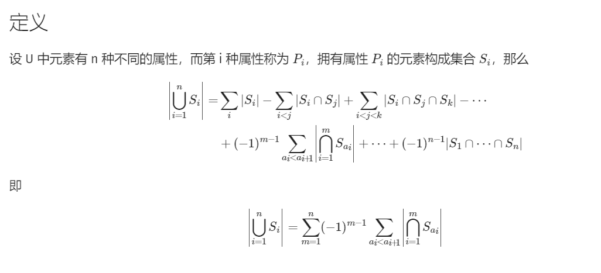

# 多校7

ac 1 / rank 670 完大蛋

经典手上只捏了一道题，导致最后出大问题，兴许如果开其它题，有可能开出来呢。比如下述这个很典的拆位问题： 但是当时就是没有一眼看出来。

## I We Love Strings

链接：https://ac.nowcoder.com/acm/contest/57361/I


###  solve

**分治：**

首先，观察范围，可以按照将字符串分成两类：

1. 小于等于20 ， 暴力枚举符合条件的字符串进行统计。
2. 大于20 ， 这种字符串最多有20个，用容斥技巧处理：

**2. 解决细节**

直接枚举字符串的选择情况：

枚举出选择情况之后，很容易就能计算出它们能够共同表达的字符串集合：

1. 一个位置上匹配但是不全为'?'： 前缀不变：
2. 一个位置上全为'?' ：          当前匹配的前缀总数乘上2。
3. 一个位置上不同 ：             匹配串总数为0。

**容斥原理**

1. 只选择一个： +
2. 选择两个， 得到的必然是1步骤中贡献的交集；  -
3. 选择三个， 得到的结果，对应2步骤中结果的交集： + 

... 奇数则贡献， 偶数则减去：

#### 生长思考：

这是一个定理，容斥并不是简单的从整体到局部的一步加减法。是一种已经上升为理论的，严谨的理论体系：

下面是一个容斥原理的定义：

 

[容斥原理 - OI Wiki](https://oi.wiki/math/combinatorics/inclusion-exclusion-principle/)

```cpp
#include<bits/stdc++.h>
using namespace std;
using ll = long long;

#define int ll
#define all(x) (x).begin(),(x).end()
#define sz(x) (int)(x).size()

const int inf = 1E9 + 7;;
const ll INF = 1E18 + 7;
const int N = 1E6 + 10;
const int mod = 998244353;

void add(int& a , int b) {
	a += b;
	if (a >= mod) a -= mod;
}
void dec(int&a , int b) {
	a -= b;
	if (a < 0) a += mod;
}
signed main()
{
	ios::sync_with_stdio(false);
	cin.tie(0);
	int n;
	cin >> n;
	map<int , vector<string>> mp;
	for (int i = 1; i <= n; i++) {
		string s;
		cin >> s;
		mp[sz(s)].push_back(s);
	}
	int ans = 0;
	for (auto &[len , s] : mp) {
		int n = sz(s);
		if (len <= 20) {
			for (int msk = 0; msk < (1 << len); msk++) {
				for (int i = 0; i < n; i++) {
					bool flag = true;
					for (int j = 0; j < len; j++) {
						if (s[i][j] != '?' && (s[i][j] - '0') != (msk >> j & 1)) {
							flag = false;
							break;
						}
					}
					if (flag) {
						add(ans , 1);
						break;
					}
				}
			}
		} else {
			for (int msk = 1; msk < (1 << n); msk++) {
				int cnt = 1;
				for (int j = 0; j < len; j++) {
					bool f1 = false , f0 = false;
					for (int i = 0; i < n; i++) {
						if (msk >> i & 1) {
							if (s[i][j] == '0') f0 = true;
							if (s[i][j] == '1') f1 = true;
						}
					}
					if (f0 && f1) {
						cnt = 0;
						break;
					}
					if (not f0 && not f1) {
						add(cnt , cnt);
					}
				}
				if (__builtin_popcount(msk) % 2) {
					add(ans , cnt);
				} else {
					dec(ans , cnt);
				}
			}
		}
	}
	cout << ans << "\n";
}

/* stuff you should look for
* int overflow, array bounds
* special cases (n=1?)
* do smth instead of nothing and stay organized
* WRITE STUFF DOWN
* DON'T GET STUCK ON ONE APPROACH
*/
```
----
## K Set

[K-Set_2023牛客暑期多校训练营7 (nowcoder.com)](https://ac.nowcoder.com/acm/contest/57361/K)
Sylvy has an array $a$ of length $n$. Glacy wants you to calculate $\sum_{S\subseteq\left\{x|x\in Z, 1\le x\le n\right\}}\left|S\right|\left(\min_{x\in S}a_x\right)\left(\max_{x\in S}a_x\right)\left(\bigoplus_{x\in S}a_x\right)$ module $998244353$, where $\bigoplus$ denotes the bitwise operator xor.

### solve
维护异或和以及乘法相关的贡献。考虑拆位技巧： 相似： [7多校.md](7多校.md) 
发现这类拆位：一段元素序列异或和（或者是其它类型的和）是单独作为一乘式中的一项。
**怎么确定最大最小值？**
1. 首先，由于是序列问题，并且是元素顺序无关的计数问题。可以对序列进行重新排序进行处理，如上对序列做一个排序之后，就产生了奇迹（事实上，往往可以考虑对数组排序处理。观察等效性，以及是否出现了某些新的性质。）
2. 排序之后，于是就变成只关注首尾端了。
**计算顺序的设计：**
对每一个位单独考虑。因为每一个位的在异或中的贡献都是独立的。
==**维护一些信息：**==
对于前端维护的序列中，关注一些和算式相关的属性，从而做一些统计的角度设计：
1. 按照位置上的异或和分为两类：0 与 1。 
    $f_{i , 0 /1 }$ 分别表示到1 ... i这个位置当前异或和为0/1 的min*|S|之和。
2. 怎么从$f_{i - 1, 0/1}$ 转移到$f_{i ,0/1}$ ? 
发现最关键的问题是： 长度不好处理，原有序列拼接上一个新的数组之后，有如下转换：
$$
  f_{i - 1 ,0/1}->\sum min \times|S|->\sum min \times (|S| + 1)
$$
解决该问题： 启发：显然只要记录一个$\sum min$ 即可。
于是新开一个数组$g_{i ,0/1}$ 同时记录所选的序列的最小值之和。

**转移：**

当前考察的是元素$a_i$ , 那么会出现如下几种可能：

1. 当前在该位上$a_i$ 对应的比特：x = 1。
   1. 接上：
   2. 单独成为一个序列。
   3. 不接：

2. x = 0

   如上：

很显然的变化，用滚动数组优化。详细看代码。

### code

```cpp
const int inf = 1E9 + 7;;
const ll INF = 1E18 + 7;
const int N = 1E6 + 10;
const int mod = 998244353;

signed main(){
	ios::sync_with_stdio(false);
	cin.tie(0);
	int n;
	cin >> n;
	vector<int> a(n);
	for (int i = 0; i < n; i++)
		cin >> a[i];
	sort(all(a));
	ll ans = 0;
	for (int i = 0; i <= 30; i++) {
		array<ll , 2> f = {0 , 0} , g = {0 , 0};
		for (int j = 0; j < n; j++) {
			int x = a[j] >> i & 1 , sum;
			// 统计贡献
			sum = (x * a[j] + f[x ^ 1] + g[x ^ 1]) % mod;
			ans = (ans + (1LL << i) * sum % mod * a[j] % mod) % mod;
			// 更新；
			auto tf = f , tg = g;
			if (x) {
				f[0] = (tf[1] + tf[0]) % mod;
				f[1] = (a[j] + tf[0] + tf[1]) % mod;
				g[0] = (tg[0] + tg[1] + tf[1]) % mod;
				g[1] = (a[j] + tg[1] + tg[0] + tf[0]) % mod;
			}
			else {
				f[0] = (a[j] + tf[0] + tf[0]) % mod;
				f[1] = (tf[1] + tf[1]) % mod;
				g[0] = (a[j] + tg[0] + tg[0] + tf[0]) % mod;
				g[1] = (tg[1] + tg[1] + tf[1]) % mod;
			}
		}
	}
	cout << ans << "\n";
}
```
