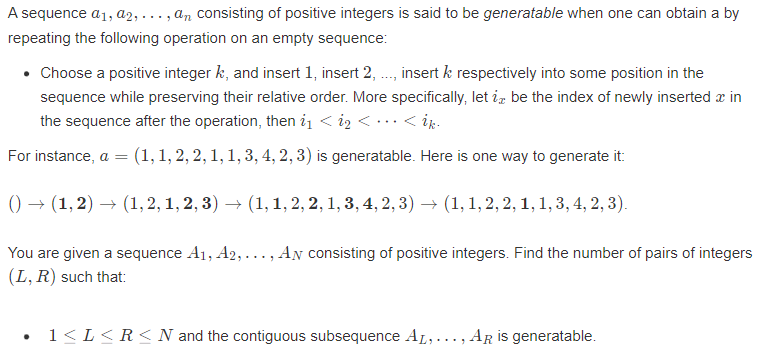
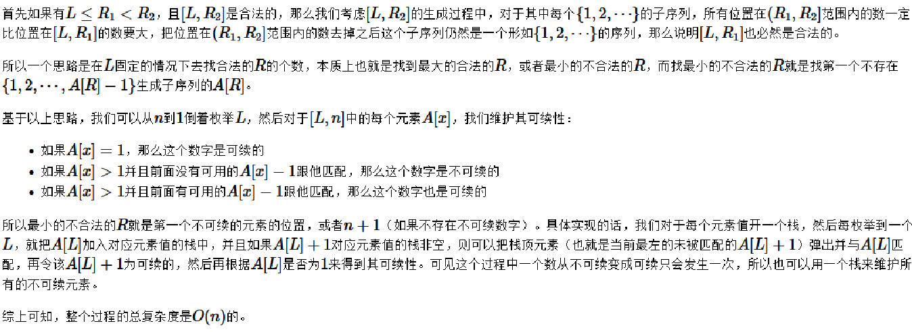
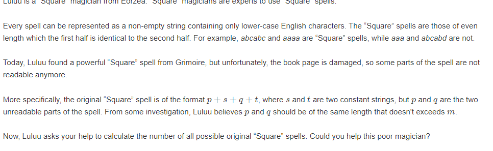

# 牛客多校8

AC ： 3/ rank : 255
**复盘**

主要的思考点： 最后的40分钟写出了I题，但是只有5分钟的调试调整。赛后调试了30分钟1A了。怎么省出25分钟去调试？

1. 浪费时间： H题第一份代码于1点25写完。可是最终不断地调试，修正之后，即使在1点半之前得到了正解地思路，最后通过确是在三点半：
   1. 第一点： 当时已经确定了算法的正确性： 也应该认识到由并查集实现找极小是不正确的。但是却没有集中精力解决该问题。
   2. 第二点： 要提醒自己，要尽早的认识到当前的问题所在： 当前自己可以做更多的事情，敢于突破自己的局限性。做好全局的时间管理： 
   3. 第三点： 很多多余的动作：
      1. 比如A完题就去外面，洗脸等等。胡思乱想，浪费一些时间看榜等等。
   4. 代码编写时间：	

## 题：

## H

[H-Insert 1, Insert 2, Insert 3, ..._2023牛客暑期多校训练营8 (nowcoder.com)](https://ac.nowcoder.com/acm/contest/57362/H)



### solve

1. 第一个观察，组合区间的计数问题， 考虑区间的右端点：然后可以找出符合条件的区间左端点。直接统计：
2. 观察，只需要找到第一个符合条件的左端点：然后就可以进行下方的转移：

$$
f_{i}-> f_{leftfirst}
$$
**证明如下：**

1. $f_{leftfirst}$ 记录的所有解拼接上当前所有解必然是正确的。（实际上left_most肯定是1）
2. 所以集中精力解决的问题是：
   1. 是否出现漏解的问题：
      1. 显然左端点在leftmost以右的区间是不正确的：违反leftmost的定义：（假设正确的leftmost）
      2. 左端点之外的拼接上的区间，和leftfirst以右的区间之间的关系是独立互不干扰的。后边的区间不依赖于拼接的区间。并且后边的区间中的元素只作为拼接上的区间的尾段。去掉这种关系左段区间依然是要求合法的。
   2. 综上，并不漏解。

3. 因此接下来集中精力解决的问题是，找到最leftfirst:

$\large 寻找leftfirst$

*场上思路：*

1. 用一个栈完成匹配。（其实就是贪心的选择最近的可选下一个。）
2. $x$ - > x - 1 。 于是得到了id。那么最近的1将会在[id , i - 1] 中区间（特判没有x - 1与之匹配。）

**状态定义：**

$pre_i$ 表示i位置为右端点时的leftmost
$f_i$ : 表示i位置为右端点时的合法序列总数：

**状态转移方程：**

$f_{i} = f_{minist(pre_{id....i-1})}$

实现上使用线段树实现：

```cpp
#include<bits/stdc++.h>
using namespace std;
using ll = long long;

#define all(x) (x).begin(),(x).end()
#define sz(x) (int)(x).size()

const int inf = 1E9 + 7;;
const ll INF = 1E18 + 7;
const int N = 1E6 + 10;
int a[N];
ll f[N];
int pre[N];
vector<int> stk[N];
/*
12
1 1 2 2 3 3 1 1 2 2 3 3

10
1 2 1 3 2 4 3 5 4 6


13
1 2 3 4 5 6 1 2 3 7 4 4 5

12
1 2 1 3 1 4 2 5 3 2 3 4
*/

//const int N = 201000;
//const ll mod = 1000000007;

//节点的内容。数据项以及内容。
//如果维护信息比较复杂。也可以考虑将信息封装。并且如上写一个区间信息合并重载函数。
struct node {
	int t;
	int val;
} seg[N * 4];

// [l, r]

//在modify以及建树之后。把两个儿子的信息合并。
void update(int id) {
	seg[id].val = min(seg[id * 2].val , seg[id * 2 + 1].val);
}

//push down。
//完成两项东西。合并标记。
//修改区间信息。
void settag(int id, int t) {
	if (t) {
		seg[id].t = min(seg[id].t , t);
		seg[id].val = min(seg[id].val , t);
	}
}
//记得将下放后将标记初始化。
void pushdown(int id) {
	if (seg[id].t) { // 标记非空
		settag(id * 2, seg[id].t);
		settag(id * 2 + 1, seg[id].t);
	}
}

//建树。记得建完之后update.
//以及到达终点时，将节点信息修正。
void build(int id, int l, int r) {
	seg[id].t = {0};
	if (l == r) {
		seg[id].val = {pre[l]};
	} else {
		int mid = (l + r) / 2;
		build(id * 2, l, mid);
		build(id * 2 + 1, mid + 1, r);
		update(id);
	}
}

// 节点为id，对应的区间为[l, r]，修改a[pos] -> val
//记得update
//正确sertag
void modify(int id, int l, int r, int ql, int qr, int t) {
	if (l == ql && r == qr) {
		settag(id, t);
		return;
	}
	int mid = (l + r) / 2;
	// 重要‼️
	pushdown(id);
	if (qr <= mid) modify(id * 2, l, mid, ql, qr, t);
	else if (ql > mid) modify(id * 2 + 1, mid + 1, r, ql, qr, t);
	else {
		modify(id * 2, l, mid, ql, mid, t);
		modify(id * 2 + 1, mid + 1, r, mid + 1, qr, t);
	}
	// 重要‼️
	update(id);
}
// [ql, qr]表示查询的区间
//到达终点时及时返回。
ll query(int id, int l, int r, int ql, int qr) {
	if (l == ql && r == qr) return seg[id].val;
	int mid = (l + r) / 2;
	// 重要‼️
	pushdown(id);
	if (qr <= mid) return query(id * 2, l, mid, ql, qr);
	else if (ql > mid) return query(id * 2 + 1, mid + 1, r, ql, qr);
	else {
		// qr > mid, ql <= mid
		// [ql, mid], [mid + 1, qr]
		return min(query(id * 2, l, mid, ql, mid) ,
		           query(id * 2 + 1, mid + 1, r, mid + 1, qr));
	}
}
/*
1. 该代码处理问题：同时维护区间加，区间改变，区间乘法三种操作。
2. 调整过程
维护信息 -> build -> updata -> 区间信息合并函数
tag - > modify  -> push_down  ->  settag
query -> 返回类型，修改内容 , 信息合并。
*/


/*
5
1 2 5 3 4

*/

signed main()
{
	ios::sync_with_stdio(false);
	cin.tie(0);

	int n = 1E6;
	cin >> n;
	for (int i = 1; i <= n; i++) {
		// a[i] = i;
		cin >> a[i];
	}
	// 快速找到第一个匹配的串：
	for (int i = 1; i <= n; i++) {
		pre[i] = i;
	}
	build(1 , 1 , n);
	ll ans = 0;
	set<int> rec;
	for (int i = 1; i <= n; i++) {
		stk[a[i]].push_back(i);
		rec.insert(a[i]);
		if (a[i] == 1) {
			f[i] = f[i - 1] + 1;
			ans += f[i];
		} else {
			if (stk[a[i] - 1].size()) {
				int t = stk[a[i] - 1].back();
				stk[a[i] - 1].pop_back();
				if (stk[a[i] - 1].empty()) {
					rec.erase(a[i] - 1);
				}
				pre[i] = query(1 , 1 , n , t , i - 1);
				modify(1 , 1 , n , i , i , pre[i]);
				f[i] = f[pre[i]];
				ans += f[i];
			} else {
				for (auto v : rec) {
					stk[v].clear();
				}
				rec.clear();
			}
		}
	}
	// for (int i = 1; i <= n; i++) {
	// 	cout << f[i] << " \n"[i == n];
	// }
	cout << ans << "\n";
}

/* stuff you should look for
* int overflow, array bounds
* special cases (n=1?)
* do smth instead of nothing and stay organized
* WRITE STUFF DOWN
* DON'T GET STUCK ON ONE APPROACH
*/
```

### 更优的解法：



但是比较模糊：

##  I Make It Square

[I-Make It Square_2023牛客暑期多校训练营8 (nowcoder.com)](https://ac.nowcoder.com/acm/contest/57362/I)



### solve

分类讨论 + 字符串哈希：只需要找出终点的位置，然后就可以找到s串和t串的交。首先由于前半段等于后边段，因此可以建立一种映射的相等关系。这种关系类比交：

1. 找到s串和t串交是关键： 其判定是否有合法解，以及自由构造的符号（p 与 q中有些位置是和s与t串映射。因此是不自由的。）

分类讨论即可：

1. 中点在s串中：
2. 中点在t串中：
3. 中点在第二个k串中；

找到交区间，就可以定位到s和t串。通过字符串哈希判断即可：

找到了一个好用的字符串哈希板子：

```cpp
class shash {
public:
	vector<ll> pres;
	vector<ll> epow;
	ll e, p;

	shash(string& s, ll e, ll p) {
		int n = s.size();
		this->e = e;
		this->p = p;
		pres = vector<ll>(n + 1);
		epow = vector<ll>(n + 1);
		epow[0] = 1;
		for (int i = 0; i < n; i++) {
			pres[i + 1] = (pres[i] * e + s[i]) % p;
			epow[i + 1] = (epow[i] * e) % p;
		}
	}

	ll operator()(int l, int r) {
		ll res = (pres[r + 1] - pres[l] * epow[r - l + 1] % p) % p;
		return (res + p) % p;
	}
};

int main(){
    string s ="0000";
    shash ss(s , 1331 , 1E9 + 7);
    cout << ss(0 , 1) << "\n";
}

```


```cpp
#include<bits/stdc++.h>
using namespace std;
using ll = long long;

#define all(x) (x).begin(),(x).end()
#define sz(x) (int)(x).size()

const int inf = 1E9 + 7;;
const ll INF = 1E18 + 7;
const int N = 1E6 + 10;

int mid, len;
array<int, 2> merge(int l1, int r1, int l2, int  r2) {
	array<int, 2> res;
	l2 -= mid;
	r2 -= mid;

	if (r2 < l1) res = { -1 , -1 };
	else if (l2 > r1) res = { -1 , -1 };
	else {
		res = { max(l1 , l2) , min(r1 ,  r2) };
	}
	return res;
}

ll qpow(ll x, ll n, ll mod = 998244353) {
	ll res = 1;
	while (n) {
		if (n & 1) res = res * x % mod;
		x = x * x % mod;
		n /= 2;
	}
	return res;
}

class shash {
public:
	vector<ll> pres;
	vector<ll> epow;
	ll e, p;

	shash(string& s, ll e, ll p) {
		int n = s.size();
		this->e = e;
		this->p = p;
		pres = vector<ll>(n + 1);
		epow = vector<ll>(n + 1);
		epow[0] = 1;
		for (int i = 0; i < n; i++) {
			pres[i + 1] = (pres[i] * e + s[i]) % p;
			epow[i + 1] = (epow[i] * e) % p;
		}
	}

	ll operator()(int l, int r) {
		ll res = (pres[r + 1] - pres[l] * epow[r - l + 1] % p) % p;
		return (res + p) % p;
	}
};
signed main()
{
	ios::sync_with_stdio(false);
	cin.tie(0);

	int m;
	cin >> m;
	string s, t;
	cin >> s >> t;

	shash ss(s, 1331, inf);
	shash tt(t, 1331, inf);

	for (int k = 1; k <= m; k++) {
		if ((sz(s) + sz(t) + 2 * k) % 2) {
			cout << 0 << "\n";
			continue;
		}
		mid = (sz(s) + sz(t) + 2 * k) / 2;
		len = 2 * mid;
		// 当前交点在s处：
		vector<array<int, 5>> mix;//重合关系：

		if (mid <= k + sz(s)) {
			int d2 = sz(t);
			int l1 = k + 1;
			int r1 = mid;
			int l2 = len - d2 + 1;
			int r2 = len;
			auto inter = merge(l1, r1, l2, r2);
			if (inter != array<int, 2> { -1, -1}) {
				mix.push_back({ inter[0] , inter[1] , mid + inter[0] , mid + inter[1] , 1 });
			}
			// 自己与自己针对l ， r
			if (mid != k + sz(s)) {
				l2 = mid + 1;
				r2 = len - d2 - k;
				inter = merge(l1, r1, l2, r2);
				if (inter != array<int, 2> { -1, -1}) {
					mix.push_back({ inter[0] , inter[1] , mid + inter[0] , mid + inter[1] , 0 });
				}
			}
		}
		// 当前在k内部：
		else if (mid <= sz(s) + 2 * k) {
			int l1 = k + 1, r1 = k + sz(s);
			int l2 = len - sz(t) + 1, r2 = len;
			auto inter = merge(l1, r1, l2, r2);
			if (inter != array<int, 2> { -1, -1}) {
				mix.push_back({ inter[0] , inter[1] , mid + inter[0] , mid + inter[1] , 1 });
			}
		}
		// 当前在t内：
		else {
			int l1 = k + 1, r1 = k + sz(s);
			int l2 = mid + 1, r2 = len;
			auto inter = merge(l1, r1, l2, r2);
			if (inter != array<int, 2> { -1, -1}) {
				mix.push_back({ inter[0] , inter[1] , mid + inter[0] , mid + inter[1] , 1 });
			}
			l1 = 2 * k + sz(s) + 1;
			r1 = mid;
			inter = merge(l1, r1, l2, r2);
			if (inter != array<int, 2> { -1, -1}) {
				mix.push_back({ inter[0] , inter[1] , mid + inter[0] , mid + inter[1] , 3 });
			}
		}
		bool flag = false;
		ll sum = sz(s) + sz(t);
		for (auto p : mix) {
			int l1 = p[0], r1 = p[1], l2 = p[2], r2 = p[3], ty = p[4];
			if (ty == 1) {
				l1 = l1 - k - 1;
				r1 = r1 - k - 1;
				l2 -= 2 * k + sz(s) + 1;
				r2 -= 2 * k + sz(s) + 1;
				if (ss(l1, r1) != tt(l2, r2)) {
					flag = true;
					break;
				}
				sum -= (r1 - l1 + 1) * 2;
			}
			else if (ty == 0) {
				l1 -= k + 1;
				r1 -= k + 1;
				l2 -= k + 1;
				r2 -= k + 1;
				if (ss(l1, r1) != ss(l2, r2)) {
					flag = true;
					break;
				}
				sum -= (r1 - l1 + 1) * 2;
			}
			else {
				l1 -= 2 * k + sz(s) + 1;
				r1 -= 2 * k + sz(s) + 1;
				l2 -= 2 * k + sz(s) + 1;
				r2 -= 2 * k + sz(s) + 1;
				if (tt(l1, r1) != tt(l2, r2)) {
					flag = true;
					break;
				}
				sum -= (r1 - l1 + 1) * 2;
			}
		}
		if (flag) {
			cout << 0 << " ";
			continue;
		}
		/*统计快速幂*/
		cout << qpow(26, (2 * k - sum)/2) << " ";
	}
	cout << "\n";
}
```

---

## Distance on Tree

[D-Distance on Tree_2023牛客暑期多校训练营8 (nowcoder.com)](https://ac.nowcoder.com/acm/contest/57362/D?&headNav=acm)

**简介：**

给定一棵树，具有以下属性：

1. 以1为根：
2. 第i个节点的点权为$ 1\le a_i \lt m$
3. 边有边权：

定义一种结构： 子树中不同的三个点：u ,v w. 定义基于该三元组x个函数
$f_x = d_{u , v} + d_{u ,w} + d_{v,w}$
$g_x = (a_u + a_v + a_w)\% m$


求一颗子树中的最优方案（最优方案定义为$f_x$ 最大，输出方案对应的$f_x$）

$\large SOLVE$

很容易想到一种暴力的树形dp的做法：

**状态定义：**

$f_{0/1/2 , u , x}$ : 表示（选择1 , 2 , 3）个不同节点，$g_{n_1 + n_2} = x$ 下， 的相关性信息：具体细节如下：

1. 0 ： 所有方案中，节点到顶点的距离的两倍（开两倍是贡献的处理问题）的最大值 
2. 1 ： 所有方案中，两点之间的距离，以及两点到顶点的距离之和 的最大值
3. 2 ： 所有方案中的$f_x$函数 的最大值。

**转移方程：**
v是u的子节点：默认滚动数组： w是两点间的边权。
$g_{2 , v,x}->f_{2 ,u ,x}$ 
$g_{1 , v ,x + f_{0, u , y}} + 2 * w-> f_{2 , u ,(x + y)\%m}$
$g_{0 , v, x} + f_{1 , u ,y} + 2*w -> f_{2 , u , (x + y)\% m}$
$g_{1, v ,x} + 2 * w -> f_{1 , u , x}$
$g_{0 , v, x} + f_{0 , u , y} + 2* w->f_{1 , u , (x + y)\% m}$
$g_{0 , v , x} + 2*w -> f_{0 , u , x}$

滚动的过程中稍微注意顺序即可：

**复杂度分析：**
这个情形树形背包非常相似，我们难以准确计算其复杂度，由于节点之间的复杂关系。但是可以明确的，如果暴力的进行枚举其复杂度将是$O(nm^2)$
然而，实际上树形背包的复杂度，经过一些计算证明等等，如果只关注节点的有效状态其复杂度将为$O(n^2)$

笔记如下： [平方复杂度的树形dp.md](..\..\..\Logrithm\动态规划\树形dp\树上背包\平方复杂度的树形dp.md)  [树上背包.md](..\..\..\Logrithm\动态规划\树形dp\树上背包\树上背包.md) 

类似的我们将获得一些启发：

1. 如果只关注有效状态之间之间 ， 那么复杂度是否会得到一个卓越的下降？

   是否是典型的值域背包？ 然而由于有两个点的状态，其有效状态的大小是$N^2$ 级别的因此并不是上述树上背包的情形：

2. 考虑复杂度的另一个典型角度如下：

   

**考虑根号分治：**
每次进行子树合并时：m(即值域)。定义阈值$\sqrt m$ ,于是根据子树的有效状态数量，自然的引出大小子树。
分类讨论不同情形下的合并：(子树节点和有效状态x的关系是最糟糕情况下$\sqrt x$ = sz(u))。

1. 小 与 小 每一次节点的合并，复杂度小于$m\sqrt m$ , 同时每一个节点只被合并一次，整体上的复杂度贡献为$n m^{\frac {3}{2}}$。
2. 大 与 大 每一次合并的花费为$m^2$ , 但是最多只有$\frac {n}{\sqrt  m}$ 这样的节点。
3.  小 与 大（反过来同理）。这时u中选两个点v中选一个点的复杂度为$m\sqrt m$，而反过来u选两个点 v选一个点的复杂度为$m\times m$ 。但是注意到$v$以小点身份加入$u$这一大点之后，以后关于v子树内 部的转移就都是以大点身份进行的，因而每个节点以小点身份转移的时候，至多只会被一个大点吸收。而单次吸收的复杂度仅为 $O(m)$（均摊到一个点上的贡献），因而这一部分的复杂度仅为 $O(nm)$。所以这部分复杂度为$O(nm^{\frac {3}{2}} + nm)$ 。

### code

```cpp
#include<bits/stdc++.h>
using namespace std;
using ll = long long;

#define all(x) (x).begin(),(x).end()
#define sz(x) (int)(x).size()

const int inf = 1E9 + 7;;
const ll INF = 1E18 + 7;
const int N = 2023;

vector<pair<int , int>> g[N];

int a[N];
int f[3][N][N];
int n , m , q;

void cmax(int& a , int b) {
	if (a < b) a = b;
}
// 重量：
// 记录有效状态的个数：
array<vector<int> , 3> dfs(int u , int fa) {
	// 一个的话好说， 但是两个怎么处理？
	array<vector<int> , 3> cur;

	f[0][u][a[u]] = 0;
	cur[0].push_back(a[u]);

	for (auto [v , w] : g[u]) {
		if (v == fa) continue;
		auto t = dfs(v , u);
		/*3 + 0 - > 3*/
		for (auto x : t[2]) {
			if (f[2][u][x] == -1) cur[2].push_back(x);
			cmax(f[2][u][x] , f[2][v][x]);
		}
		/*2 + 1 - > 3*/
		for (auto x : t[1]) {
			for (auto y : cur[0]) {
				int z = (x + y) % m;
				if (f[2][u][z] == -1) cur[2].push_back(z);
				cmax(f[2][u][z] , f[0][u][y] + f[1][v][x] + 2 * w);
			}
		}
		/*1 + 2 -> 3*/
		for (auto x : t[0]) {
			for (auto y :  cur[1]) {
				int z  = (x + y) % m;
				if (f[2][u][z] == -1) cur[2].push_back(z);
				cmax(f[2][u][z] , f[1][u][y] + f[0][v][x] + 2 * w);
			}
		}
		/*2 + 0 - > 2*/
		for (auto x : t[1]) {
			if (f[1][u][x] == -1) cur[1].push_back(x);
			cmax(f[1][u][x] , f[1][v][x] + 2 * w);
		}
		/*1 + 1 -> 2*/
		for (auto x : t[0]) {
			for (auto y : cur[0]) {
				int z = (x + y) % m;
				if (f[1][u][z] == -1) cur[1].push_back(z);
				cmax(f[1][u][z] , f[0][u][y] + f[0][v][x] + 2 * w);

			}
		}
		/*1 + 0 - > 1*/
		for (auto x : t[0]) {
			if (f[0][u][x] == -1) cur[0].push_back(x);
			cmax(f[0][u][x] , f[0][v][x] + 2 * w);
			// cout << f[0][u][x] << "\n";
		}
	}
	return cur;
}
signed main()
{
	ios::sync_with_stdio(false);
	cin.tie(0);
	cin >> n >> m >> q;
	memset(f , 0xff , sizeof f);
	for (int i = 1; i <= n ; i++)
		cin >> a[i];
	for (int i = 1; i < n; i ++) {
		int u , v , w;
		cin >> u >> v >> w;
		g[u].push_back({v,  w});
		g[v].push_back({u , w});
	}
	dfs(1 , 0);
	while (q--) {
		int x , k;
		cin >> x >> k;
		cout << max(f[2][x][k] , 0) << "\n";
	}
}
```

