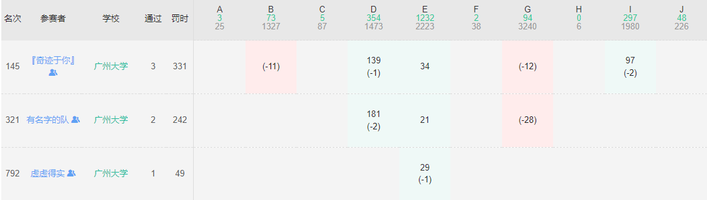
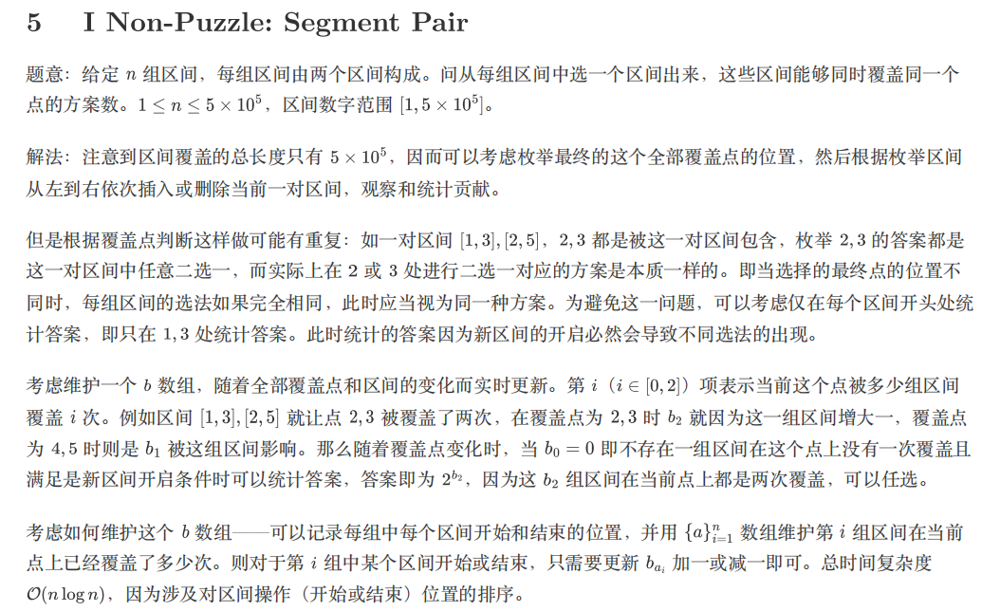

# 2023 多校9



拼命开I未果： 刘成和谢荣栩开G未果。寄！只补一道：

## I

[I-Non-Puzzle: Segment Pair_2023牛客暑期多校训练营9 (nowcoder.com)](https://ac.nowcoder.com/acm/contest/57363/I)

There are $n$ pairs of segments in the X-axis. The $i$\-th of them is $[l_{i},r_{i}]$ and $[l'_{i},r'_{i}]$.  

You should choose **exactly one** segment from each pair (that is, choose either $[l_{i},r_{i}]$ or $[l'_{i},r'_{i}]$ for each $i$), satisfying that there exists at least one point $x$, which is included by all the chosen segments.  

You need to determine the number of different ways of choosing the segments (over $2^n$ possible ways) that satisfies the condition, output it modulo $10^9+7$.  

Two ways are considered different if and only if there exists $i$, such that $[l_{i},r_{i}]$ is chosen in one way, and $[l'_{i},r'_{i}]$ is chosen in another. Note that even if $[l_{i},r_{i}] = [l'_{i},r'_{i}]$, the two ways are considered different.

在 X 轴上有 $n$对线段。其中的$i$对分别是$[l_{i},r_{i}]$对和$[l'_{i},r'_{i}]$对。

您应从每对线段中选择***准确的一条线段（即对每条$i$选择$[l_{i},r_{i}]$或$[l'_{i},r'_{i}]$），满足至少存在一个点$x$，它被所有选择的线段所包含。  

您需要确定满足条件的选择线段的不同方式的数目（超过 $2^n$ 种可能的方式），并输出它的模数 $10^9+7$。

当且仅当存在 $i$，使得 $[l_{i},r_{i}]$在一种方式中被选择，而 $[l'_{i},r'_{i}]$在另一种方式中被选择时，两种方式才被认为是不同的。请注意，即使$[l_{i},r_{i}] = [l'_{i},r'_{i}]$，这两种方式也被认为是不同的。


### solve:

考虑做一系列的转移：
1. 很容易计算出每一个点有多少种方案发生了覆盖，剩下解决问题：

但是直接求和，显然会重复（考虑一个某一个具体的方案，最终的交集可能是1个点以上的。因此如果把每一个点的贡献累加作为答案，那么显然会出现冗余的情况。）

**考虑怎么将这些方案去掉：**

有以下几个角度：


**整体把握资源规模：**

1. 考虑两种规模的空间：
   1. 问题中的求解线段。
   2. 对问题求解的线段长吨减1.
2. 然后惊奇的发现，2中所有的点被覆盖的方案数减去1中所有点被覆盖的方案数为最终答案。
   1. 对长度减少1之后，由于每一个交集的区间的左右边界，必然由某一条线段的右边界组成：如果对每一个区间进行减少1的变化。
      1. 交集长度为1的方案： 不再存在交集。 
      2. 交集长度大于1的方案。交集区间长度减少1.因此对于每一个方案都将会少一个点被覆盖。而原来的方案计算减去变化后的方案数计算。就是这些少了的点的次数。因为每一个交集发生一次缺失。因此相减即得到了最终的答案。

**枚举左区间端点**

枚举区间交集的左端点，找出这一类型的区间的答案：

**jls code**

参考了jls的代码：有一个很难学习的技巧就是，对区间覆盖的处理：它通过一些非常巧妙地方式实现。

```cpp
const int N = 5E5 + 10;
const int mod = inf;
const int M = (int) 5E5;
// const int M = 5;

int l1[N], r1[N], l2[N], r2[N];
ll p2[N];

void add(int& a, int b) {
	a += b;
	if (a > mod) a -= mod;
	if (a < 0) a += mod;
}


signed main()
{
	ios::sync_with_stdio(false);
	cin.tie(0);
	int n;
	cin >> n;

	p2[0] = 1;
	for (int i = 1; i <= n; i++) {
		p2[i] = p2[i - 1] * 2 % mod;
	}
	for (int i = 0; i < n; i++) {
		cin >> l1[i] >> r1[i] >> l2[i] >> r2[i];
	}
	// 得到交集， 补集合的方法：
	function<int()> solve = [&]() {
		int res = 0;
		vector<array<int , 3>> d(M + 10);

		for (int i = 0; i < n; i++) {
			vector<array<int, 2>> f;
			f.push_back({ l1[i] , 1 });
			f.push_back({ r1[i] , -1 });
			f.push_back({ l2[i] , 1 });
			f.push_back({ r2[i] , -1 });
			// sort(all(f) , [&](const array<int , 2>& a , const array<int , 2>&b) {
			// 	if (a[0] < b[0]) return true;
			// 	else if (a[0] > b[0]) return false;
			// 	else {
			// 		return a[1] > b[1];
			// 	}
			// });
			sort(all(f));
			//一个学不来的技巧：
			int last = 0, val = 0;
			for (auto [x,  y] : f) {

				d[last][val]++;
				d[x][val]--;
				last = x;
				val += y;
			}
			d[last][0]++;
		}
		for (int i = 1; i <= M; i++) {
			for (int j = 0; j < 3; j++) {
				d[i][j] += d[i - 1][j];
				// cout << d[i][j]  << "\n";
			}
			if (d[i][0] == 0) {
				add(res , p2[d[i][2]]);
			}
		}
		// cout << res << "\n";
		return res;
	};
	int ans = 0;
	add(ans , -solve());
	for (int i = 0; i < n; i++) {
		r1[i]++; r2[i]++;
	}
	add(ans , solve());
	cout << ans << "\n";
}
```


**第二种容斥方法：**



```cpp
#include <bits/stdc++.h>
using namespace std;
const int N = 5e5 + 5, mod = 1e9 + 7;
int n, l1, r1, l2, r2, a[N], b[3], p[N];
struct node
{
    int x, y, id;
};
vector<node> ve;
bool cmp(node a, node b)
{
    if (a.x != b.x)
        return a.x < b.x;
    return a.y < b.y;
}
int main()
{
    cin >> n;
    p[0] = 1;
    for (int i = 1; i <= n; i++)
        p[i] = p[i - 1] * 2ll % mod;
    for (int i = 1; i <= n; i++)
    {
        cin >> l1 >> r1 >> l2 >> r2;
        ve.push_back({l1, 1, i});
        ve.push_back({r1 + 1, -1, i});
        ve.push_back({l2, 1, i});
        ve.push_back({r2 + 1, -1, i});
    }
    sort(ve.begin(), ve.end(), cmp);
    b[0] = n;
    long long ans = 0;
    for (auto v : ve)
    {
        b[a[v.id]]--;
        a[v.id] += v.y;
        if (v.y == 1 && !b[0])
            ans += p[b[2]], ans %= mod;
        b[a[v.id]]++;
    }
    cout << ans;
}
```

标记信息维护地非常漂亮。感受扫描线地思想：

