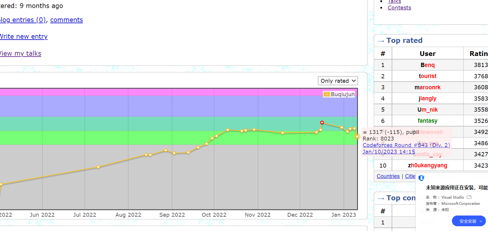

#### 情况

这场比赛最终只过了一道题。

整整掉了130多分，喜提绿名。

赛后复盘来看，这场比赛前面四道题其实还是蛮简单的。

事实上我只看了一道题。

#### 为什么？

- 问题读错。像被打了思想钢印一样。面对假的概念背景问题解决问题。无论思考多久，都无法正确。
- 不懂得前进。
  - 第一思路的前进。反思，这道题其实没有这么难，其实我想复杂了。要想的简单一点。
  - 第二反思自己现在的思考状态。如果问题的模样都很模糊，又谈什么解决问题呢？
  - 第三为什么不往下开题呢？
  - 第四，比赛的时候就要专心打。自己打，养成好习惯。

补题的文件位置：

