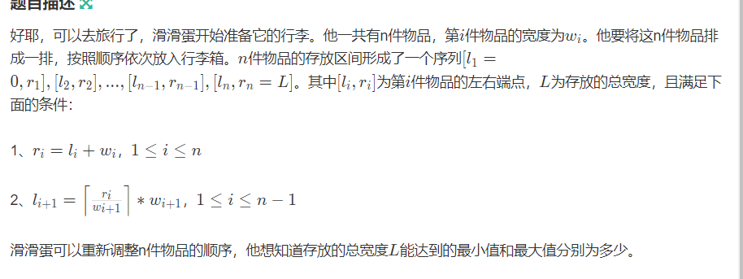
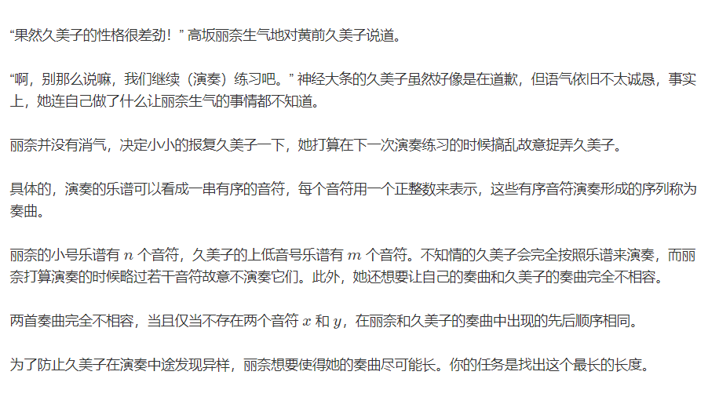
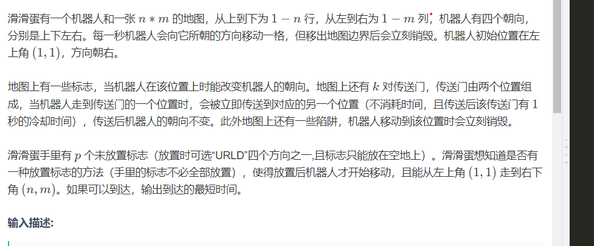

**A 萤火虫**

性质 ， 构造最优解：

[A-萤火虫_广州大学第十七届ACM大学生程序设计竞赛（同步赛） (nowcoder.com)](https://ac.nowcoder.com/acm/contest/53967/A)

问题等效为， 进行若干次操作1之后 ， 至多有多少个位置为0。

探究操作1的性质：

1. 同余分组。进行操作1相当于对每一个余数组的和进行加减1.
2. 不变量： 进行一些操作1之后，每一组和之间的差值不变。

存在一种方案，将0 ...... n - k) 所有位置变成0。考虑对最后k位进行处理。在前不变量性质的指导下。这一组继续操作成0的最大个数为组内和相同的组数。

不会有更多的方案，反证法证明如下：

标记同余组的和为$s_{0....k - 1}$

1. 如果存在更少的方案： 
   1. 非1的点落在0.... k - 1中的某一组。个数为a.
   2. 至少有 k  - a组之间的差相同。
   3. 违背上述的现象。


```cpp
#include<bits/stdc++.h>
using namespace std;
typedef long long ll;
const int oo = 0x0fffffff;
const int N = 1E6 + 10;
void work(int testNo)
{
	int n , k;
	cin >> n >> k;
	vector<int> a(k , 0);
	for (int i = 0; i < n; i++) {
		int x;
		cin >> x;
		a[i % k] += x;
	}
	map<ll , int> rec;
	int mx = 0;
	for (int i = 0; i < k; i++) {
		rec[a[i]]++;
		mx = max(rec[a[i]] , mx);
	}
	cout << k - mx << '\n';
}
int main()
{
	ios::sync_with_stdio(false);
	cin.tie(0);

	int t; cin >> t;
	for (int i = 1; i <= t; i++)work(i);
}
```

**G Clannad**

[G-Clannad_广州大学第十七届ACM大学生程序设计竞赛（同步赛） (nowcoder.com)](https://ac.nowcoder.com/acm/contest/53967/G)

由鸽巢原理，必然出现同余的情况。除了前提性不能得到满足， 所有的方案都满足题意。

```cpp
#include<bits/stdc++.h>
using namespace std;
using ll = long long;

const int N = 1E6 + 10;
const int N_C = 1E5 + 10;
const int mod = 1E9 + 7;

int fac[N_C] , infac[N_C];
ll qp(ll x  , ll n , ll p) {
	ll res = 1;
	while (n > 0) {
		if (n & 1) res = res * x % p;
		x = x * x % p;
		n /= 2;
	}
	return res;
}
void init() {
	fac[0] = infac[0] = 1;
	for (int i = 1; i < N_C; i++) {
		fac[i] = 1LL * fac[i - 1] * i % mod;
		infac[i] = 1LL * infac[i - 1] * qp(i , mod - 2 , mod) % mod;
	}
}
ll c(int a , int b) {
	return 1LL * fac[a] * infac[b] % mod * infac[a - b] % mod;
}

void solve() {
	int n , x;
	cin >> x >> n;
	if (x + 1 > n) {
		cout << -1 << '\n';
		return;
	}
	cout << c(n , x + 1) << '\n';

}


int main()
{
	ios::sync_with_stdio(false);
	cin.tie(0);
	int t;
	cin >> t;
	init();
	while (t --) {
		solve();
	}
}
```

**I min and max**



二进制：
形象的观察一种其摆放方式特点：

考虑最小值：

1. 降序的放： 物品之间没有空隙 ， 这种方案必然是长度的最小值。

考虑最大值：

----------


----------

```cpp
#include<bits/stdc++.h>
using namespace std;
typedef long long ll;
const int oo = 0x0fffffff;
const int N = 1E6 + 10;
ll w[N];
void work() {
	int n; cin  >> n;
	for (int i = 1; i <= n; i++) {
		cin >> w[i];
		w[i] = (1LL << w[i]);
	}
	sort(w + 1 , w + 1 + n);
	ll s = 0;
	ll ans = 0;
	for (int i = 1; i <= n; i++) {
		if (i > (n + 1) / 2)ans += w[i] * 2;
		s += w[i];
	}
	if (n & 1)ans += w[(n + 1) / 2];
	cout << s << ' ' << ans << '\n';
}
int main()
{
	ios::sync_with_stdio(false);
	cin.tie(0);
	work();
}
```


**H 性格差劲的久美子**

[H-性格差劲的久美子_广州大学第十七届ACM大学生程序设计竞赛（同步赛） (nowcoder.com)](https://ac.nowcoder.com/acm/contest/53967/H)



考察一个符合条件的的序列，其实就只是满足题中给出的定义即可。从该角度上看：进行一些量的抽象： 对于一个数字：有关注最后出现的位置 ， 最初出现的位置$R[i] ,L[i]$ ， 一个合法的序列必须满足条件为：
$R[i]< L[j] , i < j$
所以就是一个最长单调下降序列的变形。
集中精力 ， 处理这种变化：类比发现和普通的dp处理其实一致。

#### code
```cpp
#include<bits/stdc++.h>
using namespace std;
using ll = long long;
using iip = pair<int , int>;

const int N = 1E6 + 10;
int a[N] , b[N];
map<int , iip> rec;
int d[N];

int main()
{
	ios::sync_with_stdio(false);
	cin.tie(0);

	int n; cin >> n;
	for (int i = 1; i <= n; i++) {
		cin >> a[i];
	}
	int m; cin >> m;
	for (int i = 1; i <= m; i++) {
		cin >> b[i];
		if (rec[b[i]] == iip{0 , 0}) {
			rec[b[i]] = {i , i};
		} else rec[b[i]].second = i;
	}
	d[0] = 1E9 + 10;
	int ans = 0 ,  cnt = 0;
	for (int i = 1; i <= n; i++) {
		if (rec[a[i]] == iip{ 0 , 0}) {cnt++; continue;}
		int low = 0 , high = ans + 1;
		int fi = rec[a[i]].first;
		int se = rec[a[i]].second;
		while (low < high) {
			int mid = (low + high) / 2;
			if (d[mid] < se) high = mid;
			else low = mid + 1;
		}
		d[low] = max(d[low] , fi);
		ans = max(ans , low);
	}
	cout << ans + cnt << '\n';
}

/* stuff you should look for
* int overflow, array bounds
* special cases (n=1?)
* do smth instead of nothing and stay organized
* WRITE STUFF DOWN
* DON'T GET STUCK ON ONE APPROACH
*/
```
#### 生长：

如果 ， 在二分时 ， 将`d[mid] < se `改为 `d[mid] <= se` 就会wa一个点。按照题意 ， 如果存在两个点是不可能会出现相等的情况的。这应该没有影响但是 ， 确实是wa了一个点。

****

[B-罗伯特_广州大学第十七届ACM大学生程序设计竞赛（同步赛） (nowcoder.com)](https://ac.nowcoder.com/acm/contest/53967/B)




从起点出发搜索。bfs即可。

**比较难写的地方**

1. 处理传送阵的情况
2. 状态的记录相对复杂： 包含了路标的使用。
------
1. 着重感受， 枚举的过程中，最优解保持优势。
2. 再次回到一个状态时，其优劣情况。


```cpp
#include<bits/stdc++.h>
using namespace std;
using ll = long long;
using pii = pair<int , int>;

const int N = 1E2 + 10;
const int inf = 1E9 + 10;

pii nxt[N][N];
char mp[N][N];
int f[N][N][N][10];
int dx[5] = { -1 , 0 , 1 , 0} , dy[5] = {0 , 1 , 0 , -1};
bool vis[N][N][N][10];

struct node {
	int d , x , y , k , f;
	bool operator< (const node & t) const {
		return d > t.d;
	};
};
int main()
{
	ios::sync_with_stdio(false);
	cin.tie(0);
	int n , m , k , p; cin >> n >> m >> p >> k;
	for (int i = 1; i <= p; i++) {
		int a , b , c , d;
		cin >> a >> b >> c >> d;
		nxt[a][b] = {c , d};
		nxt[c][d] = {a , b};
	}
	for (int i = 1; i <= n; i++) {
		cin >> (mp[i] + 1);
	}
	for (int i = 1; i <= n; i++)
		for (int j = 1; j <= m; j++) {
			if (mp[i][j] == 'U') mp[i][j] = '0';
			else if (mp[i][j] == 'R')mp[i][j] = '1';
			else if (mp[i][j] == 'D')mp[i][j] = '2';
			else if (mp[i][j] == 'L')mp[i][j] = '3';
		}
	for (int i = 1; i <= n; i++)
		for (int j = 1; j <= m; j++)
			for (int s = 0; s <= k; s++)
				for (int t = 0; t < 5; t++)
					f[i][j][s][t] = inf;

	priority_queue<node> que;
	//初始状态为在起点处，花费步数为1。总长度为：
	f[1][1][0][1] = 0;
	que.push({0 , 1 , 1, 0 , 1});
	while (que.size()) {
		auto cur = que.top(); que.pop();
		//然后进行一些列的迁移；
		if (vis[cur.x][cur.y][cur.k][cur.f])continue;
		vis[cur.x][cur.y][cur.k][cur.f] = true;
		//接下来就是转移了。
		//然后是迁移分类讨论；
		//分成若干类；
		//第一类型， 可以在其中放置路标。
		if (mp[cur.x][cur.y] == '.') {
			//向四个方向转移：
			//解决四个方向。
			for (int i = 0 ; i < 4; i++) {
				//确定下一个转移状态。
				//确定下一个状态：
				int nx = dx[i] + cur.x , ny = cur.y + dy[i] , nf = i , nk = cur.k + (nf != cur.f);
				if (nx >= 1 && nx <= n && ny >= 1 && ny <= m && mp[nx][ny] != '#') {
					if (nxt[nx][ny].first != 0) {
						//说明当前是传送阵
						//先用一个temp保存结果，小心后效性。
						auto temp = nxt[nx][ny];
						nx = temp.first;
						ny = temp.second;
					}
					int nd = f[cur.x][cur.y][cur.k][cur.f] + 1;
					if (nk <= k && f[nx][ny][nk][nf] > nd) {
						f[nx][ny][nk][nf] = nd;
						que.push({nd , nx , ny , nk , nf});
					}
				}
			}
			//另外的普通情况。
		}
		if ((mp[cur.x][cur.y] >= '0' && mp[cur.x][cur.y] <= '3') || mp[cur.x][cur.y] == '@') {
			int nf = mp[cur.x][cur.y] - '0';
			if (mp[cur.x][cur.y] == '@') nf = cur.f;
			int nx = cur.x + dx[nf] , ny = cur.y + dy[nf];
			int nk = cur.k;
			//然后接下来就是处理：
			if (nx >= 1 && nx <= n && ny >= 1 && ny <= m && mp[nx][ny] != '#') {
				if (mp[nx][ny] == '@') {
					auto temp = nxt[nx][ny];
					nx = temp.first;
					ny = temp.second;
				}
				int temp = f[cur.x][cur.y][cur.k][cur.f] + 1;
				if (f[nx][ny][nk][nf] > temp) {
					f[nx][ny][nk][nf] = temp;
					que.push({temp , nx , ny , nk , nf});
				}
			}
		}
	}
	int ans = inf;
	for (int i = 0; i <= k; i++)
		for (int j = 0; j < 4; j++) {
			ans = min(ans , f[n][m][i][j]);
		}
	if (ans == inf) {
		cout << "NO\n";
	} else {
		cout << "YES\n";
		cout << ans << '\n';
	}
}

/* stuff you should look for
* int overflow, array bounds
* special cases (n=1?)
* do smth instead of nothing and stay organized
* WRITE STUFF DOWN
* DON'T GET STUCK ON ONE APPROACH
*/
```
