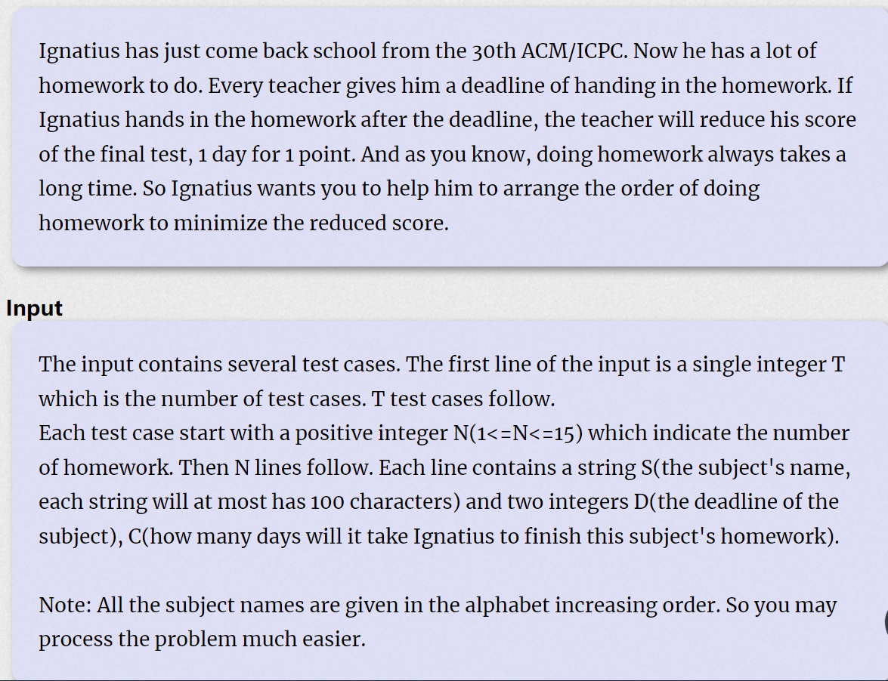

**Doing Homework**
https://vjudge.d0j1a1701.cc/problem/HDU-1074



#### solve

观察数据范围：
最基础的状态压缩dp;

**状态**

$f_{s}$表示s状态下 ， 的最佳分数。

**$状态转移：$**

有两种方案，
1. 先枚举小问题的解 ， 更新大问题的解。
   $$
   f_{s|1 << i} = max(f_{s} + max(0 , ddl[j] - sum[s|1<<j]) , f_{s|1<<j});
   $$
   

2. 先枚举大问题的解，枚举所有相关小问题，更新解。
   $$
   f_{s} = max(f_{s^{\wedge }1<<j)} + ddl[j] - sum[s] , f_s)
   $$

3. 

注意为了构造字典序最小的解。从小字典序的科目开始枚举：若方案最优， 往后同优方案字典序必然比字典序更大。这样的枚举顺序可以让字典序保持优势。因为路径函数就是记录第一个遇到的优值。

#### code

```cpp
#include<bits/stdc++.h>
using namespace std;
typedef long long ll;

const int oo = 0x0fffffff;
const int inf = 1E9;
const int N = 1E6 + 10;
ll ddl[20], nt[20];
void work(int testNo)
{
	int n; cin >> n;
	const int M = 1 << n;
	vector<string>str(n);
	vector<ll>T(M, 0), pre(M, -1), f(M, inf);
	f[0] = 0;
	for (int i = 0; i < n; i++) cin >> str[i] >> ddl[i] >> nt[i];
	for (int i = 1; i < M; i++) {
		for (int j = 0; j < n; j++) {
			if ((i >> j) & 1) {
				T[i] += nt[j];
			}
		}
	}
	for (int s = 0; s < M; s++) {
		for (int i = 0; i < n; i++) {
			if ((s >> i & 1) == 0) {
				int t = f[s] + max(0LL , T[s | 1 << i] - ddl[i]);
				if (f[s | 1 << i] > t) {
					f[s | 1 << i] = t;
					pre[s | 1 << i] = i;
				}
			}
		}
	}
	int s = M - 1;
	stack<int> ans;
	cout << f[s] << '\n';
	while (s) {
		ans.push(pre[s]);
		s ^= 1 << pre[s];
	}
	while (ans.size()) {
		cout << str[ans.top()] << '\n';
		ans.pop();
	}
}
int main()
{
	ios::sync_with_stdio(false);
	cin.tie(0);

	int t; cin >> t;
	for (int i = 1; i <= t; i++)work(i);
}

```

