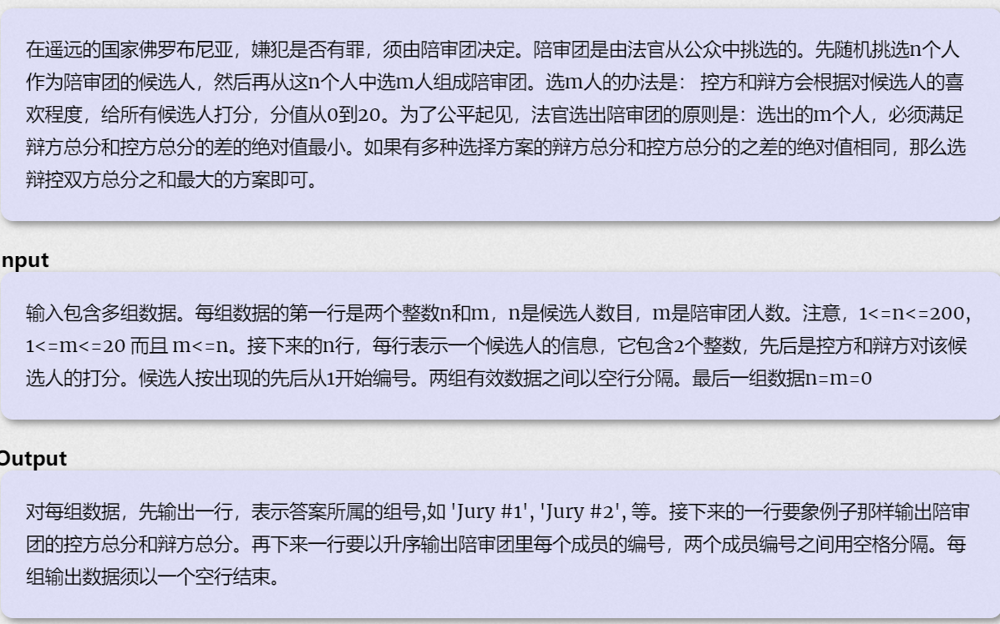

**Jury Compromise**

https://vjudge.csgrandeur.cn/problem/POJ-1015#author=0258



### solve

初步：

**状态定义**

$f_{i , j ,k}$：i  , j分别表示两种分数之和 , 已经选择了k个陪审员的情况是否存在。

**转移方程**

利用滚动数组优化：从后往前，转移。

$f_{i , j , k}为ture$ ，且更大规模的状态没有更新 ， 则更新更大规模的状态。（只记录首次发现符合解的状态。最大限度节省空间。）、

**初始化**

$f_{0 , 0 , 0} = true$

时间复杂度$O(n\times m\times 400 * 400 * q)$

1E8 --- 1E9

--------

==正解：==

**状态设计：**

$f_{i , j , k}$  ： 表示考虑前i个 ， 两种的和的差值为j ， 选择了k个物品的最大和。

滚动数组优化成$f_{i , j}$

**转移方程：**
如果用滚动数组优化就从后往前推。

**时间复杂度：**
$O(n*m*800)$
注意将：插值可能为负数， 所以要对使用移码。 	

#### 困难

关于滚动优化的细节：

1. 逆推可以保证解的正确性。
2. 路径还原的方案：
   1. `path[n][m][k]`
   2. 开一个`vector<int>数组`非常方便的维护一个状态的情况。更新情况。处理起来开销较大，虽然维护方便。

#### 总结：

由于一个地方出错拼命wa ， runtimeerror.
**状态转移顺序上**

应该先枚举m递增。因为a[i] - b[i]的大小是【-20.....20】。会造成 ， 表的缺失。导致转移不正确。

#### code1.1代码

```cpp
#include<iostream>
#include<algorithm>
#include<vector>
#include<cstring>
using namespace std;
const int N = 810, M = 24;
const int d = 400;
int f[N][M], pre[210][N][M];
int a[N], b[N];
int main() {
	int n, m;
	int test = 0;
	while (scanf("%d%d" , &n , &m) && n && m) {
		printf("Jury #%d\n", ++test);
		memset(f, 0xf0, sizeof f);

		memset(pre, 0, sizeof pre);
		f[d][0] = 0;
		for (int i = 1; i <= n; i++) {
			scanf("%d%d" , a + i , b + i);
			int x = a[i], y = b[i];
			for (int k = m; k >= 1; k--) {
				for (int j = 400; j >= -400; j--) {
					pre[i][j + d][k] = pre[i - 1][j + d][k];
					int dd = j - (x - y);
					if (dd + d >= 0 && dd + d <= 800 && f[j + d][k] < f[dd + d][k - 1] + x + y) {
						f[j + d][k] = f[dd + d][k - 1] + x + y;
						pre[i][j + d][k] = i;
					}
				}
			}
		}
		int st = 0;
		for (int i = 0; i <= 400; i++) {
			if (f[-i + d][m] > 0 || f[i + d][m] > 0) {
				if (f[-i + d][m] > f[i + d][m]) st = -i;
				else st = i;
				break;
			}
		}
		printf("Best jury has value %d for prosecution and value %d for defence:\n", (f[st + d][m] + st) / 2, (f[st + d][m] - st) / 2);
		vector<int> rec;
		//定位用到的三个变量
		int cur = n;
		st += d;
		for (int i = m; i >= 1; i--) {
			cur = pre[cur][st][i];
			rec.push_back(cur);
			st = st - (a[cur] - b[cur]);
			cur--;
		}
		for (int i = m - 1; i >= 0; i--) {
			printf(" %d", rec[i]);
		}
		printf("\n\n");
	}
}
```

**玄学的是， 其实1.1跑的更慢。大概是初始化方式过于暴力。**

#### code1.2代码：

```cpp
#include<iostream>
#include<algorithm>
#include<vector>
#include<cstring>
using namespace std;
const int N = 1000, M = 30;
const int d = 400;
int f[N][M];
int a[N], b[N];
vector<int> path[N][M];

int main() {
	int n, m;
	int test = 0;
	while ((scanf("%d%d" , &n , &m)) && n && m) {
		printf("Jury #%d\n", ++test);
		memset(f, -0x3f, sizeof f);

		for (int i = 0; i <= n; i++)
			for (int j = 0; j <= m; j++) {
				path[i][j].clear();
			}

		f[d][0] = 0;
		for (int i = 1; i <= n; i++) {
			scanf("%d%d" , a + i , b + i);
			int v = a[i] - b[i] , w = a[i] + b[i];
			for (int k = m; k >= 1; k--) {
				for (int j = 400; j >= -400; j--) {
					int dd = j - v;
					if (dd + d >= 0 && dd + d <= 800 && f[dd + d][k - 1] >= 0  && f[j + d][k] < f[dd + d][k - 1] + w) {
						f[j + d][k] = f[dd + d][k - 1] + w;
						path[j + d][k] = path[dd + d][k - 1];
						path[j + d][k].push_back(i);
					}
				}
			}
		}
		int st = 0;
		for (int i = 0; i <= 400; i++) {
			if (f[-i + d][m] > 0 || f[i + d][m] > 0) {
				if (f[-i + d][m] > f[i + d][m]) st = -i;
				else st = i;
				break;

			}
		}
		printf("Best jury has value %d for prosecution and value %d for defence:\n", (f[st + d][m] + st) / 2, (f[st + d][m] - st) / 2);
		//定位用到的三个变量
		st += d;
		for (int i = 0; i  < m; i++) {
			cout << " " << path[st][m][i] ;
		}
		printf("\n\n");
	}
}


```

#### code1的代码；tle了 (也可能错了qaq, 留个纪念)

```cpp
#include<iostream>
#include<vector>
using namespace std;
typedef long long ll;

const int N = 4e2 + 10;

int a[N], b[N], pre[N][N][21];
bool f[N][N][21];
int main()
{
	ios::sync_with_stdio(false);
	cin.tie(0);

	int n, m;
	int test = 0;
	while (cin >> n >> m && n && m) {
		test++;
		printf("Jury #%d\n", test);
		int s = 0, t = 0;
		for (int i = 1; i <= n; i++) {
			cin >> a[i] >> b[i];
			s += a[i];
			t += b[i];
		}
		for (int i = 0; i <= 400; i++)
			for (int j = 0; j <= 400; j++)
				for (int k = 0; k <= m; k++) {
					f[i][j][k] = false;
					pre[i][j][k] = 0;
				}
		s = 0, t = 0;
		//滚动之后 ， 怎么还原转移路径？
		//可以尝试记录第一次被更新到的时候的状态。
		f[0][0][0] = true;
		for (int i = 1; i <= n; i++) {
			for (int j = 400; j >= 0; j--)
				for (int k = 400; k >= 0; k--)
					for (int l = min(i, m - 1); l >= 0; l--) {
						if (f[j][k][l] && f[j + a[i]][k + b[i]][l + 1] == false) {
							f[j + a[i]][k + b[i]][l + 1] = true;
							pre[j + a[i]][k + b[i]][l + 1] = i;
							//			printf("i :%d , j : %d ， l : %d , pre : %d\n" , j + a[i], k + b[i] , l + 1 , pre[j + a[i]][k + b[i]][l + 1]);
						}
					}
			s += a[i]; t += b[i];
		}
		//然后寻找到最优的状态：
		//	printf("%d %d \n" , s , t);
		int d = 10000000, x = -1000, y = -1000;
		for (int i = 0; i <= 400; i++) {
			for (int j = 0; j <= 400; j++) {
				if (f[i][j][m] == false)continue;
				if (abs(i - j) < d) {
					d = abs(i - j);
					x = i; y = j;
					//printf("bool : %d x: %d , y: %d\n", f[i][j][m] , x , y);
				}
				else if (abs(i - j) == d) {
					if (i + j >= x + y)x = i, y = j;
					//printf("bool : %d x: %d , y: %d\n" , f[i][j][m] ,  x , y);
				}
			}
		}
		// printf("x : %d , y : %d\n" , x , y);
		printf("Best jury has value %d for prosecution and value %d for defence: \n", x, y);
		vector<int> ans;
		for (int i = m; i >= 1; i--) {
			int t = pre[x][y][i];
			x -= a[t];
			y -= b[t];
			ans.push_back(t);
			//	printf("x: %d y :%d\n" , x , y);
		}
		for (int i = 0; i < m; i++) {
			cout << ans[i] << " \n"[i == m - 1];
		}
	}
}
```


