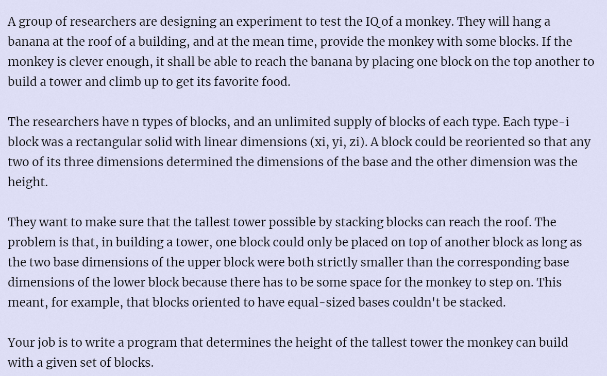

**Monkey and Banana**

https://vjudge.d0j1a1701.cc/problem/HDU-1069



#### solve

和紫书中经典的矩形嵌套是同一类型的问题：
建图处理转换成成dag上的dp即可。
注意一些模块的代码编写：

#### code
```cpp
#include<bits/stdc++.h>
using namespace std;

const int N = 35;
using ll = long long;
struct node {
	int l , r , h;
	node(int l_ , int r_ , int h_) {
		l = l_; r = r_; h = h_;
		if (l > r) swap(l , r);
	}
	bool operator> (const node & t)const {
		return l > t.l && r > t.r;
	}
};
int getid(int x) {
	return x / 3 + x % 3;
}
int main()
{
	int n;
	int test = 0;
	while ((scanf("%d" , &n)) && n) {
		test++;
		vector<vector<int>> g(n * 3);
		vector<int> deg(n * 3 , 0);
		vector<node> rec;
		vector<ll> f(n * 3 , 0);
		int c[3] {};
		for (int i = 0; i < n; i++) {
			for (int j = 0; j < 3; j++) {
				scanf("%d" , c + j);
			}
			for (int j = 0; j < 3; j++) {
				rec.push_back(node(c[j] , c[(j + 1) % 3] , c[(j + 2) % 3]));
			}
		}
		for (int i = 0; i < 3 * n; i++)
			for (int j = 0; j < 3 * n; j++) {
				if (rec[i] > rec[j]) {
					g[i].push_back(j);
					deg[j]++;
				}
			}
		//到此完成建图。
		queue<int> que;
		for (int i = 0; i < 3 * n; i++) {
			if (deg[i] == 0) que.push(i);
		}
		vector<int> topo;
		while (que.size()) {
			int u = que.front(); que.pop();
			topo.push_back(u);
			for (auto v : g[u]) {
				deg[v]--;
				if (!deg[v]) que.push(v);
			}
		}
		reverse(topo.begin() , topo.end());
		ll ans = 0;
		for (auto u : topo) {
			for (auto v : g[u]) {
				f[u] = max(f[u] , f[v]);
			}
			f[u] += rec[u].h;
			ans = max(ans , f[u]);
		}
		printf("Case %d: maximum height = %lld\n" , test , ans);
	}
}
```


