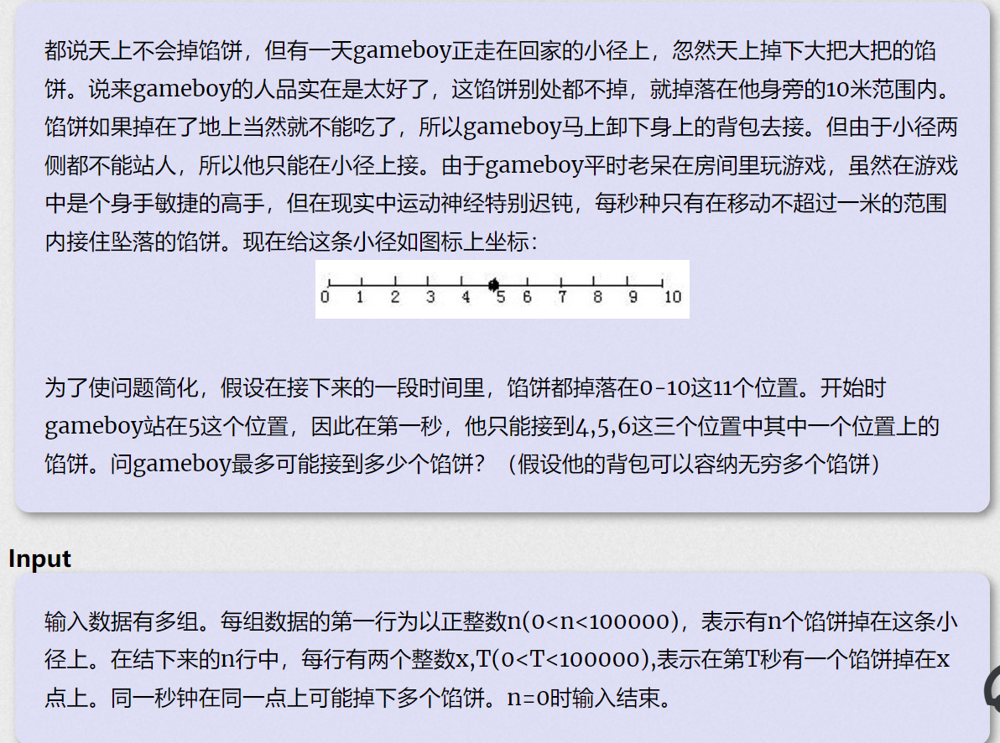

**免费馅饼**
https://vjudge.d0j1a1701.cc/problem/HDU-1176


#### solve

**状态设计：**

$f_{i , j}$从第秒时在i点 ， 之后可以获得的最大的馅饼数。

**状态转移：**

$f_{i , j}$的解中，最近一步的转移分三类。不动 ， 往左走 ，往右走。

$f_{i , j} = max(f_{i + 1, j - 1} , f_{i + 1 . j} , f_{i + 1 , j + 1}) + sum[i][j]$

#### solve code

```cpp
#include<bits/stdc++.h>
using namespace std;
using ll = long long;

const int N = 1E5 + 10;

int f[N][20];


int main()
{
	ios::sync_with_stdio(false);
	cin.tie(0), cout.tie(0);

	int n;
	while (cin >> n && n) {
		int mx = 0;
		memset(f, 0 , sizeof f);
		for (int i = 1; i <= n; i++) {
			int  t , x;
			cin >> x >> t;
			x++;
			mx = max(mx , t);
			f[t][x]++;
		}
		for (int i = mx; i >= 0; i--) {
			for (int j = 1; j <= 11; j++)
				f[i][j] = max({f[i + 1][j - 1] , f[i + 1][j] , f[i + 1][j + 1]}) + f[i][j];
		}
		cout << f[0][6] << '\n';
	}
}

/* stuff you should look for
* int overflow, array bounds
* special cases (n=1?)
* do smth instead of nothing and stay organized
* WRITE STUFF DOWN
* DON'T GET STUCK ON ONE APPROACH
*/
```

#### code

下面这一份，死活不知什么地方出错。
应该重新审视状态转换方程的正确性。

**上下两份的主要区别：**
为了防止时间过于离散，造成计算资源的浪费。
分阶段的进行考虑：

关注每一有馅饼掉落的时间。
然后进行了一下相当模糊的转移：

集中于：

```cpp
#include<bits/stdc++.h>
using namespace std;
using ll = long long;

const int N = 1E5 + 10;
struct node {
	int t;
	int x;
	bool operator<(const node& tt) {
		return t < tt.t;
	}
} a[N];

int main()
{
	int n;
	while (scanf("%d" , &n) , n) {
		for (int i = 0; i < n; ++i) {
			scanf("%d%d" , &a[i].x , &a[i].t);
		}
		sort(a , a + n);
		int f[100] {} , pre[100] {} , nxt = a[n - 1].t;
		for (int i = n - 1; i >= 0; --i) {
			int d = nxt - a[i].t;
			d = min(d , 10);
			nxt = a[i].t;
			for (int j = 0; j < 20; j ++)
				pre[j] = f[j];
			for (int j = 0; j < 11; ++j) {
				for (int k = -d; k <= d; ++k) {
					if (j + k < 0 || j + k > 10)continue;
					f[j] = max(f[j] , pre[j + k]);
				}
			}
			f[a[i].x]++;
		}
		printf("%d\n" ,  max({f[4] , f[5] , f[6]}));
	}
}

/* stuff you should look for
* int overflow, array bounds
* special cases (n=1?)
* do smth instead of nothing and stay organized
* WRITE STUFF DOWN
* DON'T GET STUCK ON ONE APPROACH
*/
```
