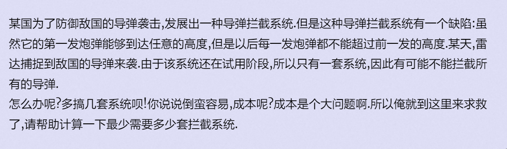

## 最少拦截系统

 https://vjudge.d0j1a1701.cc/problem/HDU-1257



#### solve

考虑一个拦截系统怎么最优的拦截导弹：
能选就选： 证明如下：

------------

？？


------------

然后转换成求最长下降子序列问题：


#### code

```cpp
#include<bits/stdc++.h>
using namespace std;
using ll = long long;
const int N = 3E4 + 10;
const int inf = 1E9;
int main()
{
	ios::sync_with_stdio(false);
	cin.tie(0);
	int n;
	while (cin >> n) {
		vector<int> a(n + 1);
		vector<int> d(n + 10, inf);
		d[0] = 0;
		for (int i = 1; i <= n; i++)
			cin >> a[i];
		int ans = 0;
		for (int i = 1; i <= n; i++) {
			int low = 0, high = ans + 1;
			while (low < high) {
				int mid = (low + high) / 2;
				if (d[mid] >= a[i]) {
					high = mid;
				}
				else low = mid + 1;
			}
			ans = max(ans, low);
			d[low] = a[i];
		}
		cout << ans << '\n';
	}
}
```

