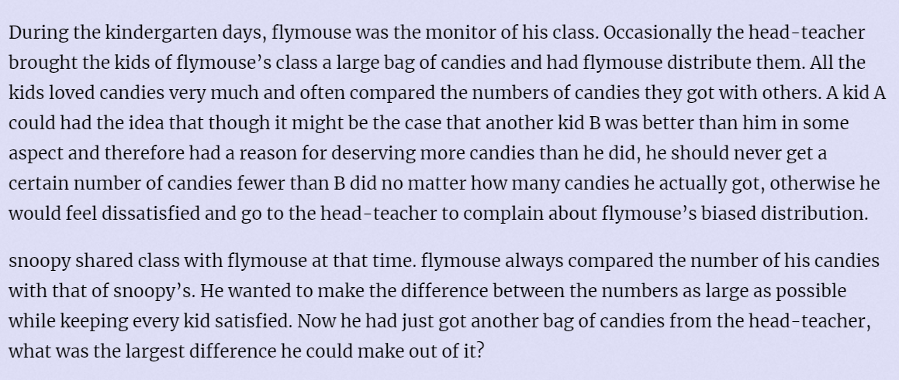

**Candies**
https://vjudge.csgrandeur.cn/problem/POJ-3159#author=Fizzmy



#### solve

怎么转换成图论模型？

1. 关注不等式。联想到差分约束系统：

   但是建立差分约束系统之后 ， 只是将其限制模型化？怎么回归到flymous 和 snoopy之间的差异最大的问题？
   
   -----------
   
    [差分约束系统.md](..\..\..\..\Logrithm\图论\差分约束系统\差分约束系统.md) 
   
   这里的笔记：讨论的内容只涉及到了：
   
   1. 求一组普通的解：
   2. 解的要求：
      1. 特殊图中求出权值的类型数量尽量多。
      2. 每一个解都大于等于0.（建立一个虚点， 并对其与其它点建立一条虚边， 这样按照正常步骤 ， 保证其大于0。）
      3. 每个变量尽量小。

反思一下：  并不是要寻找一组解。 同时糖果的数量可以认为是无限的。并且只要求差异。

1. 1和N不可能没有限制制约。否则结果将会无穷大。
2. 1 ， N有一些点 ， 相互制约。假设其中有关系的点都选择了一条边。（这些边要在制约范围内 ， a - > b该边权表示a  - b的值。）显然1   N  之间的最大差就是边只和。贪心的选取每一条边取最大值。

然后这样就转换成了求最短路问题。

看题目似乎不会出现负权制约。所以直接用dijkstra求解。

如果N —》1有限制就会正常求出一个最短路。（不是最长路 ， 是因为如果选择了最长路 ， 那么其中可能有一些更短得路得限制无法得到满足。反证法即可。）

如果只有1 - 》N有路。那么设置所有的边的大小为0。（因为接下来正常的情况下 ，都会更小。）

#### code

```cpp
#include<iostream>
#include<algorithm>
#include<vector>
#include<queue>
using namespace std;
#define  fi first
#define  se second
typedef pair<int , int> pii;

const int N = 3E4 + 10;
const int M = 150010;
const int inf = 1 << 29;
struct node {
	int v , w , nxt;

} e[M];
int head[N] , tot;
void add(int u , int v , int w) {
	++tot;
	e[tot].v = v;
	e[tot].w = w;
	e[tot].nxt = head[u];
	head[u] = tot;
}
struct qnode {
	int u;
	int d;
	bool operator<(const qnode& t) const {
		return d > t.d;
	}
};

int d[N];
bool done[N];

int main()
{
	ios::sync_with_stdio(false);
	cin.tie(0);
	int n , m;
	cin >> n >> m;
	for (int i = 1; i <= m; i++) {
		int  u , v , w;
		cin >> u >> v >> w;
		add(v , u , w);
	}
	for (int i = 1; i <= n; i++) {
		d[i] = inf;
	}
	priority_queue<qnode> que;
	que.push((qnode) {n , 0});
	d[n] = 0;
	while (que.size()) {
		qnode x = que.top(); que.pop();
		int u = x.u;
		if (done[u])continue;
		done[u] = true;
		for (int i = head[u]; i; i = e[i].nxt) {
			int v = e[i].v;
			int w = e[i].w;
			if (d[v] > d[u] + w) {
				d[v] = d[u] + w;
				que.push((qnode) {v , d[v]});
			}
		}
	}
	if (d[1] == inf)d[1] = 0;
	cout << d[1] << '\n';
}

/* stuff you should look for
* int overflow, array bounds
* special cases (n=1?)
* do smth instead of nothing and stay organized
* WRITE STUFF DOWN
* DON'T GET STUCK ON ONE APPROACH
*/
```


