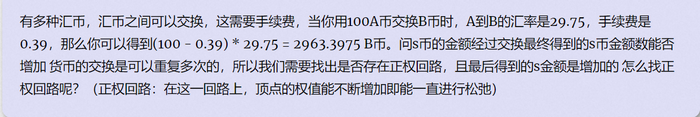

## Currency Exchange

https://vjudge.csgrandeur.cn/problem/POJ-1860#author=wanglin007



#### solve:

首先联系几个问题：

1. 怎么在图中寻找负数环？

**bellman算法：** 使用bellman算法迭代更新k次之后。所有节点数长度小于等于k + 1的节点数的路径 ， 都已经被考虑。如果第n次某一点的最短路依然被更新，说明存在负数环；

2. 怎么将问题转换成一个图上问题？

建图角度： ==关于点的处理：==  没有点权 ，代表一种类型的 钞票。

​                      ==关于边的处理：==   有边权（可以认为是一个函数 ） ， 转换后的钞票价格。


**question** : 所有的钞票是否都转换成一种钞票？这种转换方式是最优的吗？

考察一定量采取某一转移路径 ， 其总值的变化 ：
$$
f = (((f - a_1)*b_1 - a_2 )*b_2 - a_3)*b_3...
$$
从起点到达某一点时， 总有一个最优方案， 把所有钱投进该方案最优。所以采取全部统一的策略。

**综上：**

跑bellman ， 关注最长路。判断是否有回路即可。


纳闷的是g++ ,要改成float才能过。改成vs的c++ 可以过。不大理解。

```cpp
#include<iostream>
#include<algorithm>
#include<string.h>
#include<queue>
using namespace std;

const int N = 110;
double r[N][N];
double c[N][N];
double d[N];
int n , m , s;
double st;
int inq[N] , cnt[N];

bool spfa(int s , double have) {
	queue<int> que;
	memset(inq , 0 , sizeof(inq));
	memset(cnt , 0 , sizeof(cnt));
	d[s] = have;
	inq[s] = true;
	que.push(s);
	while (!que.empty()) {
		int u = que.front(); que.pop();
		inq[u] = false;
		for (int v = 1; v <= n; v++) {
			if (d[v] < (d[u] - c[u][v])*r[u][v]) {
				d[v] = (d[u] - c[u][v]) * r[u][v];
				if (!inq[v]) {
					que.push(v); inq[v] = true;
					if (++cnt[v] > n) return false;
				}
			}
		}
	}
	return true;
}
int main()
{
	ios::sync_with_stdio(false);
	cin.tie(0);
	cin >> n >> m >> s >> st;
	for (int i = 1; i <= m; i++) {
		int u , v;
		cin >> u >> v;
		double a , b;
		cin >> a >> b;
		r[u][v] = a;
		c[u][v] = b;
		cin >> a >> b;
		r[v][u] = a;
		c[v][u] = b;

	}
	if (spfa(s , st))cout << "NO\n";
	else cout << "YES\n";

}

/*stuff you should look for
* int overflow, array bounds
* special cases (n=1?)
* do smth instead of nothing and stay organized
* WRITE STUFF DOWN
* DON'T GET STUCK ON ONE APPROACH
*/
```

