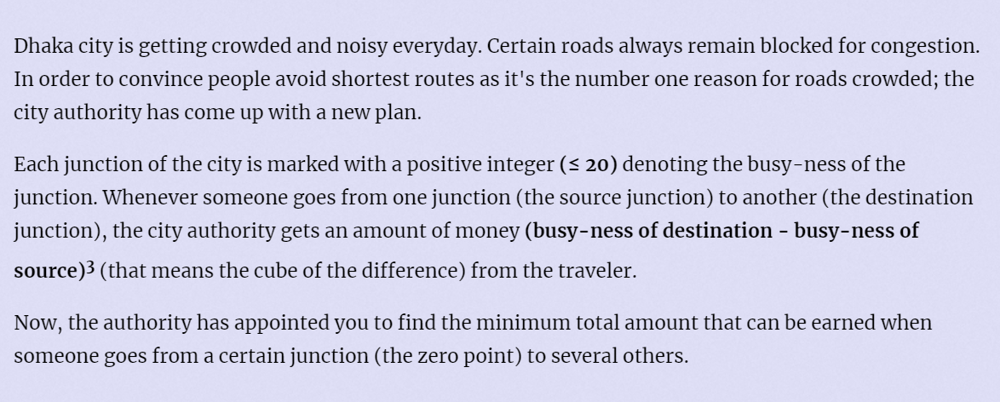

**Extended Traffic**



#### 简介：

给定一个图要求能够判断负环 ， 以及明确负环上的点的位置。而对于非负环上的点 ， 可以求出其离1的距离。

#### solve

关键问题是判断负数圈相关的点：找到该点就跑一遍深度优先搜索 ， 标记其可达点。

#### code

```cpp
#include<bits/stdc++.h>
using namespace std;
typedef long long ll;
const int N = 300;
const int M = 3E6;
const ll inf = 1E18 + 100000;
ll v[N];
bool cycle[N];
struct node {
	int v;
	ll w;
	int nxt;
} e[M];
int head[N], tot;

void add(int u, int v, ll w) {
	e[++tot].v = v;
	e[tot].w = w;
	e[tot].nxt = head[u];
	head[u] = tot;
}
void init(const int n) {
	tot = 0;
	for (int i = 1; i <= n; i++) {
		head[i] = 0;
		cycle[i] = false;
	}
}
ll d[N];
bool inq[N];
int cunt[N];
bool vis[N];
void dfs(int u) {
	vis[u] = true;
	cycle[u] = true;
	for (int t = head[u]; t > 0; t = e[t].nxt) {
		int v = e[t].v;
		if (vis[v] == false)dfs(v);
	}
}
void bellman(const int  n) {
	fill(d, d + n + 1, inf);
	fill(inq, inq + n + 1, false);
	fill(cunt, cunt + n + 1, 0);
	fill(vis , vis + 1 + n , false);
	queue<int> que;
	que.push(1);
	inq[1] = true;
	d[1] = 0;
	while (que.size()) {
		int u = que.front(); que.pop();
		inq[u] = false;
		if (vis[u])continue;
		for (int t = head[u]; t > 0; t = e[t].nxt) {
			int v = e[t].v;
			ll w = e[t].w;
			if (d[v] > d[u] + w) {
				d[v] = d[u] + w;
				if (inq[v] == false) {
					inq[v] = true;
					if (++cunt[v] > n) {
						dfs(v);
					}
					if (cycle[v] == false)
						que.push(v);
				}
			}
		}
	}
}
//负数环只影响了一部分。怎么处理该环的情况？
ll f(int i, int j) {

	ll d = v[j] - v[i];
	return d * d * d;
}
void solve(int id) {
	printf("Case %d:\n", id);
	int n;
	scanf("%d" , &n);
	// cin >> n;
	init(n);
	for (int i = 1; i <= n; i++) {
		scanf("%lld" , v + i);
	}
	int m;
	scanf("%d" , &m);
	// cin >> m;
	for (int i = 0; i < m; i++) {
		int u, v;
		scanf("%d%d" , &u , &v);
		// cin >> u >> v;
		add(u, v, f(u, v));
	}
	bellman(n);
	int q;
	scanf("%d" , &q);
	while (q--) {
		int x;
		scanf("%d" , &x);
		// cin >> x;
		if (d[x] < 3 || cycle[x] || d[x] == inf) {
			printf("?\n");
		}
		else printf("%lld\n", d[x]);
	}
}
int main()
{
	ios::sync_with_stdio(false);
	cin.tie(0);
	int t;
	scanf("%d" , &t);
	// cin >> t;
	for (int i = 1; i <= t; i++) { solve(i); }

}
/* stuff you should look for
* int overflow, array bounds
* special cases (n=1?)
* do smth instead of nothing and stay organized
* WRITE STUFF DOWN
* DON'T GET STUCK ON ONE APPROACH
*/
```

#### 总结：

1. 出现一些问题：
   1. 在处理负环之后：
      1. 在环中的点不进队伍。
      2. 标记了的点不仅队。
   2. 否则可能会溢出。导致一些奇奇怪怪的错误。发现更新没有意义 ， 并且可能导致溢出情况时 ， 要及时处理。