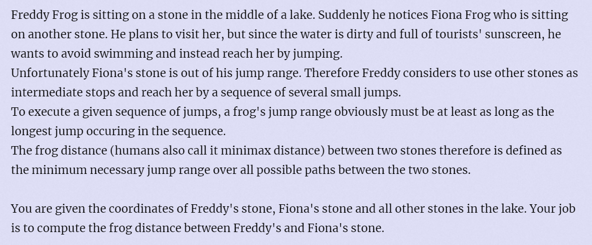

 **Frogger**

https://vjudge.csgrandeur.cn/problem/POJ-2253



#### solve

找到两点之间的可达路径的最大边的最小值。
通过floyed的dp思想。更新即可。

#### 生长：

数据强化版本： [Heavy Transportati.md](Heavy Transportati.md) 

#### code

```cpp
#include<iostream>
#include<math.h>
#include<iomanip>
using namespace std;
typedef long long ll;
const int N = 1E3 + 10;
double x[N] , y[N];
double d[N][N];
double f(int i , int j) {
	return sqrt((x[i] - x[j]) * (x[i] - x[j]) + (y[i] - y[j]) * (y[i] - y[j]));
}
int main()
{
	ios::sync_with_stdio(false);
	cin.tie(0);
	int t; cin >> t;
	while (t--) {
		int n , m;
		cin >> n >> m;
		cout << "Scenario #" << test << '\n';
		for (int i = 1; i <= m; i++) {
			int u , v;

		}
		for (int k = 1; k <= n; k++)
			for (int i = 1; i <= n; i++)
				for (int j = 1; j <= n; j++) {
					d[i][j] = min(d[i][j] , max(d[i][k] , d[k][j]));
				}
		cout << fixed << "Frog Distance = " <<  setprecision(3) << d[1][2] << "\n\n";
	}
}
```

