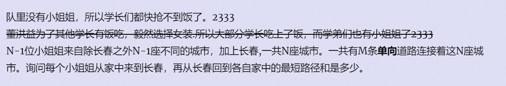

**Invitation Cards**
https://vjudge.csgrandeur.cn/problem/POJ-1511#author=0



#### solve

求其他非常多个点到一个目标点的最短路 ： 通过反图转换技巧处理问题：

1. 反图上的每一条路径在正图中对应了一条路径。
2. 反图上两点的最短路 ， 在正图中也是最短路。

实现难度比较高 ，各种卡常。以及用上了终极优化。

#### code

```cpp
#include<iostream>
#include<queue>
using namespace std;
typedef long long ll;
const ll inf = 1LL << 59 ;
const int N = 1E6 + 10;
int n , m;
struct graph {
	struct node {
		int v , w , nxt;
	} e[N];
	int tot;
	int head[N];
	void init() {
		tot = 0;
		for (int i = 1; i <= n; i++) {
			head[i] = 0;
		}
	}+
	void add(int x , int y , int w) {
		tot += 1;
		e[tot].v = y;
		e[tot].w = w;
		e[tot].nxt = head[x];
		head[x] = tot;
	}
} f , g;
ll d1[N] , d2[N];
bool vis[N];
struct qnode {
	int u ;
	ll w;
	bool operator<(const qnode& t)const {
		return w > t.w;
	}
};
void dijkstra(ll d[] ,  graph* e) {
	for (int i = 1; i <= n; i++) {
		vis[i] = false;
		d[i] = inf;
	}
	priority_queue<qnode> que;
	d[1] = 0;
	que.push((qnode) {1 , 0});
	while (que.size()) {
		qnode t = que.top(); que.pop();
		int u = t.u;
		if (vis[u])continue;
		vis[u] = true;
		for (int i = e->head[u] ; i ; i = e->e[i].nxt) {
			int v = e->e[i].v;
			int l = e->e[i].w;
			if (d[v] > d[u] + l) {
				d[v] = d[u] + l;
				que.push((qnode) {v , d[v]});
			}
		}
	}
}
int main()
{
	ios::sync_with_stdio(false);
	cin.tie(0);
	int t; cin >> t;
	while (t--) {
		cin >> n >> m;
		g.init();
		f.init();
		for (int i = 1; i <= m; i++) {
			int u , v , w;
			cin >> u >> v >> w;
			f.add(u , v , w);
			g.add(v , u , w);
		}
		dijkstra(d1 , &f);
		dijkstra(d2 , &g);
		ll ans = 0;
		for (int i = 1; i <= n; i++) {
			ans += d1[i] + d2[i];
		}
		cout << ans << '\n';
	}
}
/* stuff you should look for
* int overflow, array bounds
* special cases (n=1?)
* do smth instead of nothing and stay organized
* WRITE STUFF DOWN
* DON'T GET STUCK ON ONE APPROACH
*/
```

