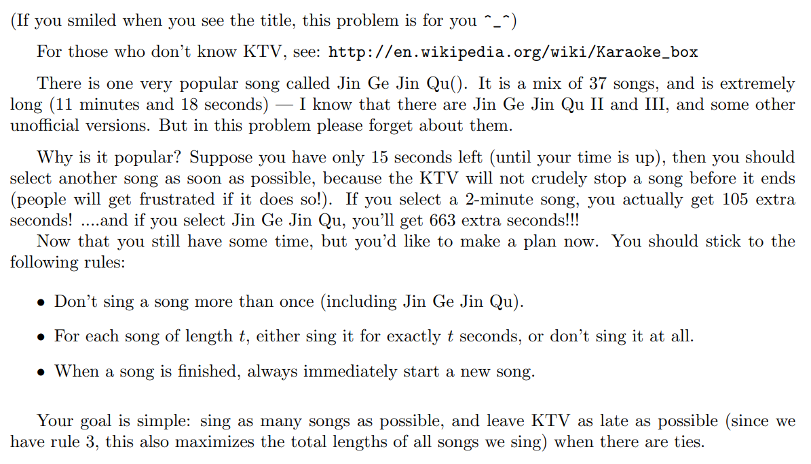

#### Jin Ge Jin Qu hao

 https://vjudge.csgrandeur.cn/problem/UVA-12563

紫书： p274



#### solve

1. 最长的歌曲放置在最后一个是否是最优选择？
   1. 对于任意放置前前面的解。其与最后一个解交换顺序， 前列的往前移动。这种将最后一个放在最后都是等效的。即将金曲放在最后唱结果肯定不会差。并且可行性变高。
   2. 对于任何一个方案， 将最后一曲换成金歌 ， 结果是更优的。
   3. 歌曲越长，伸出的尾巴就可以更长。直觉上是不会变差的。（qaq没东西写啦）
2. 几个角度：
   1. 两维价值。
   2. 加一个空间放满的解。

----

**解法1：**

**状态设计1：**

`struct node{`

`int t , d;`

`}`

$f_{i}$  ,表示 i的花费下 ， 选择的曲子的最大数量， 基于最大数量前提下的最长时间。

**状态转移：**

和普通的01背包问题一样：转移即可。优先级的维护。

**初始化：**

全部设置为0  , 0。

#### code

```cpp
#include<bits/stdc++.h>
using namespace std;
typedef long long ll;
const int oo = 0x0fffffff;
const int N = 1E6 + 10;
struct node {
	int sum;
	int t;
};
int a[N];
node f[N];
void work(int testNo)
{
	int n , t;
	scanf("%d%d" , &n , &t);
	fill(f , f + t + 1, (node) {0 , 0});
	for (int i = 1; i <= n; i++) {
		scanf("%d" , a + i);
	}
	function<void(int , int)> update = [&](int i , int j) {
		//不能装满；
		if (f[j].sum < f[j - a[i]].sum + 1) {
			f[j] = {f[j - a[i]].sum + 1 , f[j - a[i]].t + a[i]};
			// printf("i , j : %d %d : %d\n"  , i , j , f[j].t);
		} else if (f[j].sum == f[j - a[i]].sum + 1) {
			f[j].t = max(f[j].t , f[j - a[i]].t + a[i]);
			// printf("i , j : %d %d : %d\n"  , i , j , f[j].t);
		}
	};
	for (int i = 1; i <= n; i++) {
		for (int j = t; j >= a[i]; j--) {
			update(i , j);
		}
	}
	printf("Case %d: %d %d\n" , testNo , f[t - 1].sum + 1 ,  f[t - 1].t + 678);
}
int main()
{
	ios::sync_with_stdio(false);
	cin.tie(0);
	int t;
	scanf("%d" , &t);
	for (int i = 1; i <= t; i++)work(i);
}
/* stuff you should look for
* int overflow, array bounds
* special cases (n=1?)
* do smth instead of nothing and stay organized
* WRITE STUFF DOWN
* DON'T GET STUCK ON ONE APPROACH
*/
```


