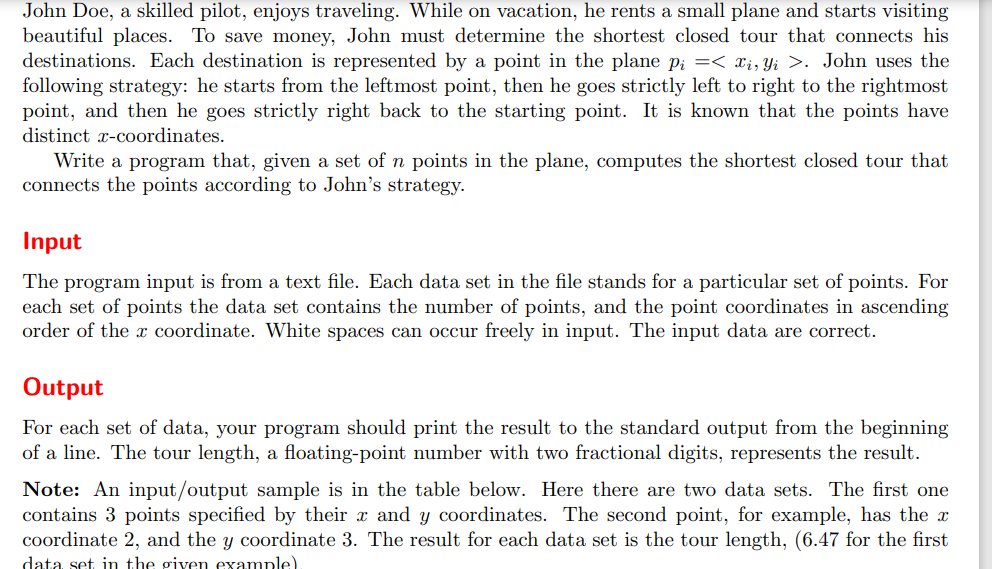

**tour**

[Tour - UVA 1347 - Virtual Judge (csgrandeur.cn)](https://vjudge.csgrandeur.cn/problem/UVA-1347)



#### solve

1. 问题可以等闲成， 两个人从同一个起点出发。达到终点。途中，两人的经过点除了起点终点外不相同。

**状态设计：**

$dp_{i ,j}$表示 ， 两个人到达分别到达max(i , j)个点时 ， 其经过的最短距离。

**转移方程：**

1. 一种处理技巧是： 规定 i  大于 j  。 $dp_{i , j } 和dp_{j , i}$等效性启发下的一个处理。

2. 因为途中的点都将被经历， 每一步决定谁先走到i + 1。类似于完全背包的优化思想
3. 从小贡献大状态的方向更加容易处理。

**初始化：**

1. dp\[1][2] = g(1 , 2)

#### 生长思考：

1. 基于等效性的启发的体会：
   1. 其作用：
      1. 优化常数：/2
      2. 降低编码难度。不需要分类讨论谁大谁小。
   2. 原理体会：
      1. 关于两个问题，它们是等效的
         1. 它们的大小相同： 问题的解系中存在单射 ， 满射的关系。
         2. 它们对更大规模问题的贡献相同， 两者其中一个有贡献计算记录即可。
2. 基于状态设计角度的体会：
   1. 类比完全背包问题：
      1. 选择1 ， 2 ， 3 步 ， 等效于当前选择1步进入下一个状态。
   2. 这种设计角度保证 《 max(i , j)的所有点经过。从而不需要具体研究解集点的经历情况。
   3. 并不可以往回走， 跳一大步之后的转移是可预测的。
   4. 转换思维：将问题分为两种阶段：分化成两个人的交互移动问题。像传纸条也有类似的 ， 双向搜索有着类似的思想精华；

#### code

[Source code - Virtual Judge (csgrandeur.cn)](https://vjudge.csgrandeur.cn/solution/42431288/D1jj9SGptwMT57CAe2Nn)

```cpp
#include<bits/stdc++.h>
using namespace std;
using ll = long long;

#define fi first
#define se second

const int N = 1100;
const double inf = 1E16;
pair<double , double> c[N];
int tot;
double f[N][N];

double g(int i , int j) {
	double dx = c[i].fi - c[j].fi;
	double dy = c[i].se - c[j].se;
	return sqrt(dx * dx + dy * dy);
}

int main()
{
	ios::sync_with_stdio(false);
	cin.tie(0);

	int n;
	while (cin >> n) {
		tot = 0;
		for (int i = 1; i <= n; i++) {
			double x , y;
			cin >> x >> y;
			c[++tot] = make_pair(x,  y);
		}
		for (int i = 1; i <= n; i++)
			for (int j = 1; j <= n; j++) {
				f[i][j] = inf;
			}
		f[1][1] = 0;
		f[2][1] = g(2 , 1);
		// cout << f[2][1] << "\n";
		for (int i = 1; i <= n; i++) {
			for (int j = 1; j < i; j++) {
				f[i + 1][i] = min(f[i + 1][i] , f[i][j] + g(i + 1, j));
				f[i + 1][j] = min(f[i + 1][j] , f[i][j] + g(i , i + 1));
			}
		}
		//那么最终的解是和哪一个指标函数有关呢？
		for (int i = 1; n - i >= 1; i++) {
			f[n][n] = min(f[n][n - i] + g(n, n - i) , f[n][n]);
		}
		cout << fixed << setprecision(2) <<  f[n][n] << "\n";
	}
}
/* stuff you should look for
* int overflow, array bounds
* special cases (n=1?)
* do smth instead of nothing and stay organized
* WRITE STUFF DOWN
* DON'T GET STUCK ON ONE APPROACH
*/
```
