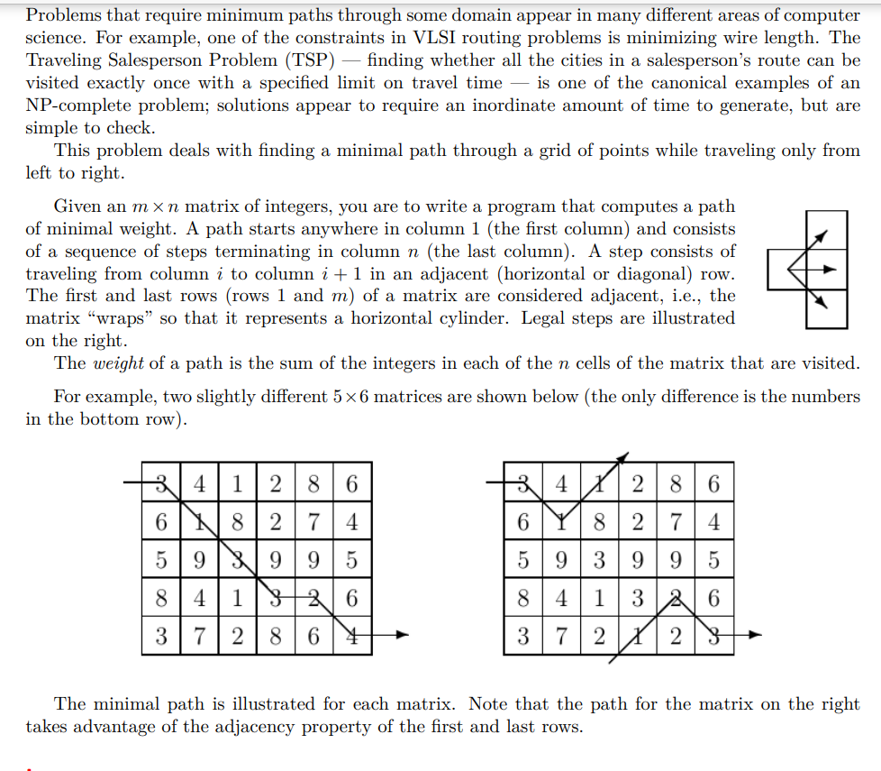

**单向TSP**

[Source code - Virtual Judge (csgrandeur.cn)](https://vjudge.csgrandeur.cn/solution/42445475/ag8ROvLP5zV5LRKpCnUc)



[Unidirectional TSP - UVA 116 - Virtual Judge (csgrandeur.cn)](https://vjudge.csgrandeur.cn/problem/UVA-116)

#### solve

==自己的：==

正推转移：

**状态定义：**

$f_{i , j}$： 从第一列格子开始 到达（i  ， j）中最大经历权重和。

$pre_{i , j}$ , $f_{i , j}$表示的最优方案中， i ， j点的前驱。

**状态转移：**

按照题意 ， 三个方向： 

1. 就是三个状态转移的同时记录初始化点即可

2. 一个技巧： 循环可以通过mod运算天然的实现。

**初始化 + 递归起点**

将第一列的初始化即可。

==书上 ， 逆推角度==

**状态定义：**

$f_{i , j}$ ，  从格子（i , j )出发到最后一列的最小开销。

$nxt_{i , j}$ ,  记录最优解 ，且最小的转移行号。

#### 生长：

遇到非常多的问题：

1. 第一构造过程中 ， 保证每一个方案都是最优。除此之外， 比较还有一个维度， 题目中的问题是针对列的而不是针对某一个点， 在列集合中再额外完成一个还原比较字典序的工作。
2. 这个角度上， 逆推似乎恰到好处。

#### 书上思路：code

```cpp
#include<bits/stdc++.h>
using namespace std;
using ll = long long;

const int N = 1E3 + 10;
const int inf = 1 << 29;

int a[N][N] , f[N][N];
int nxt[N][N];


int main()
{
	ios::sync_with_stdio(false);
	cin.tie(0);
	int n , m;
	while (cin >> n >> m) {
		for (int i = 1; i <= n; i++)
			for (int j = 1; j <= m; j++) {
				cin >> a[i][j];
			}
		//尝试逆推实现
		int ans = inf , first = 0;
		for (int j = m; j > 0; j--) {
			for (int i = 1; i <= n; i++) {
				if (j == m)f[i][j] = a[i][j];
				else {
					int rows[3] = {i , i - 1 , i + 1};
					if (i == 1) rows[1] = n;
					if (i == n) rows[2] = 1;
					sort(rows , rows + 3);
					f[i][j] = inf;
					for (int k = 0; k < 3; k++) {
						int t = f[rows[k]][j + 1] + a[i][j];
						if (t < f[i][j])f[i][j] = t , nxt[i][j] = rows[k];
					}
				}
				if (j == 1 && f[i][j] < ans) {
					ans = f[i][j];
					first = i;
				}
			}
		}
		cout << first;
		for (int i = nxt[first][1] , j = 2; j <= m; i = nxt[i][j] , j++) {
			cout << " " << i;
		}
		cout << "\n" << ans << "\n";
	}
}

/* stuff you should look for
* int overflow, array bounds
* special cases (n=1?)
* do smth instead of nothing and stay organized
* WRITE STUFF DOWN
* DON'T GET STUCK ON ONE APPROACH
*/
```

#### code 自己的思路 wa了（未解之谜）

```cpp
#include<bits/stdc++.h>
using namespace std;
using ll = long long;
using pii = pair<int , int>;
const int N = 1E2 + 10;
const ll inf = 1LL << 40;

ll a[N][N] , f[N][N] , pre[N][N];
int n , m;
vector<int> g(int t) {
    vector<int> ans;
    for (int i = m; i >= 1; i--) {
        ans.push_back(t);
        t = pre[t][i];
    }
    reverse(ans.begin() , ans.end());
    return ans;
}
bool cmp(const vector<int> & a , const vector<int> & b) {
    for (int i = 0; i < m; i++) {
        if (a[i] < b[i]) return true;
        else if (a[i] > b[i]) return false;
    }
    return true;
}
int main()
{
    ios::sync_with_stdio(false);
    cin.tie(0);
    while (cin >> n >> m) {
        for (int i = 1; i <= n; i++)
            for (int  j = 1; j <= m; j++) {
                cin >> a[i][j];
                f[i][j] = inf;
                pre[i][j] = inf;
            }
        for (int i = 1; i <= n; i++) {
            f[i][1] = a[i][1];
            pre[i][1] = i;
        }
        //转移顺序： 先列在行
        function<void(int , int , int)> update = [&](int i , int j, int x) {
            if (x == n + 1) x = 1;
            if (x ==  0) x = n;
            if (f[i][j] > f[x][j - 1] + a[i][j]) {
                f[i][j] = f[x][j - 1] + a[i][j];
                pre[i][j] = x;
            } else if (f[i][j] == f[x][j - 1] + a[i][j]) {
                pre[i][j] = min(pre[i][j] , 1LL * x);
            }
        };
        for (int j = 2; j <= m; j++) {
            for (int i = 1; i <= n; i++) {
                for (int k = -1; k <= 1; k++) {
                    update(i , j , i + k);
                }
            }
        }
        vector<int> ans;
        ll mi = inf;
        for (int i = 1; i <= n; i++) {
            if (f[i][m] > mi)continue;
            vector<int> temp = g(i);
            if (f[i][m] < mi) {
                ans = temp;
                mi = f[i][m];
            }
            else  if (cmp(temp , ans)) ans = temp;
        }
        // cout << "d : " << cunt++ << "\n";
        // for (int i = 1; i <= n; i++) {
        //     cout << f[i][m] << " \n"[i == m];
        // }
        for (int i = 1; i <= m; i++) {
            cout << ans[i - 1] << " \n"[i == m];
        }
        cout << mi << "\n";
    }
}

/* stuff you should look for
* int overflow, array bounds
* special cases (n=1?)
* do smth instead of nothing and stay organized
* WRITE STUFF DOWN
* DON'T GET STUCK ON ONE APPROACH
*/
```

