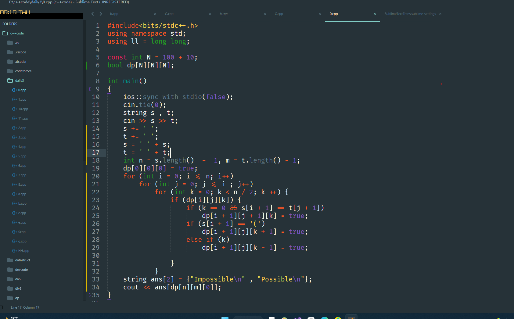
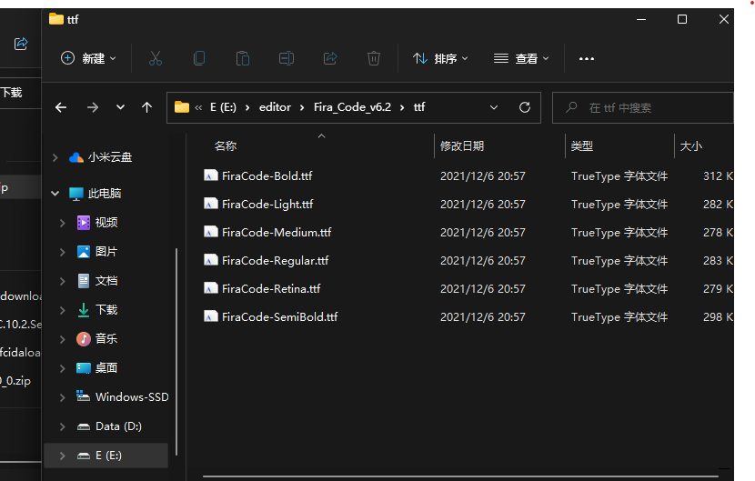
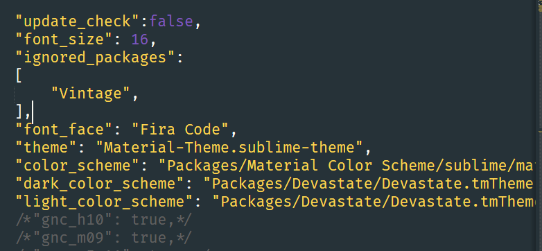

**比较喜欢的主题**

纤细 ， 明了 ，锋利。
1. material 
   1. dark版本的最喜欢。
   2. 直接搜索install安装即可。
2. monoki
   1. 很锋利的一种风格。

一种主题配上字体，效果更佳。纤细一点的字体， 会使得字体没有那么炫眼。

这里使用的字体是：
Fira_Code这里直接将它放在同目录的文件夹中。
配置方法：
1. 直接解压压缩包。找到对应的文件夹。然后点开安装即可。

2. sublime将setting中的字体设置为FiraCode即可。

