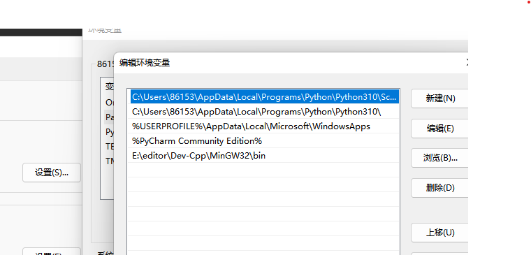

#### 内容

下次校赛前，快速搭建sublime环境。

#### 目标：

首要：

1. 编译环境：
2. 快捷键：

次要

1. 目标的主题：
2. 目标的字体：


#### 操作

1. 使用u盘的安装包：data默认安装在了C盘。不然会相当慢。

2. 设置环境变量。

   [MinGW-w64 C/C++编译器下载和安装_mingw64下载-CSDN博客](https://blog.csdn.net/jiqiren_dasheng/article/details/103775488)

   


3. 构建新的编译系统。

```json
{
	"cmd": ["g++", "-Wall", "${file}","-std=c++11", "-fexec-charset=gbk", "-o","${file_path}/${file_base_name}"],
	"file_regex": "^(..[^:]*):([0-9]+):?([0-9]+)?:?(.*)$",
	"working_dir": "${file_path}",
	"selector": "source.c, source.c++",
	"shell": true,
	"encoding":"cp936",
	"variants":
	[
		{
			"name": "Compile Only",
			"cmd": ["cmd","/C","g++", "-Wall", "${file}","-std=c++17", "-fexec-charset=gbk", "-o","${file_path}/${file_base_name}"],
		},
		{
			"name": "Run Only",
			"cmd": ["start","cmd","/c", "${file_base_name} & echo. & pause"],
		},
		{
			"name": "Compile & Run",
			"cmd": ["cmd","/C","g++", "-Wall", "${file}","-std=c++17", "-fexec-charset=gbk", "-o","${file_path}/${file_base_name}", "&&","start","cmd","/c", "${file_base_name} & echo. & pause"],
		}
	]
}
```

4. 设置快捷键

```json
{ "keys": ["ctrl+j"], "command": "move", "args": {"by": "characters", "forward": false} },
{ "keys": ["ctrl+l"], "command": "move", "args": {"by": "characters", "forward": true} },
{ "keys": ["ctrl+alt+j"], "command": "move", "args": {"by": "word_ends", "forward": false} },
{ "keys": ["ctrl+alt+l"], "command": "move", "args": {"by": "word_ends", "forward": true} },
{ "keys": ["ctrl+i"], "command": "move", "args": {"by": "lines", "forward": false} },
{ "keys": ["ctrl+k"], "command": "move", "args": {"by": "lines", "forward": true} }
```


最简单的方法其实是，把两个文件夹，全部拷贝过去。

install packages

packeges

