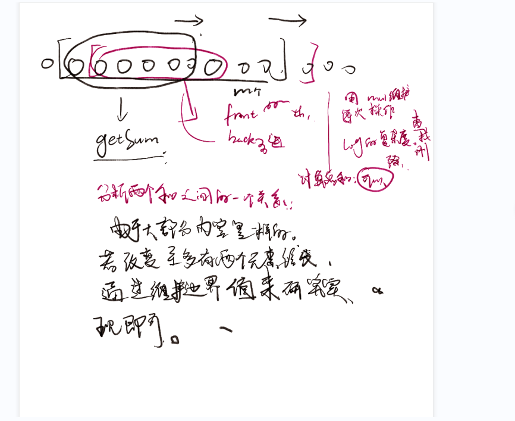

---
怎么看到大佬全部起码补题补到F
---


https://atcoder.jp/contests/abc281/tasks/abc281_e

- 给定一个数组，一个长度固定的滑动窗口。查询，各个滑动窗口的排序后，前k个的和。

### $solve$




#### 整体思路

- 对于每一次的转移。丢失一个值，同时得到一个值。
- 只需要快速实现两个操作即可。one-》重新排序。处理结果。
- O(1)的复杂度计算出这个解。

#### 实现细节

- 用vector大模拟。同时使用。
  - lower_bound
  - upper_bound
  - insert
  - erase
  - 复杂度大概是$O((n-m)*m*log(m));$一般肯定不可以过。但是这一次可以卡过去。
- 用一个可重的set集合来模拟。
  - multiset
  - 同时用一个迭代器件进行管理。

----------

```cpp
#include <iostream>
#include <set>
using namespace std;
typedef long long ll;
const int maxn = 2e5 + 10;

ll ans;
multiset<int> rec;
ll a[maxn];

int main()
{
    int n, m, k;
    scanf("%d%d%d", &n, &m, &k);
    for (int i = 1; i <= n; i++)
        scanf("%d", a + i);
    for (int i = 1; i <= m; i++)
        rec.emplace(a[i]);
    multiset<int>::iterator p = rec.begin();
    for (int i = 0; i < k; i++, p++)
        ans += *p;
    printf("%lld ", ans);
    p--;
    for (int i = m + 1; i <= n; i++)
    {
        rec.emplace(a[i]);
        if (a[i] < *p)
        {
            ans -= *p;
            ans += a[i];
            p--;
        }
        if (a[i - m] <= *p)
        {
            p++;
            ans += (*p - a[i - m]);
        }
        rec.erase(a[i - m]);
        printf("%lld ", ans);
    }
}
```


